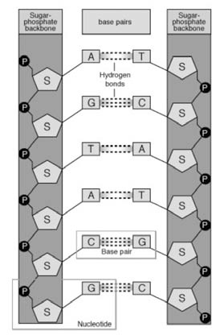
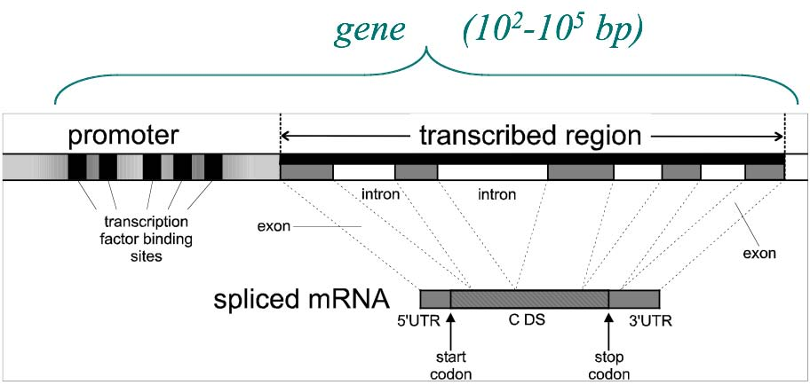
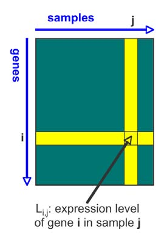
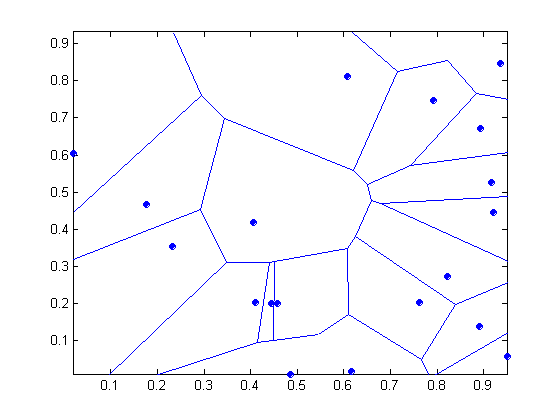
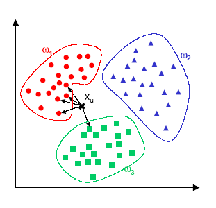
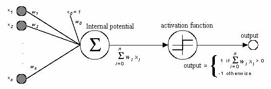

# 			Appunti Bioinformatica

# Introduzione

- Svolgimento di un progetto software per 3 persone o discussione articolo scientifico
- Orale sugli argomenti del corso

## Materiale didattico

- Pagina corso, bioinformatica1920
- Sito Ariel

# Concetti di biologia

## Cos’è la bioinformatica

La bioinformatica è lo studio delle informazioni biologiche e dei sistemi biologici.

La biologia computazionale  è spesso intesa come sinonimo di bioinformatica. In altri casi la biologia computazionale è intesa come sviluppo di nuove tecnologie nell’ambito della biologia molecolare, mentre la bioinformatica da più enfasi sull’applicazione dei metodi che sullo sviluppo.

Non è bioinformatica l’informatica che si ispira alla biologia reale, come ad esempio gli algoritmi genetici o le reti neurali.

## The three kingdoms of life

- ​	eukaryota
- ​	bacteria
- ​	archea

Gli organismi più vecchi sono gli archea. Sono organismi semplicissimi da cui si sono evoluti i bacteria e gli eucarioti. Sono tutti organismi unicellulari, ma gli eucarioti sono i più complessi e da loro si sono formati gli organismi pluricellulari.

## La cellula

### Cellula procariota

Il contenuto cellulare è avvolta da una membrana composta da proteine e lipidi. Il DNA è libero di muoversi all’interno della cellula. Ha organelli come i ribosomi.

### Cellula eucariota

Evoluzione delle cellula procariote. Contiene altri organelli, come i mitocondri e il reticolo endoplasmatico che trasporta le proteine nei vari compartimenti della cella.

C’è un nucleo avvolto da una membrana nucleare, al cui interno c’è il DNA. Il DNA è in un nucleo perché è più complesso e più grande, è importante separarlo dal resto della cellula per semplificare operazioni come la duplicazione. Il DNA infatti è in grado di sdoppiarsi in una copia identica di se stesso.

Il **DNA** è una molecola con struttura a doppia elica. Contiene l’informazione genetica che viene trasmessa alle proteine tramite una molecola chiamata **messanger RNA.**

La maggior parte dei componenti di una cellula sono composti da proteine, ed anche le reazioni biochimiche interne alla cellula sono regolate dalle proteine

**Interaction graph →**  Si rappresenta la cellula come un grafo i cui nodi sono proteine, e gli archi sono le interazioni tra le proteine.

## Struttura DNA

  
Il DNA è formato da due sequenze lineari di nucleotidi. Ogni nucleotide è formato da uno zucchero composto da 5 atomi di carbonio chiamato S, collegato ad una base azotata di tipo A / C / G / T. Le posizioni degli atomi di carbonio sono numerati da 1 a 5, come i vertici di un pentagono. La P è una molecola di fosfato che collega la posizione 5 di S alla posizione 3 di S successivo. Questo collegamento è sempre fisso, quello che cambia è la base azotata. La sequenza di nucleotidi può quindi essere rappresentata come una sequenza di lettere. I batteri hanno circa  nucleotidi, le piante e i mammiferi. La seconda sequenza del DNA è ribaltata nel modo in cui sono collegati i nucleotidi. Le due sequenze poi sono collegate sempre nello stesso modo, la  A va con la T, la C con la G. Tra A e T si formano legami deboli doppi, Tra G e C legami deboli tripli. Questi legami anche se deboli sono sufficienti a tenere insieme i due nucleotidi. I legami si possono rompere, è importante per duplicare il DNA. Il DNA può creare una molecola figlia identica a quella padre.  Se il DNA si spezza a metà, da una metà si può ricavare la seconda perché i collegamenti sono sempre uguali. Il DNA in certi punti si attorciglia formando una struttura a elica

## Cromosomi

I cromosomi hanno una struttura impaccata, il DNA si avvolge intorno a degli istoni e si comprime per occupare meno spazio. Gli istoni a loro volta si avvolgono ancora a elica e si compattano fino a costituire dei cromosomi.

## Central dogma

Nella stringa di DNA ci sono le informazioni per costruire le proteine. Le proteine sono sequenze di aminoacidi. Ce ne sono 20 diverse. Una sequenza di nucleotidi del DNA può codificare una sequenza di aminoacidi di una proteina.

mRNA è una sequenza di nucleotidi U/C/A/G, al posto che T c’è U, ma sono molto simili chimicamente. La funzione dell’RNA messaggero è copiare una delle due sequenze del DNA con la tecnica delle basi complementari.

La copia avviene in due passi:

- **Trascrizione:** mRNA copia la porzione di DNA che serve a codificare una proteina. Queste sezioni di DNA sono chiamate geni. Il DNA si apre nella parte da copiare, l’mRNA la copia. L’ RNA messaggero poi può uscire dal nucleo della cellula perché è piccolo.
- **Traduzione:** C’è un’altra molecola nella cellula chiamato transport RNA. È in grado di trasportare uno specifico aminoacido. In un organello chiamato ribosoma l’mRNA si lega ad un tRNA complementare. L’operazione avviene in parallelo

Ad ogni tripletta di lettere corrisponde un solo aminoacido. Si chiama codon. Con 3 lettere si fanno 64 combinazioni (4 * 4 * 4), se avessimo due lettere solo 16.

Ci sono più triplette che corrispondono allo stesso aminoacido. Il codice è ridondante in modo da riparare a degli errori. Infatti è vero che una proteina ha più codifiche ma differiscono al massimo di una lettera.

AUG = segnale di start, indica che in quel punto del DNA inizia la codifica della proteina. Il segnale di stop invece ha più codifiche.

## I geni

I geni sono porzioni di genoma di dimensione tra e  bp (base pairs, coppia di nucleotidi complementari).

Il gene è composto da 2 parti:

1. **promoter:** non tutti i geni sono trascritti in aminoacidi e non tutti nello stesso momento. Serve un meccanismo di regolazione della trascrizione. I promoter sono regioni di un gene che fungono da interruttori. Al promoter si legano delle proteine che hanno la funzione di attivare la trascrizione. L'rna polimerasi che attiva la trascrizione è specifica per quel gene.
2. **transcribed region:** regione usata per codificare le proteine. Ci sono due sottoparti diverse:
   1. esoni: sono le parti effettivamente codificanti
   2. introni: non sono tradotti. La traduzione dell'RNA avviene in due 	fasi, traduzione e splicing. Lo splicing serve perchè può darsi 	che non tutti gli esoni siano inclusi nella traduzione. Ci sono 	quindi diverse combinazioni di esoni che danno via a RNA diversi e 	quindi proteine diverse dallo stesso gene  	

 

## Struttura proteine

- **Struttura primaria:** Sequenze di aminoacidi (ci sono 20 aminoacidi diversi). Gli aminoacidi sono fatti tutti allo stesso modo cambia solo il gruppo R. [Immagine presa da internet]
- **Struttura secondaria:**
  - a elica
  - a foglietto
  - a gomitolo casuale
- ​	**Struttura terziaria:** Struttura 3D
- ​	**Struttura quaternaria:** Complessi proteici

## Funzioni proteine

**Information processing:**

- Recettori → sentire segnali che vengono dall’esterno, ad esempio molecola che interagisce con una proteina
- signal transduction →  il segnale ricevuto si propaga all’interno della cellula
- regulation of gene expression →  come i promoter
- regolazione ciclo cellullare → la cellula aumenta di dimensione e poi si divide in cellule diverse
- differenziazione cellulare →  l’uomo deriva da un’unica cellula, le prime cellule non hanno funzioni precise ma piano piano si differenziano.

**Metabolismo:**

- energia
- sintesi proteine DNA / RNA

**Struttura cellula:**

- citoscheletro →  scheletro che da forma alla cellula

Una stessa proteina può avere più funzioni, un problema della bioinformatica è prevedere la funzione di una proteina.

# Tipi di dati in bioinformatica

- Sequenze: per geni, proteine, DNA
- grafi 3D: per la struttura delle molecole
- dati di popolazione: come varia la sequenza del DNA di una specie
- matrici
- grafi con archi e nodi annotati: reti di proteine

## Sequenze di DNA

Il processo di sequenziamento richiede la frammentazione del DNA che poi va rimesso insieme per ricostruire il genoma

## Dati di popolazione

Sequenziando tanti genomi diversi è possibile studiare la variabilità delle sequenze nei diversi individui. Si cerca di distinguere varianti fisiologiche che portano a differenze fisiche tra gli individui da quelle cattive che portano a patologie.

## Espressione dei geni

Si possono misurare i livelli di espressione di tutti i geni di una cellula. Un gene si esprime se viene trascritto in RNA messaggero. Si rappresentano con microarrays, matrici in cui ogni cella è un numero che indica il livello di espressione di un gene

## Espressione delle proteine

Matrici che indicano espressione della proteina nel gene *i,* nel campione *j*

## Interazioni

Come interagiscono le proteine tra loro, con il DNA o con l’RNA. Il risultato sono grafi che rappresentano queste interazioni.

## Perché analizzare questi dati?

- Rimpiazzare altre misurazioni: ad esempio predire la struttura 3D delle proteine dalla sequenza.
- Capire la biologia: ricostruire le regole dei meccanismi biologici
- ricostruire il passato: analizzando il DNA si può inferire l’evoluzione della specie
- Predire il futuro: predire patologie o evoluzione delle patologie.
- Migliorare organismi

## Trovare strutture nei DNA

- La teoria della evoluzione di Darwin è stata provata in modo genetico oggi.
- Individuare geni all’interno del genoma. I geni sono meno del 2% del genoma umano.
- Distinguere esoni, introni, e promoter

# Machine learning

## Problema di supporto alla diagnosi

### Dati

I dati generati da biotecnologie high throughput sono rappresentabili come un insieme di coppie (x, t).

Ho un vettore $x = [x_1, x_2,…,x_d]$, ogni componente è l’espressione di un gene. Avendo questi dati è possibile predire se il paziente è sano o malato.

### Obbiettivi apprendimento automatico

L'obbiettivo è apprendere una funzione non nota $f$ che mappa da un vettore di dati reali allo stato funzionale di un paziente indicato come C.

Si usa un algoritmo di machine learning che ha accesso ad un sottoinsieme di dati limitato chiamato training set D, formato da coppie di valori x, t

x è l’ingresso, t è la risposta

In pratica si danno degli esempi con la risposta corretta per insegnare alla macchina a rispondere. Si parla di algoritmi supervisionati, in cui un supervisore (come un medico) da le risposte corrette.

Avendo solo un training set D, l’obbiettivo è costruire una funzione $g$ che approssimi il più possibile la funzione non nota $f$. Si usa una funzione di perdita Loss che misura quanto $g$ differisce da $f$.

Nei problemi di classificazione si usa la funzione di perdita 0/1, ha due argomenti, il valore predetto da $g(x)$ e il valore vero $f(x)$.
$$
Loss(g(x),f(x)) = 
\begin{cases} 
      1 \; se \; g(x) \neq f(x)\\
      0 \; se \; g(x) = f(x)
\end{cases}
$$
 L’obbiettivo è minimizzare la funzione di perdita.

Il problema è che $f$ non è nota…

## Addestramento learning machine

La learning machine viene addestrata. Si vuole minimizzare la funzione di perdita rispetto al training set, non rispetto a $f(x)$ che non è nota. $R_{emp}$ è l’errore medio secondo la funzione di perdita scelta. In genere il training set è ridotto.

## Generalizzazione

L viene addestrata su un training set $D \subset U$, da ciò che apprende in un training set ridotto cerca di generalizzare su tutti i dati Si vuole costruire la funzione $g$ che sia predittiva per l’universo dei dati e non solo sul training set. Il problema è che non si conosce U, e nemmeno la distribuzione di probabilità congiunta estesa a tutto l’universo. La probabilità congiunta significa conoscere tutto su $x$ e $t$,  quindi significa conoscere la probabilità di $t$ dato $x$. 

## Universo dei dati e campioni

SIi prendono i dati del training set, e si suddivide in due parti:

- training set

- test set

Uso solo il training set per addestrare la learning machine, e provo a fargli indovinare il test set. Conoscendo il risultato del test set ho una stima dell’errore.

## 1 – nearest neighbor

Posso usare i diagrammi di voroni per determinare la classe di un punto. Ho dei punti che già conosco che fanno parte del training set, quando trovo un nuovo punto guardo in quale regione di Voronoi cade, e trovo quindi il nearest neighbor. La classe del nuovo punto sarà la stessa del vicino nel diagramma di Voronoi Le linee sono tutti i punti equidistanti tra due punti.

## K – nearest neighbour

Generalizzazione, ho degli insiemi, se un punto cade fuori dagli insiemi, guardo i K nearest neighbour e scelgo la classe in base alla maggioranza.

Nell’esempio i vicini sono 4 rossi e 1 verde e quindi il punto da classificare è rosso

La risposta può cambiare in base al K:

- Se k è piccolo la classificazione è sensibile a dati rumorosi

- se k è grande l’intorno potrebbe includere campioni appartenenti ad altre classi

## Limiti dei k – nn

Si basa solo sull’osservazione dei dati e calcolo delle distanza, sono pigri non costruiscono esplicitamente un modello

I dati di espressione genetica sono di elevata dimensionalità e k-nn è soggetto dal *curse of dimensionality*. Se ho uno spazio n dimensionale i punti aumentano velocemente. Riempire un piano si fa con meno punti che riempire un cubo.

## Percettrone

Modello lineare di neurone. Rappresentazione matematica del neurone biologico.

- $x_1,...,x_n$ input
- $w_1,...,w_n$ pesi
- $w_0$ fattore costante (bias)

Un neurone vero ha:

- **dendriti:** ingresso dei segnali ai neuroni, molecole che si legano sulla membrana cellulare dei neuroni
- **assone:** esce dal neurone, ha dei terminali che sono l’uscita, rilascia le molecole che si legano al neurone successivo
- **sinapsi:** collegamento tra due cellule

I neuroni si scambiano segnali elettrici tra di loro o tra i muscoli. Nel modello matematico ci sono valori di ingresso numerici, arrivano all’interno del corpo attraverso una funzione di somma pesata per simulare il potenziale di attivazione si usa una activation function non lineare. Se la somma pesata è > 0, l'output 1, altrimenti -1

### rappresentazione geometrica

Nello spazio bidimensionale la funzione è una retta, i punti sopra la retta hanno valore funzione maggiore di 0, quelli sotto minore di 0.

Il percettrone implementa funzioni lineari e può classificare solo insiemi linearmente separabili da una retta.

### Errore

Va individuato il vettore w (dei pesi) che permette una corretta classificazione minimizzando $ E(w)$

Si vuole minimizzare l’errore della funzione $y_k = sgn(w*x_k)$ computata dal percettrone, calcolata rispetto al training set T. Si calcola la funzione senza segno.

- $X_k$ è il vettore di valori
- $t_k$ sono le etichette
- $y_k$ è il valore predetto

Si calcola poi l'errore quadratico $E(w)= \frac{1}{2} \sum\limits_{t_k \in T} (t_k - y_k)^2$

### Minimizzazione dei pesi discesa gradiente

Ho una superficie di errore, prendo un punto sulla superficie e cerco di spostarmi verso il minimo. La cosa più logica è considerare il vettore tangente alla superficie. La direzione è determinata dal gradiente

Eta è il passettino di cui mi muovo.

