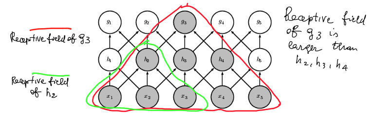

# Introduzione

- Svolgimento di un progetto software per 3 persone o discussione articolo scientifico
- Orale sugli argomenti del corso

## Materiale didattico

- Pagina corso, bioinformatica1920
- Sito Ariel

# Concetti di biologia

## Cos’è la bioinformatica

La bioinformatica è lo studio delle informazioni biologiche e dei sistemi biologici.

La biologia computazionale  è spesso intesa come sinonimo di bioinformatica. In altri casi la biologia computazionale è intesa come sviluppo di nuove tecnologie nell’ambito della biologia molecolare, mentre la bioinformatica da più enfasi sull’applicazione dei metodi che sullo sviluppo.

Non è bioinformatica l’informatica che si ispira alla biologia reale, come ad esempio gli algoritmi genetici o le reti neurali.

## The three kingdoms of life

- ​	eukaryota
- ​	bacteria
- ​	archea

Gli organismi più vecchi sono gli archea. Sono organismi semplicissimi da cui si sono evoluti i bacteria e gli eucarioti. Sono tutti organismi unicellulari, ma gli eucarioti sono i più complessi e da loro si sono formati gli organismi pluricellulari.

## La cellula

### Cellula procariota

Il contenuto cellulare è avvolta da una membrana composta da proteine e lipidi. Il DNA è libero di muoversi all’interno della cellula. Ha organelli come i ribosomi.

### Cellula eucariota

Evoluzione delle cellula procariote. Contiene altri organelli, come i mitocondri e il reticolo endoplasmatico che trasporta le proteine nei vari compartimenti della cella.

C’è un nucleo avvolto da una membrana nucleare, al cui interno c’è il DNA. Il DNA è in un nucleo perché è più complesso e più grande, è importante separarlo dal resto della cellula per semplificare operazioni come la duplicazione. Il DNA infatti è in grado di sdoppiarsi in una copia identica di se stesso.

Il **DNA** è una molecola con struttura a doppia elica. Contiene l’informazione genetica che viene trasmessa alle proteine tramite una molecola chiamata **messanger RNA.**

La maggior parte dei componenti di una cellula sono composti da proteine, ed anche le reazioni biochimiche interne alla cellula sono regolate dalle proteine

**Interaction graph →**  Si rappresenta la cellula come un grafo i cui nodi sono proteine, e gli archi sono le interazioni tra le proteine.

## Struttura DNA

  
Il DNA è formato da due sequenze lineari di nucleotidi. Ogni nucleotide è formato da uno zucchero composto da 5 atomi di carbonio chiamato S, collegato ad una base azotata di tipo A / C / G / T. Le posizioni degli atomi di carbonio sono numerati da 1 a 5, come i vertici di un pentagono. La P è una molecola di fosfato che collega la posizione 5 di S alla posizione 3 di S successivo. Questo collegamento è sempre fisso, quello che cambia è la base azotata. La sequenza di nucleotidi può quindi essere rappresentata come una sequenza di lettere. I batteri hanno circa  nucleotidi, le piante e i mammiferi. La seconda sequenza del DNA è ribaltata nel modo in cui sono collegati i nucleotidi. Le due sequenze poi sono collegate sempre nello stesso modo, la  A va con la T, la C con la G. Tra A e T si formano legami deboli doppi, Tra G e C legami deboli tripli. Questi legami anche se deboli sono sufficienti a tenere insieme i due nucleotidi. I legami si possono rompere, è importante per duplicare il DNA. Il DNA può creare una molecola figlia identica a quella padre.  Se il DNA si spezza a metà, da una metà si può ricavare la seconda perché i collegamenti sono sempre uguali. Il DNA in certi punti si attorciglia formando una struttura a elica

## Cromosomi

I cromosomi hanno una struttura impaccata, il DNA si avvolge intorno a degli istoni e si comprime per occupare meno spazio. Gli istoni a loro volta si avvolgono ancora a elica e si compattano fino a costituire dei cromosomi.

## Central dogma

Nella stringa di DNA ci sono le informazioni per costruire le proteine. Le proteine sono sequenze di aminoacidi. Ce ne sono 20 diverse. Una sequenza di nucleotidi del DNA può codificare una sequenza di aminoacidi di una proteina.

mRNA è una sequenza di nucleotidi U/C/A/G, al posto che T c’è U, ma sono molto simili chimicamente. La funzione dell’RNA messaggero è copiare una delle due sequenze del DNA con la tecnica delle basi complementari.

La copia avviene in due passi:

- **Trascrizione:** mRNA copia la porzione di DNA che serve a codificare una proteina. Queste sezioni di DNA sono chiamate geni. Il DNA si apre nella parte da copiare, l’mRNA la copia. L’ RNA messaggero poi può uscire dal nucleo della cellula perché è piccolo.
- **Traduzione:** C’è un’altra molecola nella cellula chiamato transport RNA. È in grado di trasportare uno specifico aminoacido. In un organello chiamato ribosoma l’mRNA si lega ad un tRNA complementare. L’operazione avviene in parallelo

Ad ogni tripletta di lettere corrisponde un solo aminoacido. Si chiama codon. Con 3 lettere si fanno 64 combinazioni (4 * 4 * 4), se avessimo due lettere solo 16.

Ci sono più triplette che corrispondono allo stesso aminoacido. Il codice è ridondante in modo da riparare a degli errori. Infatti è vero che una proteina ha più codifiche ma differiscono al massimo di una lettera.

AUG = segnale di start, indica che in quel punto del DNA inizia la codifica della proteina. Il segnale di stop invece ha più codifiche.

## I geni

I geni sono porzioni di genoma di dimensione tra e  bp (base pairs, coppia di nucleotidi complementari).

Il gene è composto da 2 parti:

1. **promoter:** non tutti i geni sono trascritti in aminoacidi e non tutti nello stesso momento. Serve un meccanismo di regolazione della trascrizione. I promoter sono regioni di un gene che fungono da interruttori. Al promoter si legano delle proteine che hanno la funzione di attivare la trascrizione. L'rna polimerasi che attiva la trascrizione è specifica per quel gene.
2. **transcribed region:** regione usata per codificare le proteine. Ci sono due sottoparti diverse:
   1. esoni: sono le parti effettivamente codificanti
   2. introni: non sono tradotti. La traduzione dell'RNA avviene in due fasi, traduzione e splicing. Lo splicing serve perchè può darsi che non tutti gli esoni siano inclusi nella traduzione. Ci sono quindi diverse combinazioni di esoni che danno via a RNA diversi e quindi proteine diverse dallo stesso gene  	

 

## Struttura proteine

- **Struttura primaria:** Sequenze di aminoacidi (ci sono 20 aminoacidi diversi). Gli aminoacidi sono fatti tutti allo stesso modo cambia solo il gruppo R. [Immagine presa da internet]
- **Struttura secondaria:**
  - a elica
  - a foglietto
  - a gomitolo casuale
- ​	**Struttura terziaria:** Struttura 3D
- ​	**Struttura quaternaria:** Complessi proteici

## Funzioni proteine

**Information processing:**

- Recettori → sentire segnali che vengono dall’esterno, ad esempio molecola che interagisce con una proteina
- signal transduction →  il segnale ricevuto si propaga all’interno della cellula
- regulation of gene expression →  come i promoter
- regolazione ciclo cellullare → la cellula aumenta di dimensione e poi si divide in cellule diverse
- differenziazione cellulare →  l’uomo deriva da un’unica cellula, le prime cellule non hanno funzioni precise ma piano piano si differenziano.

**Metabolismo:**

- energia
- sintesi proteine DNA / RNA

**Struttura cellula:**

- citoscheletro →  scheletro che da forma alla cellula

Una stessa proteina può avere più funzioni, un problema della bioinformatica è prevedere la funzione di una proteina.

# Tipi di dati in bioinformatica

- Sequenze: per geni, proteine, DNA
- grafi 3D: per la struttura delle molecole
- dati di popolazione: come varia la sequenza del DNA di una specie
- matrici
- grafi con archi e nodi annotati: reti di proteine

## Sequenze di DNA

Il processo di sequenziamento richiede la frammentazione del DNA che poi va rimesso insieme per ricostruire il genoma

## Dati di popolazione

Sequenziando tanti genomi diversi è possibile studiare la variabilità delle sequenze nei diversi individui. Si cerca di distinguere varianti fisiologiche che portano a differenze fisiche tra gli individui da quelle cattive che portano a patologie.

## Espressione dei geni

Si possono misurare i livelli di espressione di tutti i geni di una cellula. Un gene si esprime se viene trascritto in RNA messaggero. Si rappresentano con microarrays, matrici in cui ogni cella è un numero che indica il livello di espressione di un gene

## Espressione delle proteine

Matrici che indicano espressione della proteina nel gene *i,* nel campione *j*

## Interazioni

Come interagiscono le proteine tra loro, con il DNA o con l’RNA. Il risultato sono grafi che rappresentano queste interazioni.

## Perché analizzare questi dati?

- Rimpiazzare altre misurazioni: ad esempio predire la struttura 3D delle proteine dalla sequenza.
- Capire la biologia: ricostruire le regole dei meccanismi biologici
- ricostruire il passato: analizzando il DNA si può inferire l’evoluzione della specie
- Predire il futuro: predire patologie o evoluzione delle patologie.
- Migliorare organismi

## Trovare strutture nei DNA

- La teoria della evoluzione di Darwin è stata provata in modo genetico oggi.
- Individuare geni all’interno del genoma. I geni sono meno del 2% del genoma umano.
- Distinguere esoni, introni, e promoter

# Machine learning

## Problema di supporto alla diagnosi

### Dati

I dati generati da biotecnologie high throughput sono rappresentabili come un insieme di coppie (x, t).

Ho un vettore $x = [x_1, x_2,…,x_d]$, ogni componente è l’espressione di un gene. Avendo questi dati è possibile predire se il paziente è sano o malato.

### Obbiettivi apprendimento automatico

L'obbiettivo è apprendere una funzione non nota $f$ che mappa da un vettore di dati reali allo stato funzionale di un paziente indicato come C.

Si usa un algoritmo di machine learning che ha accesso ad un sottoinsieme di dati limitato chiamato training set D, formato da coppie di valori x, t

x è l’ingresso, t è la risposta

In pratica si danno degli esempi con la risposta corretta per insegnare alla macchina a rispondere. Si parla di algoritmi supervisionati, in cui un supervisore (come un medico) da le risposte corrette.

Avendo solo un training set D, l’obbiettivo è costruire una funzione $g$ che approssimi il più possibile la funzione non nota $f$. Si usa una funzione di perdita Loss che misura quanto $g$ differisce da $f$.

Nei problemi di classificazione si usa la funzione di perdita 0/1, ha due argomenti, il valore predetto da $g(x)$ e il valore vero $f(x)$.
$$
Loss(g(x),f(x)) = 
\begin{cases} 
      1 \; se \; g(x) \neq f(x)\\
      0 \; se \; g(x) = f(x)
\end{cases}
$$
 L’obbiettivo è minimizzare la funzione di perdita.

Il problema è che $f$ non è nota…

## Addestramento learning machine

La learning machine viene addestrata. Si vuole minimizzare la funzione di perdita rispetto al training set, non rispetto a $f(x)$ che non è nota. $R_{emp}$ è l’errore medio secondo la funzione di perdita scelta. In genere il training set è ridotto.

## Generalizzazione

L viene addestrata su un training set $D \subset U$, da ciò che apprende in un training set ridotto cerca di generalizzare su tutti i dati Si vuole costruire la funzione $g$ che sia predittiva per l’universo dei dati e non solo sul training set. Il problema è che non si conosce U, e nemmeno la distribuzione di probabilità congiunta estesa a tutto l’universo. La probabilità congiunta significa conoscere tutto su $x$ e $t$,  quindi significa conoscere la probabilità di $t$ dato $x$. 

## Universo dei dati e campioni

SIi prendono i dati del training set, e si suddivide in due parti:

- training set

- test set

Uso solo il training set per addestrare la learning machine, e provo a fargli indovinare il test set. Conoscendo il risultato del test set ho una stima dell’errore.

## 1 – nearest neighbor

Posso usare i diagrammi di voroni per determinare la classe di un punto. Ho dei punti che già conosco che fanno parte del training set, quando trovo un nuovo punto guardo in quale regione di Voronoi cade, e trovo quindi il nearest neighbor. La classe del nuovo punto sarà la stessa del vicino nel diagramma di Voronoi Le linee sono tutti i punti equidistanti tra due punti.


## K – nearest neighbour

Generalizzazione, ho degli insiemi, se un punto cade fuori dagli insiemi, guardo i K nearest neighbour e scelgo la classe in base alla maggioranza.


Nell’esempio i vicini sono 4 rossi e 1 verde e quindi il punto da classificare è rosso

La risposta può cambiare in base al K:

- Se k è piccolo la classificazione è sensibile a dati rumorosi

- se k è grande l’intorno potrebbe includere campioni appartenenti ad altre classi


## Limiti dei k – nn

Si basa solo sull’osservazione dei dati e calcolo delle distanza, sono pigri non costruiscono esplicitamente un modello

I dati di espressione genetica sono di elevata dimensionalità e k-nn è soggetto dal *curse of dimensionality*. Se ho uno spazio n dimensionale i punti aumentano velocemente. Riempire un piano si fa con meno punti che riempire un cubo.

## Percettrone

Modello lineare di neurone. Rappresentazione matematica del neurone biologico.


- $x_1,...,x_n$ input
- $w_1,...,w_n$ pesi
- $w_0$ fattore costante (bias)

Un neurone vero ha:

- **dendriti:** ingresso dei segnali ai neuroni, molecole che si legano sulla membrana cellulare dei neuroni
- **assone:** esce dal neurone, ha dei terminali che sono l’uscita, rilascia le molecole che si legano al neurone successivo
- **sinapsi:** collegamento tra due cellule

I neuroni si scambiano segnali elettrici tra di loro o tra i muscoli. Nel modello matematico ci sono valori di ingresso numerici, arrivano all’interno del corpo attraverso una funzione di somma pesata per simulare il potenziale di attivazione si usa una activation function non lineare. Se la somma pesata è > 0, l'output 1, altrimenti -1

### rappresentazione geometrica

Nello spazio bidimensionale la funzione è una retta, i punti sopra la retta hanno valore funzione maggiore di 0, quelli sotto minore di 0.

Il percettrone implementa funzioni lineari e può classificare solo insiemi linearmente separabili da una retta.

### Minimizzare l'errore

Va individuato il vettore w dei pesi che permette una corretta classificazione minimizzando $ E(w)$

Si vuole minimizzare l’errore della funzione $y_k = sgn(w*x_k)$ computata dal percettrone, calcolata rispetto al training set T. Si calcola la funzione senza segno.

- $X_k$ è il vettore di valori
- $t_k$ sono le etichette
- $y_k$ è il valore predetto

Si calcola poi l'errore quadratico :
$$
E(w)= \frac{1}{2} \sum\limits_{t_k \in T} (t_k - y_k)^2
$$


### Minimizzazione dei pesi, discesa a gradiente

Ho una superficie di errore, prendo un punto sulla superficie e cerco di spostarmi verso il minimo. 


Per spostarsi siG considerare il vettore tangente alla superficie. La direzione è determinata dal gradiente. Sul minimo la tangente vale 0.


Gradiente di E: $\nabla E(w)=[\frac{\delta E}{\delta w_0}, \frac{\delta E}{\delta w_1},..., \frac{\delta E}{\delta w_n}]$

Cambio il vettore dei pesi di un valore $\Delta w_i$ che dipende dal valore del gradiente. Ci si muove di un valore piccolo $\eta$ (eta) che tende a decrescere ad ogni iterazione.

$$
w_i \larr w_i+ \Delta w_i \;\;dove \; \; \Delta w_i = -\eta \frac{\delta E}{\delta w_i}
$$
Si differenzia $E$ rispetto a $w_i$:
$$
\frac{\delta E}{\delta w_i}= \frac{\delta}{\delta w_i}\frac{1}{2}\sum\limits_{t_k \in T}(t_k-y_k)^2 = \sum\limits_{t_k \in T}(t_k -y_k)(-x_i)
$$
È una derivata composta in cui $w_i$ è nascosto in $y_{k}$

### algoritmo iterativo di discesa a gradiente

1. Inizializzazione di ciascun peso $w_i$ a valori casuali vicini allo 0

2. Finchè non si raggiunge una condizione di stop:

   - $ \Delta w_i $ casuale, inizializza random il vettore dei pesi
   - per ogni $(x_k, t_k) \in T$ (il data set)
     - calcola l'output $y_k$, prodotto scalare di $w \cdot x_k$, all'inizio sarà un valore casuale perchè il vettore è inizializzato a caso
     - aggiorna il vettore dei pesi, per ogni peso $w_i$:
    - $\Delta w_i = \eta(t_k -y_k)x_i$
       - $w_i = w_i + \Delta w_i$

Ad ogni iterazione ci si sposta verso il minimo usando il gradiente.

L'algoritmo si ferma quando:

- L'errore scende sotto una soglia prefissata
- Quando i $\Delta w_i$ tendono a 0, infatti il valore di $\Delta  w_i$ dipende dal valore predetto e quello vero, se i due valori sono molto vicini anche $\Delta  w_i$ è vicino a 0. E quindi il percettrone sta predicendo correttamente il training set
- Essendo iterativo ci si ferma dopo un certo numero di iterazioni

### percettrone a singolo strato per classificazione a più classi


Problema di classificazione multiclasse a $m$ classi. C'è una matrice di pesi, $n$ numero input, $m$ numero classi. Se un oggetto appartiene alla classe 1, l'uscita è 1 sulla classe 1, -1 su tutte le altre. 

wta = winner takes all, viene assegnata la classe in base a quella con l'output maggiore.

### percettrone multistrato (MLP)

I percettroni non sono in grado di classificare punti che non si possono separare con una retta. Vanno usati percettorni multistrato:

- strato di ingresso
- strati nascosi (hidden layer) &rarr; si trovano in mezzo tra l'ingresso e l'uscita
- strati di uscita

I neuroni di un layer sono connessi a tutti i neuroni dello strato successivo, ci sono sempre i pesi. L'ultimo strato nascosto è connesso allo strato di uscita.

Un algoritmo di discesa a gradiente non è direttamente applicabile:

- ogni strato ha i suoi pesi che devono essere aggiornati
- solo l'errore rispetto all'uscita è noto

#### Algoritmo di back propagation

Computazione in avanti &rarr; passo l'input ai neuroni del primo stato che lo propagano fino all'uscita della rete neurale

Si computa l'errore e si retropropaga dagli stati d'uscita fino all'input aggiungendo i pesi passo a passo

### MLP: scelta modello

L'apprendimento dipende dalla condizioni iniziali

Le capacità di generalizzazione dipendono:

- dalla topologia
- dal numero di neuroni degl strati intermedi
- dalla regolarizzazione della rete
- dalle condizioni di stop selezionate
- dal coefficiente di apprendimento
- dalla variante algoritmi utilizzata

Empiricamente si prova:

- un numero diverso di strati intermedi
- diverso numero di neuroni negli strati intermedi
- diverse condizioni di stop
- MLP regolarizzati come *Weight Decay* che cerca di minimizzare oltre l'errore anche il vettore dei pesi. Questo garantisce migliori capacità di generalizzazione

## Deep feed forward network

Ogni layer calcola una funzione che viene passata al layer successivo il quale calcola un'altra funzione. Il risultato sono funzioni composte come ad esempio $f(x) = l(g(h(x)))$ <br>$h(x)$ è il primo strato nascosto, il risultato è passato al layer successivo $g$. Ogni neurone di un layer prende in input un vettore e ritorna un valore scalare.

La *profondità* è determinata dal numero di strati nascosti di cui è composta la rete. La *larghezza* indica il numero di neuroni presenti in ogni strato.

L'apprendimento delle deep neural networks richiede il calcolo del gradiente di funzioni complesse. Questo problema è stato risolto con l'algoritmo di backpropagation.

### Backpropagation

Algoritmo di allenamento di una rete a partire dalle coppie (x,y) del training set. L'idea è sottoporre più volte il training set alla rete, aggiustando i pesi per minimizzare l'errore quadratico. L'algoritmo applicato è discesa gradiente, è facile se non ci sono strati nascosti. ma con più strati è meno automatico. Il training è un problema NP-completo, si ottiene un'approssimazione della funzione da computare.

L'algoritmo continua ad aggiornare i pesi fino a quando non commette più errori, fino ad un numero massimo di iterazioni o fino a quando l'errore quadratico scende sotto una soglia $\epsilon$ 

```pseudocode
initialize weights at random
//passo forward
repeat 
    for each example in the training set
        compute example's output
        compute quadratic error
        //backpropagation (parte dal layer di output)
        for i = layers down to 1
            compute update for weights at layer i
        update all weights
until (correct classification / max iteration reached)

```


Esempio rete neurale con un solo strato hidden con 3 neuroni. L'obbiettivo è apprendere i pesi di output $w^o$ e i pesi dell'input $w^h$ che è una matrice che rappresenta i pesi dell'hidden layer. 
$$
z^0 = \sum^m\limits_{j=0}w^o_jh_j \quad \quad \quad o = \sigma(z^o)
$$
L'output è $o$, $z^0$ è la somma pesata della funzione computata dagli hidden neuron. Questa funzione è lineare, viene aggiunta una funzione di attivazione sigma non lineare (funzione sigmoide).
$$
\sigma(x) = \frac{1}{1 + e^{-x}} \quad \quad \quad \sigma'(x) = \sigma(x)(1-\sigma(x))
$$
$\lim_{x \to +\infty} \sigma(x) = 1$ e $\lim_{x \to -\infty} \sigma(x) = 0$. Per $x=0$ è $\frac{1}{2}$. Quando ci sono valori vicino a 1 si predice la classe positiva, vicino a 0 la classe negativa.
$$
z_j^h = \sum^n\limits_{i=0}w^h_{ij}x_i \quad \quad \quad h_j = \sigma(z^h_j)
$$
$z_j^h$ è la somma pesata degli input per il j-esimo neurone nascosto
$$
E = \frac{1}{2}(y-o)^2
$$
$E$ è l'errore quadratico da minimizzare, $o$ è l'output della rete, $y$ è il valore corretto da predire.
$$
w_i = w_i - \alpha \frac{\partial E}{\partial w_i} = w_i + \Delta w_i
$$
I pesi si aggiornano con la discesa gradiente, $\alpha$ è il learning rate, di solito è un valore molto piccolo (si chiamava $\eta$ nelle altre slide), $\Delta w_i$è l'update dei pesi.
$$
\frac{\partial E}{\partial w_j^o} = \frac{\partial E}{\partial o} \cdot \frac{\partial o}{\partial z^o} \cdot \frac{\partial z^o}{\partial w_j}
$$
Si calcola la derivata dell'errore rispetto all'output, è una funzione composta. Quindi derivata della funzione esterna per la derivata della funzione interna. Ma anche quella interna è composta e quindi si fa ancora la derivata composta.

$$
\frac{\partial E}{\partial o} = \frac{\partial}{\partial o}[\frac{1}{2}(y-o)^2] = -(y -o)
$$

$$
\frac{\partial o}{\partial z^o} = o \cdot (1-o)
$$

$$
\frac{\partial z^o}{\partial w_j^o} = h_j
$$

Si calcolano separatamente le 3 derivate.
$$
\frac{\partial E}{\partial w_j^o} = -(y-o)\cdot o \cdot (1-o) \cdot h_j = -\delta^oh_j
$$
Si calcola il prodotto delle derivate
$$
\Delta w_j^o = \alpha \delta^o h_j
$$
Si aggiornano i pesi, se l'output è corretto $\delta$ vale 0, il $\delta$ è più ampio con un errore maggiore


Si calcola poi l'errore rispetto a ogni peso dell'hidden layer. Il processo va ripetuto per ogni $i$ e $j$. L'errore viene propagato dall'output agli strati inferiori.

$$
\Delta w_j^o = \alpha \delta^o h_j
$$

$$
\Delta w_{ij}^h = \alpha \delta^h_j x_j
$$

​														   con
$$
\delta^o =(y-o)\cdot o \cdot (1-o)
$$

$$
\delta_j^h =\delta^o \cdot w_j^o \cdot h_j \cdot (1-h_j)
$$

I pesi vengono aggiornati partendo dallo strato di output e poi rispetto allo strato hidden. Il $\Delta w_{i,j}^h$ viene calcolato per ogni peso di input, ma l'update dei pesi viene fatto alla fine di un epoca, dopo aver passato tutti gli esempi. Si chiama aggiornamento batch. Dopo aver aggiornato i pesi, si fa di nuovo feed forward Per velocizzare l'apprendimento si fa mini batch, cioè non passo tutti i pesi di input ma suddivido gli esempi di training in blocchetti. Aggiorno i pesi per ogni blocchetto. Quindi in un epoch i pesi vengono aggiornati più volte.

## Altre tipologie di reti neurali

- Recurrent neural network &rarr; includono un certo meccanismo di memoria rispetto alla sequenza dei dati di input che vengono appresi. Nei casi in cui conta il contesto queste reti possono essere di grande utilità.
- Associative neural networks
- Altre

## Convolutional neural network

https://towardsdatascience.com/a-comprehensive-guide-to-convolutional-neural-networks-the-eli5-way-3bd2b1164a53


Si chiamano CNN perchè i neuroni al posto che effettuare la moltiplicazione tra vettore dei pesi e valori di input, effettuano una convoluzione. 

$$
s(t) = \int_{a \in A} x(a)w(t-a)da
$$

- x = input
- w = kernel
- s = feature map

In generale non si ha a che fare con integrali ma con somme, si parla di convoluzione discreta.
$$
s(t) = (x \cdot w)(t) = \sum_{a = -\infty}^\infty x(a)w(t-a)
$$
Il kernel $w$ corrisponde ai pesi da apprendere dalla rete, $x$ corrisponde ad un tensore.
$$
s(i) = \sum_mI(m)K(i-m)
$$
È la formula per la convoluzione unidimensionale che si usa di solito, la parte che varia del kernel è più ridotta come dimensionalità rispetto all'input. La convoluzione è commutativa

### Cross correlation

**Formula cross-correlation 1-D:**
$$
S(i,j)=\sum_m(i+m)K(m)
$$
**Esempio:**


Sposto il kernel di una posizione. Il kernel può essere visto come un vettore della stessa lunghezza dell'input, in cui i valori non significativi del kernel sono 0. Shiftando il kernel vado a spostare gli 0.

**One hot encoding** &rarr; codifica i nucleotidi ATCG utilizzando 4 bit, solo un bit alla volta ha valore 1.

- 1 0 0 0 = A
- 0 1 0 0 = T
- 0 0 1 0 = C
- 0 0 0 1 = G

Si forma una matrice con 4 righe, e n colonne, con n numero di nucleotidi nella sequenza.

**Formula cross correlation 2-D:**
$$
S(i,j) = \sum_m \sum_n I(i+m, j+n)K(m,n)
$$
**Esempio**:


### Vantaggi CNN

- Il kernel ha una dimensione minore dell'input, il vantaggio è il valore della complessita spaziale e temporale della rete neurale. In una feed forward neural network con $m$ input e $n$ output la complessità è $O(n \cdot m)$. I kernel di una CNN corrispondono ai pesi, il tempo di calcolo è $O(k \cdot n)$.
- Condivisione dei parametri (pesi) &rarr; nelle CNN il kernel scorre lungo l'input, i pesi vengono usati più volti perchè ci si sposta solo di una posizione. Nelle FNN i pesi invece vengono utilizzati una volta sola. 

### CNN vs FFN


La prima è una CNN con kernel width = 3, la seconda una FFN. La differenza è che nella CNN ogni neurone è connesso solo ad altri 3 neuroni, nelle FFN invece la connessione è completa. Anche se le CNN sono sparse alla fine le connessioni si espandono e si riescono a sfruttare tutti i dati in input



Nelle FFN il peso di ogni neurone è usato solo da quel neurone, nelle CNN il kernel è sempre lo stesso e viene spostato su tutti i neuroni


### Filtri

Un filtro è un insieme di kernel, servono ad estrarre più feature da un set di input.  [immagine pagina 4]

### Pooling layer

Si prende una sottomatrice e si proietta su una nuova matrice un'operazione statistica come massimo, minimo, valore medio.


Servono a creare un sommario delle feature estratte. Lo stride è di quanti passi mi sposto sulla matrice per fare la statistica. In questo esempio stride = 2

Il pooling layer è poco sensibile allo shift dell'input, infatti spostando l'input di una posizione l'output del layer cambia poco.


I pooling layer riducono la complessità computazionale, il numero di connessioni tra uno strato e quello successivo dipende dallo stride.

I pooling layer permettono di gestire input di diverse dimensioni, se ho immagini di dimensioni diverse posso dividerle in *n* quadranti che vengono dati in input al pooling layer.

### Padding

Se applico un kernel di dimensione *k* senza padding ad ogni strato la dimensione dell'output diminuisce di *k - 1*. Con il padding, cioè aggiungendo valori nulli alla rete si ottiene un output di dimensione sempre uguale. Il problema è che i neuroni sul bordo usano meno input reali e più input "falsi" con valore 0.


# Prediction of cis-regulatory region

## Promoter ed Enhancers


Le regioni cis-regolatorie sono le regioni non codificanti del DNA che regolano la trascrizione dei geni vicini. La trascrizione è il processo con cui il DNA viene copiato in RNA messaggero. L'RNA messaggero poi con la traduzione viene trasformato in proteine. 

Le regioni viola sono promoter, quando enzimi come l'RNA polimerasi si legano ad un promoter parte la trascrizione del DNA.  Se nessun enzima si lega il gene non si attiva e rimane silente. 

Gli enhancers sono altre regioni cis-regolatorie, alcune proteine si legano agli enhancer, il DNA ha una struttura 3D e quindi gli enhancer possono entrare in contatto con promoter vicini ad altre zone e attivare ulteriormente l'RNA polimerasi per far partire la trascrizione.

Gli insulator hanno la funzione di isolare gli enhancer dai promoter, impediscono che gli enhancer vengano a contatto con i promoters. Impediscono quindi l'attivazione dei promoter stessi. Le regioni trans-regolatorie regolano l'espressione dei geni a distanza.

Tutte le cellule condividono lo stesso DNA ma ogni tipo di cellula si comporta in modo molto diverse dalle altre. Un ruolo importante è svolto dalla regolazione cellulare, infatti in un tipo di cellula solo una parte dei geni viene attivato e questo caratterizza funzionalmente i diversi tipi di cellule.

## Paper

Divisione in 7 classi:

1. A-E &rarr; active enhancer
2. I-E &rarr; inactive enhancer
3. A-P &rarr; active promoter
4. I-P &rarr; inactive promoter
5. A-X &rarr; active exon
6. I-X &rarr; inactive exon
7. UK &rarr; unknown

Le etichette delle regioni regolatorie sono state prese dal progetto Fantom, i dati sono presi dal progetto ENCODE

 