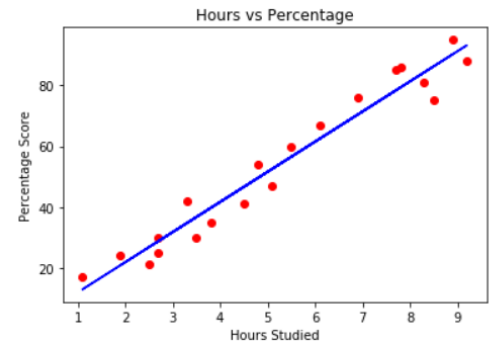
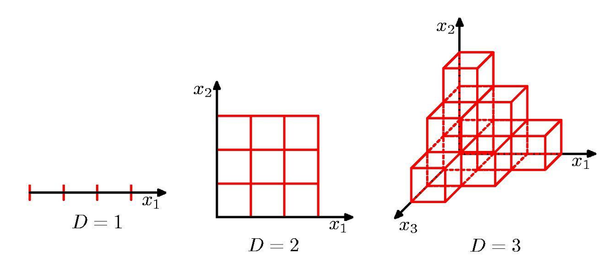

 Appunti Intelligent System 

# Slide 1

## Natural interaction

Deep learning will be able to understand language, reason and interact with humans in a more natural way. Speech recognition softwares now has an error rate < 5%, naturally interacting with a computer will not happen until we reach error rates of < 1%.

## AI bias

An algorithm is blocked onto something that is meaningless and could potentially give you very poor result. Ex: predict fractures from X-ray images in data from multiple hospitals. The X-ray machine have different characteristics in the image they produce, and some hospitals have a much larger percentage of fractures than other.

# Slide 2

## What is a NN?

A trained model of machine learning is just a non-linear function.

X = input vector

Out = output value / vector / matrix

Out = F(X)

## Feature space 

The network is not "thinking" but "measuring"

## Human brain: Gestalt

Gestalt means pattern or form, a part of the image can be "just noise" for one pattern or "the most salient feature" for other

## What is an artificial intelligent system?

The key is evolution: it is intelligent if it can learn (even if only in a limited sense) and/or get better in time.

**AI:**
is the broader concept of machines being able to carry out a tasks in a smart way.

**ML:**
a current application of AI where machines access to data and learn for themselves

**According to Engelbrecht:**

- artificial neural networks
- artificial immune system
- evolutionary computing
- fuzzy system
- swarm intelligence

## Main drivers for AI

- More data
- Better models and algorithms
- powerful GPU accelerators
- The designer's brain

# Slide 3

## ML taxonomy

- **supervised:** training data includes desired outputs (labels)
- **unsupervised:** training data does not include desired outputs
- **semi-supervised:** training data includes a few desired outputs
- **reinforcement:** rewards from sequence of actions

### Supervised learning

#### Regression

It predicts continuous valued output. Compute the probabilistic relationship between variables for the purposes of forecasting or prediction. It is used to predict numerical data instead of labels. Ex: predicting a person's income from their age, education, etc...

### Classification

It predicts discrete number of values processing the input. The data is categorized under different labels, and then the labels are predicted from the data. Ex: classifying emails as spam or not spam.

### Unsupervised learning

#### clustering

The task of partitioning the dataset into groups, called clusters of similar items.

#### Reinforcement learning

Reinforcement learning models use opposite dynamics such as rewards and punishment to "reinforce" different type of knowledge.

## Deductive VS Inductive learning

**Deductive:**
starting with a set of rules and inferring new rules that are more efficient in the context to be applied.

**Inductive:**
is based on inferring a general rule from datasets of input-output pairs (the majority of AI methods)

# Slide 4

## When to use ML

When:

- the nature of computations required in a task is not well understood
- or there are too many exceptions
- or known algorithms are too complex or inefficient

## the 3 main components of ML

- **Representation:** decision trees, neural networks, vector machines, etc...
- **Evaluation:** accuracy, precision, entropy, etc..
- **Optimization:** greedy search, gradient descent, etc...

# Slide 5

## ML workflow

- Get data
- Clean, prepare and manipulate data
- Train model
- Test data
- Improve

## Application of the Occam's razor

Do not waste your design and processing time. Start with classical models like KNN and DTree, use a simple neural networks before to consider deep learning models.

## Edge &larr;&rarr;Fog&larr;&rarr;Cloud

## IoT data sources

- Passive data
- Active data
- Dynamic data

### Passive data sources

Is the ability to consume data from sensors that don't actively comminicate. Passive data does not means a passive data / IoT application since the sensors need to be managed, the application must take on the logic needed to do so.

### Active data sources

It means that the sensor is typically streaming data. Data can't be lost, it must be correctly parsed from the stream, and placed in the correct format for both storage and processing.

### Dynamic data sources

The most sophisticated and most useful. These are devices with sensors that communicate dynamically with IoT applications. These types of sensors carry out a "conversation" with IoT applications and they can alter the data that devices produce to meet the needs of the target IoT application. Here we can implement AI systems!

## IoT categories

**Consumers:**
Non real time, non deterministic, a human interacting with a device. Ex: smart cars, phone, watches, etc...

**Commercial:**
Ex: inventory controls, medical devices, etc...

**Industrial:**
Resilience to failures, security, machine to machine communications. Ex: robots, electric meters, etc...

# Slide 6

## Security of IoT

The number and the devices and their relevance poses huge security problems. Complex interactions bring to more security issues. We need secure device, secure communications, secure cloud and secure lifecycle management.

## AI + IoT

AI can be used to transform IoT data into useful information for improved decision making processes, thus creating a fundation for newer technology such as IoT data as a service.
The system needs to be:

- robust: self calibration, self diagnosis...
- secure: information are provided with accuracy and assessing quality of the data
- scalable: supporting different protocols and data format

AIoT technology create data "learning machines" that can be applied to enterprise and industrial data. Real time data is a key value of all AIoT use cases and solutions.
Ex: a camera system equipped with computer vision capability can use facial recognition to identify customers. The system gather intel about customers (gender, product preferences...), analyzes the data to predict customer behavior for marketing.

# Slide 7

## Data collection

It is the first step of the ML workflow. Is the process of gathering and measuring information on targeted variables in an estabilished system. The primary source for training are public dataset.

Garbage in &rarr; Garbage out, no neural network can save you from bad data.

## Clean, prepare and manipulate data

It is the second step of the ML workflow. From noisy, messy and unstructured data to the perfect dataset for ML. 

### Data wrangling

The data wrangling problem is growing as different types of unstructured data or data in varying formats are pouring in from sensors, online and from traditional databases. All these data must be cleaned up and organized before data analytics / classifier / regressors models can be applied.

#### data wrangling tasks

- **discovering:** understand data
- **structuring:** as the data is gathered from different sources, the daa will be present in various shapes and sizes
- **cleaning / removing:** should be performed to increase performance
- **enrichment:** extract new features or data from the given data

## Data pre-processing

Is a technique that is used to convert the raw data into a clean data set.
Preprocessing includes:

- data cleaning
- data integration
- data transformation
- data reduction

Data preprocessing and visualization are useful to find:

- outliers
- errors
- missing values
- different scales
- distributions
- cluster in the dataset
- salient features

#### missing data

**Ignoring records:**
Ignoring the missing record it is the simplest and efficient method for handling the missing data. This method should not be performed when the umber of missing values are immense or when you lose the pattern in your data.

**Filling the missing values manually:**
One of the best-chosen methods, it is time-consuming on a large database.

**Filling using computed values:**
The missing values can be also be computed with mean, mode or median of the observed given values, you can also find the most simila column and use it to copy the missing values. Another method is use values compute by a ML algorithm, the drawback is thath it can generate bias within the data.

## Structured data vs unstructured data

**Structured data:**
Usually resides in relational databases, this format is searchable both with human generated queries and via algorithms. It includes email, social media, website, media, buisness app.

**Unstructured data:**
Is everything else, it has internal structure but is not structured via pre-defined data models or schema. It includes satellite imagery, scientific data, digital surveillance, sensor data.

It is not strictly compulsory to have structured data to achieve ML.

# Slide 8

## Data knowledge spectrum

## Number of parameters of NNs

This NN has $4\cdot5+5 = 25$ neron weights to be fixed. How many input data are need in the training to fix properly weights?

### Degree of freedom in general

The degrees of freedom  for a given problem are the number of indipendent problem variables which must be specified to uniquely determine a solution.
$$
Degrees\;of\;freedom = Par-Data
$$
It is not always true in complex non linear system.
If the are to many parameters the learning method is not capable to deal with all the elements / parameters you inserted into the model with the given dataset. The model is not optimal, some parts are useless or you can get a bad behaviour.

## Data leakage

Data leakage is responsible for the cause of invalid ML model due to the over optimization of the applied model. If a specific featue is not present at the time of training in the dataset then data leakage will be introduced within the model.
Ex: you want to add to your dataset the concentration of OrmonX to predict CancerZ but OrmonX is not almost present in the training dataset.

Another problem is statistical independence between training set and test set.

**Minimizing data leakage:**

- feature selection
- outlier detection and removal
- projection method
- scaling of selected features
- dividing the dataset

# Slide 9

## Label errors in datasets

Sources:

- human error
- labels are not updated
- data automatic conversion errors

Problems:

- same input vectors with opposite labels
- unlabeled imputs

## Similarity checks in dataset

Too similar data / images are providing little more information and make the dataset more complex to be handled.
We think about similarity but often the metrics is the distance:

- Distance &rarr; zero so Similarity &rarr; $\infty$ 
- Distance &rarr; $\infty$ so Similarity &rarr; zero

Often a real conversion is not necessary, just use the distance and find the proper thresholds.

### Basic metrics

- Euclidean
- Manhattan
- Cosine

### Chebyshev distance

Gives the largest magnitude among each element of a vector.
$$
d(p,q)=max\{|p_i-q_i|\}
$$

### Minkowski distance

$$
D(X,Y) = \left( \sum^n_{i=1}|x_i-y_i|^p \right)^{\frac{1}{p}}
$$

- p = 1 is the manhattan distance
- p = 2 is the euclidean distance
- p = $\infty$ is the Chebyshev distance

## Image similarity

### Keypoint matching

1. Compute the abstraction of the image information and make a local decision at every image point to see if there is an image feature of the given type existing in that point
2. Compare the decteded feature between two images

These methods can match images under different scales, rotations, and lighting but the running time is $O(n^{2m})$

### Histogram comparison

1. Compute the histogram of the image
2. create a feature vector
3. use a metric to compare images

This method is very fast but shape and pattern are not relevant, it is too simplistic

### Image hash

1. The image is reduced down to a small hash code by identifying salient feature in the original image file and hashing a compact representation of those features.
2. Count the number of bit positions that are different

### Cross correlation

Is a measure of similarity of two series as a functino of the displacement of one relative to the other. The function returns the similarity value and the position with the better alignment of the two images

# Slide 11

## Exploratory data analysis

Step 2 of ML workflow

### Basic function for descriptive statistics

- mean 
- median
- std
- min
- max

#### Shape of the distributions

## Feature engineering

Step 2 of ML workflow

- create features
- check how the features work with your model
- improve your features

Optimizing:

- one single feature at time
- all features at time
- all dataset at time

### Normalization

The goal of normalization is to transform features to be on a similar scale. This improves the performance and training stability of the model.

- **scaling to a range:** $x'=(x-x_{min})/(x_{max} - x_{min})$
- **clipping:** if the dataset contains extreme outliers, cap all feature values above/below a certain value to a fixed value
- **log scaling :** $x' = log(x)$   When a hanful of your values have many points, while most other values have few points
- **z-score:** $x' = (x-\mu)/ \sigma$

# Slide 12

## Benefits of data visualization

- allows users see server different perspectives of the data
- makes possible to interpret vast amount of data
- offers the ability to note exceptions in the data
- allows the user to analyze visual patterns in the data
- equips users with the ability to see influences (outputs vs inputs)

# Slide 14

## PCA

The Principal Component Analysis is an effective method for reducing a dataset's dimensionality while keeping spatial characteristics as much as possible.

## Encoding

**Integer encoding:**
Each unique category value is assigned an integer value. Ex: "red" &rarr; 1, "green" &rarr; 2, "blue" &rarr; 3.
Integer values have a order relationship, ML algorithm may be able to understand this relationship.

**One-hot encoding:**
For categorical variables where no such ordinal relationship exists, allowing the model to assume a natural ordering between categories may result in poor performance.

# Slide 15

## Dataset partitioning

If the whole dataset is used for both build and then validate the model we have no clue about how the model will behave with new, unseen cases.
There are two main problems:

- underfitting: the model is poorly adjusted to the data, suffering from high error both in training and test data
- overfitting: the model is too tightly adjusted to data offering high precision to known cases but behaving poorly with unseen data.

Performing a bad partitioning will surely lead to incomplete and/or biased behavior about the model being evaluated.

**Train data:**
For design activities like number of neurons / layers, normalization, PCA, feature engineering etc...

**Test data:**
only for generalization error, no design here.

### Cross validation

#### k-fold cross validation

1. the original data is randomly partitioned into k equal size folds or partitions
2. from the k partitions, one is retained as the validation data for testing the model, and the remaining k-1 subsamples are used to build the model
3. the process is repeated k time with each of the k subsamples used exactly once as the validation data

Stratified k-fcv places an equal number of samples of each class on each partition to mantain class distributions equal in all partitions.

#### 5 $\times$ 2 cv

1. the whole dataset is randomly partitioned in A and B
2. the model is built using A and validated with B
3. then the process is reversed with the model built with B and tested with A
4. the partitioning process is repeated as desired

#### Leave one out

If you are underfitting using k-fcv and $5 \times 2$ CV. Is a k-fcv where k = number of examples in the dataset.

## Accuracy assessment

Used in step:

- 3: by the learning method
- 4: by you on test data
- 5: by you for improving the whole systems

General expression: $y = f(x, params)$
Regressor: $y \in R$
Classifier: $y \in Z$

## Errors assessment

### Regressors

- **R-squared (R2):** rapresent the proportion of variation in the outcome
- **Root mean squared error ( RMSE):** the average error performed by the model, squared so is less sensitive to outliers
- **Mean absolute error (MAE):** less sensitive to outliers compared to RMSE

### Classifiers

- **Accuracy:** ratio of predicted results that match the expected results, bad for unbalanced dataset
- **Confusion matrix:** true negative, false negative, true positive, false positive
- **ROC:** curve plotted as true positive rate against the false positive rate

# Slide 17

## Bayes optimal limit

Given a specific problem/dataset, over time, making more attempts and using new techniques the ML algorithm can outperform humans but to a limit.

## Eager vs Lazy learner

**Lazy learners:**
Lazy learners simply store the training data and wait until a testing data appear. When it does, classification is conducted based on the most related data in the stored training data. Compared to eager learners, lazy learners have less training time but more time in predicting. Ex: k-nearest, svm, kernel machines, etc...

**Eager learners:**
Eager learners construct a classification model based on the given training data before receiving data for classification. It must be able to commit to a single hypothesis that covers the entire instance space. Due to the model construction, eager learners take a long time for train and less time to predict. Ex: decision trees, FFN, CNN, etc,...

## Curse of dimensionality 

As dimensionality D increases, the amount of data needed increases exponentially with D.

## kNN

- not based on neural techniques
- deterministic
- minimum number of parameters required
- simple learning

kNN is a debug tool for controlling the data and the accuracy of the other classifier, it tends to the Bayes optimal classifier.

**Requires three things:**

- set of stored records
- distance metric to compute distance between records
- the value of k, the number of nearest neighbors to retrieve

**To classify unknown record:**

- compute distance to other training records
- identify k nearest neighbors
- use class labels of nearest neighbors to determine the class label of unknow n record

**Value of k:**

- if k is too small, knn is sensitive to noise points
- if k is too large, the neighborhood may include points from other classes

**knn issues:**

- speed
- curse of dimensionality
- bias: features scale, choiche of distance function, choice of k

# Slide 18

## Feature selection

Irrelevant or partialy relevant features can negatively impact model performance.
Plus:

- reduces overfitting due to noise
- can improve accuracy
- reduces training time

Wrapper methods measure the “usefulness” of features based on the classifier performance. In contrast, the filter methods pick up the intrinsic properties of the features (i.e., the “relevance” of the features) measured via univariate statistics instead of cross-validation performance. The third class, embedded methods, are quite similar to wrapper methods since they are also used to optimize the objective function or performance of a learning algorithm or model. The difference to wrapper methods is that an intrinsic model building metric is used during learning.

## Feature extraction: PCA

It's all about finding a proper shifted, rotated, sub space describing the data. It is unsupervised (using no labels). Given data points in a d-dimensional space, project into lower dimensional space while preserving as much information as possible.

## Dimensionality reduction

- **LDA:** find a linear combination of features thath characterizes or separates the classes
- **t-SNE:** non linear technique for dimensionality reduction
- **ICA:** used in signal processing

