# Introduzione corso

## Prerequisiti

Nozioni di reti di calcolatori da laurea triennale, nozioni da reti wireless e mobili consigliate ma non obbligatori.

## Esame

Scritto su tutto il programma con domande aperte

## Orario lezioni

- ​	Martedì 14.45 – 16.15, Aula 302
- ​	Venerdì 14.45 – 16.15, Aula B2

### Materiale corso

- ​	Slide Ariel
- ​	Non ci sono libri
- ​	Risorse varie…

## Argomenti corso

### Caratteristiche challenged networks

reti caratterizzate da sfide di progettazione, diverse dalla reti internet che usano TCP, UDP.

**Composte da dispositivi:**

- Piccoli e mobili
- Eterogenei
- Limited MTU (dati nel body e header dei pacchetti)
- Con poche risorse: bandwidth, memoria, batteria…

**La topologia delle reti cambia frequentemente:**

- Le batterie si scaricano: per risparmiare batteria i dispositivi vanno in standby
- Gli ostacoli o le interferenze possono bloccare la comunicazione wireless
- Nodi sparsi/mobili: potrebbe non esserci una sequenza di nodi intermedi che permette di individuare una rotta tra sorgente e destinazione

### Reti single-hop

Un apparato utilizza una tecnologia wireless per comunicare con una stazione base (antenna). La stazione media tutte le comunicazioni, due apparati non comunicano direttamente tra di loro, ma con la stazione base

### Reti multi-hop(MANETs)

Non c’è un infrastruttura fissa, i nodi comunicano direttamente tra di loro. Se i nodi sono troppo lontani utilizzano i nodi intermedi come router.

C’è un assunzione fondamentale: i nodi sono mobili, ma poco mobili. I protocolli di instradamento individuano una sequenza di hop tra sorgente e destinazione, ma per tutto questo tempo, e nel tempo di invio dei dati da sorgente a destinazione la topologia non cambia. Questo non vale nelle challenged network.

### Tipi di challenged network

- ​	WSNs
- ​	Reti urbane
- ​	VANETs
- ​	IoT
- ​	Industry 4.0
- ​	DTNs

## WSNs – GoodFood

Usata nei vigneti.

WSN con sensori distribuiti ad alta densità sul territorio. I sensori realizzano una rete wireless. Non tutti i sensori sono uguali, ci sono micro-server che comunicano con una rete fissa.

**Funzionalità:**

- Sincronizzazione: per comunicare ed etichettare i dati in modo temporale
- Sicurezza: il canale wireless è broadcast
- Localizzazione: localizzare i sensori per dare un senso alla misurazioni senza usare un GPS
- Comunicazione data-centric invece che address-centric: si comunica con sensori caratterizzati da una certa posizione o che ha raccolto certi tipi di dato. Non si comunica per indirizzo perché dall’indirizzo non si ricava la posizione
- Scalabilità a $O(10^3)$
- Self-organization: I sensori si organizzano da soli quando la topologia cambia per avere tolleranza ai fallimenti
- Eterogeneità dei nodi

## Urban / participatory sensing

Costituite dagli smartphone degli utenti.

### MetroSense projects

Collezione di progetti di urban sensing:

- Usare il microfono e il GPS del telefono per produrre commenti in una certa posizione
- Rilevazione agenti chimici
- Percorsi per ciclisti e sciatori

## Vehicular ad-hoc NETwork (VANETs)

Reti costituita da dispositivi wireless a bordo di veicoli e di apparati a lato strada.

### Traffic information system

Utilizzare le informazioni raccolte dai veicoli:

- Per migliorare il calcolo delle rotte dei navigatori
- Condividere percorso taxi con più utenti
- Ridurre inquinamento
- Semafori smart
- Gestione incidenti
- Informazioni su bar / ristoranti / monumenti / attrazioni
- Tracciare veicoli rubati
- Gestire flotte (es. pescherecci)

### UAV

Unmanned ground/aerial vehicle, droni utilizzati per varie applicazioni:

- Ricerca persone disperse
- Trasporto defibrillatore
- Consegna pacchi

## Delay tolerant Networks

Reti con nodi molto mobili e sparsi, molto probabile che siano partizionate. Sono delay tolerant perché dal momento in cui si rileva un dato, a quando viene consegnato può passare molto tempo.

### Deep-space networks

Ci sono due tipi di satelliti: satelliti in orbita bassa, satelliti in orbita geostazionaria. Quelli in orbita bassa hanno una velocità di orbita diversa da quella della rotazione terrestre, quindi i satelliti non puntano sempre nello stesso punto e anche la distanza dagli altri satelliti cambia. Quindi anche queste costellazioni di satelliti sono considerate reti challenged.

### Underwater networks

Sensori trasportati dall’acqua, o sensori ancorati ma che cambiano la loro profondità nel tempo. Usati per monitorare correnti oceaniche o inquinamento acqua.

### DAKNET

La zona è così rurale che non c’è nessun ritorno economico a tirare i cavi per creare la rete internet. Ci sono dei villaggi e dei pullman o delle macchine che si muovono da un villaggio all’altro.

Nei villaggi ci sono dei kiosk su cui si possono lasciare messaggi, quando il pullman passa per un villaggio si sincronizza con il kiosk, rilascia i messaggi per quel villaggio, e carica i messaggi memorizzati nel kiosk.

### Reti opportunistiche

Le reti opportunistiche sono costituite solo da apparati wireless portati dagli utenti. Wireless = WiFi / Bluetooth. Lo scambio di dati avviene quando c’è un’opportunità.

Idea futura per il 5G: offloading, se due dispositivi sono nella stessa cella, al posto che comunicare con la stazione base i due dispositivi comunicano direttamente tra di loro. L’antenna è usata solo per coordinare.

## Internet of Things

Interazione di “smart things” tra loro e con utenti.

# Slide 2

## Comunicazione sincrona

Normalmente la comunicazione è sincrona, il client può assumere che il server sia presente durante la comunicazione. C’è un rendezvous: cioè un appuntamento. Il server esegue il suo compito assumendo che il client rimanga presente in comunicazione fino alla risposta del server.

Randezvous stretto: dopo avere inviato i dati, il client rimane bloccato in attesa della risposta.

## Comunicazione asincrona

In reti challenged la propagazione del messaggio può richiedere tempo, perché non c’è sempre un cammino tra sorgente e destinazione. I nodi intermedi memorizzano il messaggio fino a quando non si presenta la possibilità di inoltrare il messaggio. Quindi è impossibile instaurare una comunicazione sincrona. La sorgente non fa affidamento sul fatto che la destinazione sia raggiungibile, e non aspetta la risposta perché potrebbe richiedere molto tempo.

La rete ha:

- Memoria
- Intelligenza &rarr; sa che i messaggi vanno instradati al momento opportuno, è completamente diverso da quello che fa un router normale. Il router usando la tabella di routing se scopre che non c’è un cammino per la destinazione scarta il pacchetto

Soluzione:

- Middleware per i messaggi
- Gestore di code virtuale e distribuite

## Content centric networking (CCN) / Interest centric networking (ICN)

In questo paradigma ciò che  interessa al client è raggiungere un server qualunque in cui ci sia il contenuto cercato, non uno specifico server.

Il middleware aggiunge intelligenza alla rete, gestisce l’instradamento togliendo il carico al client di capire dove sono i dati.

La sorgente fa broadcast per un nome di contenuto, cerca di raggiungere tutti i dispositivi di rete raggiungibili.

**Esempio rete LAN multihost (con più router):**

In una LAN il client invia in broadcast una query a tutti i router della rete. In HTTP la query contiene l’indirizzo del server e il nome del contenuto, nel CCN la query ha solo il nome di contenuto. Un problema è trovare uno schema di naming senza ambiguità che permette al middleware di trovare il contenuto richiesto. L’interest arriva a tutti i router che hanno un middleware, i quali cercano la copia del contenuto migliore (sul server più scarico/vicino). Le tabelle di instradamento memorizzano dove sono allocati i contenuti.

Il nome del contenuto può essere impreciso, e indicare genericamente un tipo di contenuto (keyword), il router con la sua routing table, capisce dove potrebbero essere i contenuti richiesti. L’interest ritorna un solo contenuto, trovata la direzione l’interest è reinoltrato solo in quella direzione, anche se altre destinazioni hanno un interest con una parte in comune.

**Architettura:**

- Rete tradizionale
- Middleware (CCN)
- Applicazioni

Un nodo che è nel mezzo della CCN vede arrivare degli interessi, capisce che può reinstradare gli interessi verso un nodo che probabilmente contiene il contenuto. Il nodo ricorda l’interest che ha ricevuto. Quando riceve una risposta (anche molto più tardi perché la rete è delay tolerant), la inoltra alla sorgente. Nel frattempo, il nodo può ricevere un altro interest che cerca lo stesso contenuto. In questo caso non reinoltra la richiesta perché sta ancora aspettando la risposta precedente. Memorizza comunque chi gli ha fatto questa richiesta. Quando il nodo riceve la risposta la reinoltra a tutti i nodi che avevano fatto la stessa richiesta.

## Schema CCN

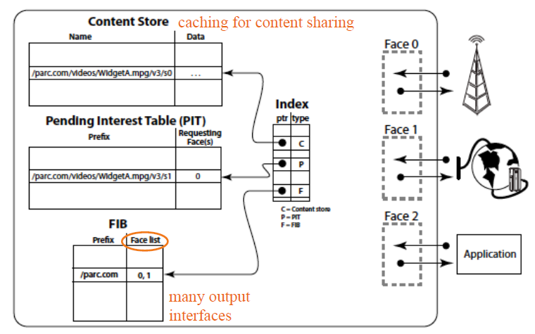

### Interfacce

- Face0: interfaccia del nodo che può comunicare con un antenna
- Face1: interfaccia che parla con la rete wired classica
- Face2: interfaccia che parla con un applicazione  ci sono nodi che forniscono servizi e contemporaneamente sono dei router

### Strutture dati

**Content store**:

è una cache. Il nodo può mettere contenuti a disposizione della rete e rispondere a interessi. Inoltre, memorizza anche i contenuti ricevuti perché c’è alta probabilità che questi contenuti vengano richiesti di nuovo. In questo modo può rispondere agli interest anche se non è il creatore originale del contenuto. Il content store non è first in - first out, la memoria è limitata, alcune contenuti sono scartati secondo politiche di caching come least recently used  o least frequently used.

**Pending interest table (PIT):**

Se l’interest non è memorizzato nel contest store, il nodo va a guardare nel PIT che contiene i contenuti reinoltrati nel passato. Se il contenuto è stato già reinoltrato, il nodo sta aspettando una risposta, allora alla prossima interest per lo stesso contenuto non inoltra di nuovo il contenuto.

**Forwarding information based (FIB):**

Se il contenuto non è né nel content store né nella PIT, allora devo guardare la FIB, analogo di una tabella di routing per CCN. C’è una tabella con due colonne. Si fa il matching del contenuto usando i prefissi nella colonna di sinistra, si usa la colonna di destra per reinoltrare l’interest. Per un prefisso ci possono essere più interfacce che fanno match, ma in questo paradigma la politica di reinoltro è unicast. Se ricevo due interest verso la stessa interfaccia posso fare round robin per scegliere invece un’altra interfaccia. Fare il round robin permette di avere più possibilità di ricevere una risposta perché nelle reti challenged non è detto che ci sia un cammino verso la destinazione. E inoltre si bilancia il carico facendo lavorare tutti i nodi.

## Publish-subscribe

Definizione: disaccoppiamento delle entità comunicanti, in tempo, spazio e sincronizzazione.

### Entità

- **Publisher:** qualcuno che produce contenuto e li marca per indicare cosa contiene. Il publisher manda il contenuto al broker. Il publisher non sa quanti subscriber leggono il loro contenuto.
- **Subscriber:** è il consumatore di contenuto. Il subscriber dice al broker che lui è interessato a contenuti targati in un certo modo. Aspetta poi passivamente che il broker gli porti i contenuti interessati.
- **Broker:** riceve le notifiche di pubblicazione dai publisher, riceve le notifiche di subscribe/ unsubscribe dai subscriber. Quando c’è un contenuto interessante per i subscriber inoltra il contenuto. Il paradigma non definisce che tipo di entità è il broker, dipende dalla rete.

Il broker può essere un entità distribuita, anche l’intera rete.

## Topic-based P/S

Paradigma basato su argomenti. Il publisher etichetta i contenuti generati con il nome di un canale, i subscriber possono sottoscriversi a questi canali che sono predefiniti. I canali possono poi essere organizzati in una tassonomia, una struttura ad albero in cui i nodi ai livelli più bassi sono più specializzati rispetto ai padri.

Esempio tassonomia: Animale &rarr; mammifero &rarr; canidi

Nel caso ci sia una tassonomia il subscriber quando sottoscrive ad un canale, sottoscrive anche a tutti i nodi discendenti.

### Codice sottoscrittore

~~~java
```
Subscriber sub = new heatingSubscriber();
EventService.subscribe(sub, "heating");

public class Heating implements Subscriber {
	public void notify (Object o) {
		if(o.temperature < 19°C)
			heating_ON();
    }	
}
~~~

Codice sottoscrittore interessato a tutti i dati che riguardano la temperatura. Il metodo notify() risveglia il sottoscrittore, l’oggetto Object o contiene un campo temperatura

### Scelta della tassonomia

Prima dell’installazione del sistema bisogna già decidere i topic dei dati, la struttura dei dati, e la tassonomia. 

**Tassonomia a granularità grossolana:**

Se la granularità è molto grossolana il sottoscrittore riceverà anche contenuti che non interessano, questo è un problema nelle challenged network perché solitamente sono reti wireless broadcast, e si va a intasare il canale con dati inutili. Inoltre, gli apparati sono spesso a batterie. Il costo della computazione è basso, ma è alto il costo della comunicazione, ed aumenta in base alla distanza

**Tassonomia a granularità fine:**

Ci sono tanti livelli nella tassonomia, ciò permettere ai sottoscrittori di agganciarsi anche ad un livello profondo. In questo caso c’è il rischio di dover costringere un subscriber a sottoscriversi a tanti canali alternativi. Questo può portare di nuovo ad avere dati inutili.

## Content-based P/S

Sono definite delle caratteristiche che vengono analizzate dai broker della rete, che in questo modo decidono se inoltrare o meno i dati. Il sottoscrittore non si iscrive ad un canale ma a contenuti con determinate proprietà (etichette, metadati XML).  

### Codice sottoscrittore

```java
String criteria = (temperature < 19°C)
Subscriber sub = new heatingSubscriber();
EventService.subscribe(sub, **criteria**);

public class Heating implements Subscriber {
	public void notify (Object o) {
		heating_ON();
	}
}
```

- Si definisce un criterio, il broker invia il dato al subscriber solo se la temperatura è minore di 19 gradi.
- Si crea il subscriber
- Il subscriber si iscrive ai contenuti che soddisfano il criterio
- Si sveglia con notify, il dato è già stato processato dal broker

### Vantaggi/svantaggi

Non c’è da definire una tassonomia a priori, che se dovesse essere cambiata andrebbe riscritta per tutti i sensori che spesso sono difficili da raggiungere. Vanno definite delle proprietà ma è più facile che definire una tassonomia. 

## Type based P/S

Le informazione sono caratterizzate da una certa struttura.

In un linguaggio object oriented sono classi. Il publisher genera un istanza di una classe, il subscriber si iscrive per ricevere oggetti appartenenti a specifiche classi

### Codice sottoscrittore

```java
public class Sensor { public float temperature; }
public class User { public float minT, maxT; }
public class Heating implements Subscriber**** {

public void notify (Sensor o) {
	if(o.temperature < 19°C)
		heating_ON();
	}
}
```

- La classe utente è un partecipante al sistema, potrebbe controllare la temperatura dal telefono
- La classe Heating controlla gli attuatori del riscaldamento (i subscriber)
- Il publisher è un sensore di temperatura o il device utente
- Il subscriber riceve sia la temperatura che le preferenze dell’utente.
- Nel caso di questa notify() sono ricevuti solo oggetti di classe sensore, non quelli della classe utente. Questo perché è un attuatore che accende/spegne riscaldamento in base alla temperatura dell’ambiente

### Vantaggi / svantaggi

Nel modello type-based si sta già pensando a livello di classe, mentre nel content base si pensa in astratto, è più flessibile. Dato che il codice va realizzato in modo da poter essere scritto nella memoria limitata dei sensori, l’approccio type-based permette di sapere a priori quando occuperà il codice.

## Utilità w.r.t. sensori

- **Topic:** arrivano tutte le informazioni di temperatura anche se sono di valore maggiore della soglia
- **Type:** arrivano tutte le informazioni dei sensori, anche se sono di valore > soglia perché si ricevono tutti gli oggetti di un tipo
- **Content:** arrivano solo le informazioni di interesse  risparmio in banda ed energia

# Slide 3

## I sensori

Un sensore è un apparato il cui primo obbiettivo è rilevare dei segnali / grandezze dal mondo fisico in cui è immerso e quantificarli. Spesso hanno un sistema operativo ad hoc come TinyOS, Contiki o RIOT. Sono sistemi piccoli e molto performanti, focalizzano l’attenzione sul risparmio energetico

### Componenti sensori

- **Sensori veri e propri:** oggetti in grado di misurare una grandezza fisica analogica
  - Passivi: rilevano qualcosa nell’ambiente senza interagire con 	esso
  - Unidirezionali: puntano in una direzione (videocamera)
  - Omnidirezionali: misurano in tutte le direzioni (termometro, 	microfono)
  - Attivi: agiscono sull’ambiente per rilevare una grandezza (sonar, 	radar)
- **ADC:** analog digital converter, trasforma il segnale analogico in segnale digitale tramite campionamento
- **Micro-controller:** elaborazione
- **External-memory**
- **Transceiver:** radio dell’apparecchio, trasmette e riceve
- **Power source:** spesso la batteria

## Altri dispositivi

**Attuatore:** dispositivo che può modificare l’ambiente in cui è immerso (es. irrigatori, impianto di riscaldamento, motori...)

**Sink:** è un apparato che riceve tutte le informazioni rilevate dai sensori. Possono esserci più sink nell’ambiente che raccolgono dati differenti o dati dello stesso tipo. Il sink è cablato alla rete fissa e porta i dati raccolti su un cloud o ad un server. Possono elaborare parzialmente o totalmente i dati.

**Coordinatore:** in base a quello che ha raccolto dai sensori il coordinatore può mandare agli attuatori o anche ai sensori per farli funzionare in modo differente (es. aumentare la frequenza delle misurazioni)

Sensori, attuatori e sink possono essere fissi o mobili. Se sono fissi i rapporti di vicinato cambiano solo in base al duty cycle. Se sono mobili ci sono più complicazioni perché la mobilità contribuisce alla variazione della topologia.

## Caratteristiche dispositivi in WSN

Apparati anche di piccole dimensioni:

- Alimentati a batteria, rete elettrica o tramite l’ambiente (energia eolica, solare…)
- Distribuiti sul territorio da monitorare. I sensori sono sparpagliati in modo casuale, i sink e i controllori vengono piazzati. Spesso i sensori sono difficili da raggiungere una volta piazzati (es. in fondo al mare, in montagna...)
- Muniti di interfaccia wireless per la comunicazione

  - Eterogenei, i sink sono diversi dai sensori

  - Diversa disponibilità di energia e quindi diversa potenza di antenna
  - Tecnologia wireless diversa (bluetooth, wifi...)


## Multipath fading

Tutte le volte che si usa un canale wireless utilizzando un’antenna multidirezionale, il segnale viene propagato in tutte le direzioni. Il segnale può essere attenuato anche dall’acqua (quindi anche le persone, la pioggia), oppure essere riflesso dal metallo (quindi anche le automobili).

Quando le onde sono riflesse si ha il multipath fading, cioè un segnale riflesso si sovrappone al segnale originale. Se i due segnali hanno fase diversa, la somma / sottrazione algebrica delle onde sinusoidali può indebolire o interferire con il segnale originale.

## Requisiti WSN

### Accuratezza monitoraggio

Le reti di sensori misurano determinate grandezze ambientali, per poi memorizzare i valori o avvisare quando viene superato un valore di soglia preimpostata. Questi sensori devono essere piazzati in modo che tutta la superficie sia coperta dai sensori, in modo tale da verificare eventi con alta probabilità (non 100% perché i sensori si possono rompere).

### Autonomic / self organization

La rete deve potersi riconfigurare da sola perché spesso i sensori di cui è composta sono spesso difficili da raggiungere. I nodi devono quindi controllare costantemente le condizioni della rete di sensori (chi sono i vicini). Nella progettazione si deve pensare in anticipo agli ostacoli ambientali (alte temperature, campi elettromagnetici) per scrivere codice sui sensori che permette loro di riconfigurarsi.

### Energy saving

Se non possiamo collegare i sensori alla rete elettrica è saggio prevedere di costruire la parte di computazione e comunicazione per risparmiare energia. Il consumo energetico è estremamente dipendente dall’hardware e dall’uso del dispositivo. 

Nella pila ISO /OSI ogni livello è una scatola nera che offre servizi al livello superiore e chiede servizi a quello inferiore. C’è un livello di astrazione tale per cui i livelli più alti sono indipendenti dall’implementazione dei livelli più bassi. Ad esempio ai livelli superiori non interessa se la comunicazione è fatta su fibra ottica o cavo in rame. Nelle WSN questo non è più vero. Lo stack va progettato tutto insieme, si sceglie l’hardware in base alle necessità della rete, e si sviluppa il software in base all’hardware. Si parla di cross layer design. Alcuni hardware consumano di più a mandare che a ricevere, altri consumano uguale. Il costo della computazione invece è poco più alto rispetto a quando il sensore dorme. 

Ci sono però diversi **livelli di dormienza**:

- **completamente dormente** &rarr; CPU e radio ferma, c’è solo un orologio che fa interrupt per svegliare il sensore
- **dorme poco** &rarr; il sensore tiene acceso il transceiver in modalità ricezione solo per i messaggi indirizzati a lui. Ogni scheda di rete ha un indirizzo fisico. Quando arriva un nuovo messaggio,la scheda di rete controlla il mac address di destinazione, se corrisponde al suo, la scheda di rete fa un interrupt per svegliare il sensore.
- **Ricezione promisqua** &rarr; qualunque dato ricevuto indipendentemente dal mac address di destinazione. Il dato viene ritenuto di interesse per il sensore che viene svegliato.

É vero che in dormienza i sensori consumano molto meno rispetto a riceve e trasmettere, ma quando il sensore viene risvegliato il consumo di energia ha un picco di risveglio che poi si abbassa per tornare sul livello di consumo energetico medio 

### lifetime sensori e rete

È meglio massimizzaere il lifetime della rete e non del singolo sensore. I sensori fanno anche da router usando energia ( un po’ come nelle content sensor network)

Se voglio massimizzare il consumo il sensore comunica solo con il sink, e trascura qualunque messaggio che non ha il suo MAC address (nodo selfish). Facendo così non fa da router. Il problema che in questo modo gli altri sensori potrebbero essere costretti a usare più energia per comunicare a distanze più grandi. Quindi potrebbe essere interessante massimizzaere la vita della rete e non del singolo sensore. Ogni sensore fa da router, e tutti durano di più. Load balancing, non c’è nessun sensore che lavora più di altri. Se un sensore finisce l’energia potrebbe diventare un punto di partizione nella rete. E potrebbe esserci un buco nel monitoraggio.

### Scalabilità

Tanti nodi, alta densità.

### Robustezza

I sensori devono resistere a polvere, pioggia, alta temperature. La rete deve prevedere sensori che si scaricano, vengono spostati o vengono rotti. Il sistema deve essere robusto per adattarsi in modo autonomo, mantenendo l’accuratezza di monitoraggio. 

### Consenso

Il dato riportato da un singolo sensore non è significativo come l’insieme dei dati raccolti da tanti sensori.

## Deployed vs unplanned

### Deployed

Si studia come è fatta l’area in cui si vogliono piazzare i sensori e si sceglie accuratamente la posizione di ogni sensore. È un problema di max/min, si vogliono massimizzare / minimizzare delle grandezze rispettando dei vincoli.

Esempio: massimizzare accuratezza e contemporaneamente minimizzare  costi.

Normalmente queste reti sono composte da oggetti piuttosto grandi.

### Unplanned

I sensori sono sparpagliati a caso nell’area interessata.

I colori indicano l’interesse di rilevare un certo evento. Rosso indica che è più importante rilevare l’evento in quella zona.

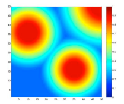

L ’immagine indica come sono seminati i sensori. Ci sono chiazze di sensori più dense che corrispondono alle aree della figura precedente. Lo sparpagliare non è perfetto perché è importante creare anche dei cammini di comunicazione tra una chiazza e l’altra per fare arrivare i dati al sink.

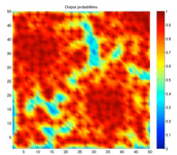

## Localizzazione e sincronizzazione

Se i sensori sono stati piazzati si conoscono le coordinate, ma se i sensori sono stati sparpagliati devono essere in grado di individuare la loro posizione, assoluta (lat / long) oppure in relazione ad altri sensori.

Il GPS non funziona indoor, in foreste, strade strette e consuma molta batteria.

I sensori possono usare il segnale dei sink che sono dispositivi fissi per capire dove sono. Utilizzando caratteristiche come il tempo di propagazione del segnale.

La posizione è utile per aggregare i dati dei sensori vicini, e per capire in che posizione un certo evento si sta verificando.

Può essere utile tenere sincronizzati gli orologi dei sensori per etichettare i dati anche in modo temporale. 

## Naming e routing

Non interessa andare verso un certo indirizzo o sensore, ma andare alla ricerca di un dato o inviare un dato ad un dispositivo sink qualsiasi che può raccogliere i dati.

## Range di comunicazione

### Hop lunghi

i sensori comunicano con il sink, i sensori lontani dal sink esauriranno prima le batterie perché la potenza necessaria di trasmissione varia con il quadrato della distanza. C’è probabilità di interferenza tra i sensori che stanno comunicando contemporaneamente.

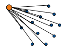

### hop corti 

i sensori comunicano con altri sensori, i sensori lontani dal sink comunicano comunque a breve distanza. Il problema è che un singolo sensore potrebbe diventare un punto fragile perché magari si trova al centro e riceve messaggi da tutti gli altri sensori.

Ci sono due soluzioni a questo problema:

1. potenza variabile per la trasmissione
2. aggregazione dei dati con ottimizzazione della bandwidth usata

 Rispetto agli hop lunghi c’è meno probabilità di interferenza. Gli hop corti sono preferiti nelle WSN.

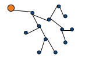

## Data Aggregation

- **La stessa segnalazione può arrivare da più sensori** → in questo caso si eliminano i duplicati inviando al sink una volta sola l’evento
- **Gli eventi possono essere** **aggregati** → Certe volte non è necessario inviare tutti i dati che sono stati letti, alcuni nodi potrebbero fare un’aggregazione dei dati processandoli prima di inviarli al sink. Il tipo di processing dipende dal tipo di rete che si vuole sviluppare (es. un sensore riceve tante misure di temperature, fa media e varianza e inoltra solo quei dati).

Messaggi piccoli vs grandi → i messaggi piccoli sprecano meno energia e hanno maggior possibilità di successo. C’è poca probabilità di sovrapporsi con altri nodi se comunico per un breve intervallo temporale.

I nodi devono essere capaci di aggreggare → application awareness, intelligenza dei nodi per capire la semantica dei dati che sono trasmessi nella rete

## Aspetti secondari WSN

### Database

Raccogliere dati prodotti dai sensori, deve essere distribuito, i sensori devono memorizzare poche informazioni.

### Sicurezza

Il canale è wireless e il segnale può essere recepito da tutti quelli che sono in grado di sentirlo. La soluzione più semplice è cifrare i dati, un’operazione molto costosa in termini di computazione e memoria.

### Attuatori

Possono influenzare il sensing dei sensori mobili. 

## Nodi statici vs mobili

**Ferries** → nodi di cui si può controllare il movimento per facilitare la comunicazione o per coprire aree rimaste scoperte o partizionate. I ferries potrebbero anche non cambiare la topologia della rete, ma essere dei magazzini di dati che vengono spostati da un’area all’altra (paradigma store, carry and forward).

Il movimento dei ferries può essere periodico e regolare, controllabile, o libero perché installati su veicoli o animali. Nell’ultimo caso la topologia cambia in modo quasi imprevedibile, c’è una maggiore probabilità di partizione della rete.

## Architetture gerarchiche

### Three-tiered architecture

- **Sensori** → alcuni sono più potenti in termini di calcolo, antenna e disponibilità energetica

- **Microserver** → maggiore capacità di comunicazione, OS tradizionale, più risorse in batteria (Raspberry e simili). Si parla di edge computing, elaborazione ai limiti della rete di sensori

- **Sink** → punto di connessione con internet. Invia i dati o riceve direttive come query di dati, cambio di configurazione dei sensori, ecc...

  

# Slide 4

## Tassonomia minima

### Hierarchical

Ci sono nodi di tipo diverso, alcuni più potenti. Sono reti più semplici da implementare perché spostano la computazione e il coordinamento su nodi centrali nella rete

### Reverse path forwarding

L’approccio ipotizza che il sink fa delle query che informano la rete di sensori di quello che il sink vuole sapere e quanto spesso. Le query fanno dei cammini che sono ricordati dai nodi, quando un nodo ha una risposta per la query inoltra seguendo il cammino al rovescio. Questi approcci assumono implicitamente che il canale sia full duplex (bidirezionali). 

### Cost – field

I sensori sono preprogrammati per riportare il verificarsi di un evento, seguono dei cammini precostituiti.

## Assunzione sul sistema

- Sensori distribuiti sul territorio in modo unplanned, i sensori conoscono la loro posizione che però non è usata nell’algoritmo di instradamento ma solo per arricchire il dato rilevato.
- I sensori hanno ID univoci e orologi sincronizzati
- I sensori non sono mobili
- La rete è densa, ci sono path ridondanti, topologia significativamente connessa
- I sensori sono intelligenti, sanno ragionare sui dati
- Il canale è wireless, le antenne sono omnidirezionali
- Preferiti hop corti

## Directed diffusion

### Assunzioni sui dati

Rientra nella categoria del reverse path forwarding.

Il sink invia delle query chiamate interest. Si dice interest e non query perché il sink annuncia di essere interessato ad un evento, ma non sa se lo riceverà mai. Diverso dalle query che spesso ritornano qualcosa

L’interest è composto da coppie attributo valore:

```
type = four-legged animal

interval = 20 ms

rect = [-100, 100, 200, 400]

timestamp = 01:20:40

expiresAt = 01:30:40
```

- **type** → dice al sensore di stare attento ad un tipo di evento. Se un sensore non è capace di rilevare un evento farà solo da relay per i messaggi. Il duty cycle è diverso per i sensori che fanno solo relay
- **interval** → i sensori riconfigurano il loro duty cicle per misurare l’evento con la frequenza definita
- **rect** → area rettangolare in cui cercare l’evento. Le coordinate non sono coordinate assolute di lat e long, ma relativa ad un punto della rete
- **timestamp** → quando è stato fatto l’interest, gli orologi devono essere sincronizzati
- **expiresAt** → quando scade l’interest

### Caratteristiche

**canali bi-direzionali**

**reverse path forwarding**

Gli interest installano informazioni di stato nei sensori che ricordano quali cammini sono stati seguiti dagli interest. 

**Reactive routing**

Non vengono mantenute informazioni di instradamento o rapporti di vicinato. Le informazioni di stato vengono costruite solo nel momento in cui il sink inoltra un interest, e i cammini sono mantenuti attivi solo fino a quando questo interest è attivo. Le sorgenti sono i sensori, le destinazioni sono i sink.

**Flooding degli interessi**

L’algoritmo si divide in due fasi. La prima è la diffusione degli interest. Il flooding è la politica di instradamento più banale: la sorgente invia il messaggio a tutti i suoi vicini, i nodi che ricevono il messaggio lo reinoltrano a tutti i suoi vicini escludendo il nodo da cui l’ha ricevuto.

Pila ISO/OSI:

1. Livello fisico
2. Livello data link → mac address / hardware address
3. Livello rete → indirizzo ip
4. livello trasporto → numero di porta

L’hardware address può essere unicast o broadcast. L’informazione ad alto livello della interest che è destinata solo ad alcuni sensori, deve essere instradato usando l’hardware address. In queste reti wireless non si può fare il flooding classico diffondendo il segnale a tutti i sensori. Questo perché il segnale non è detto che venga rilevato da tutti i nodi a causa del duty cycle.

Non è obbligatorio fare tutte le comunicazione broadcast, quando le notifiche tornano indietro si indirizza a livello due unicast. 

Il cammino di ritorno non è unico ma si memorizzano tutti i cammini possibili, e poi si usa il migliore per il ritorno.

**Aggregazione dati**

In direct diffusion i sink possono essere multipli, possono diffondere interessi diversi ma c’è la possbilità che sink differenti diffondano lo stesso interest. 

I sensori capiscono la semantica dei dati fanno aggregazione filtrando i duplicati o adattando la frequenza con cui i dati vengono mandati verso i sink.

Crying baby → se due sink diversi chiedono lo stesso evento a frequenza diversa i sensori devono adattare il duty cycle per quello a frequenza maggiore. I sensori che hanno visto solo l’interest con frequenza più bassa però non vogliono riceve l’interest a frequenza più alta. A questi sensori può arriva una notifica ogni *n* notifiche, oppure si fa la media di *n* notifiche e la si invia al sensore.

### Diffusione interesse

Il sink periodicamente guarda nella propria cache gli interessi attivi, rimuove quelli scaduti e invia ogni interesse attivo. Dato che il broadcast non è completo a causa del duty cycle dei sensori, è fondamentale diffondere l’interest periodicamente in broadcast.  Il primo broadcast usa un alto interval (ogni quanto un sensore invia il dato) perché il sink non sa se l’evento a cui è interessato succederà mai. Infatti l’azione di risveglio del sensore è molto costosa. Nel momento in cui l’evento si verifica e un sensore comincia a inviare notifiche al sink, allora il sink cambia l’intervallo di monitoraggio dei sensori.

Ogni nodo ricorda l’interest nella cache, ogni entry è formata da:

- interest
- timestamp → da quando l’interest è attivo
- serie di gradienti:
  - neighbor ID (mac address)
  - data rate → rate a cui devo mandare le notifiche al vicino
  - duration → ricavata da timestamp e expiration.  	

I gradienti sono i nodi vicini a cui devo reinoltrare un evento. Posso avere più vicini e inviare i dati ad ogni vicino con data rate diverso

Gli interest duplicati sono scartati mantenendo solo l’ultimo. Nel gradiente non c’è scritto l’identificatore e la distanza dal sink. Un nodo che riceve un evento sa solo quali sono i next hop, non sa nemmeno se il next hop è un sink.

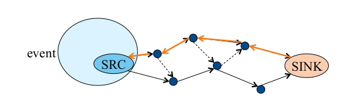  
A destra c‘è il sink, il cerchio azzurro è la zona in cui il sink vuole monitorare l’evento. SRC è la sorgente dell’evento

1. il sink manda l’interest la prima volta ai propri vicini
2. i primi 2 nodi capiscono che non possono acquisire quella misurazione, si ricordano però come gradiente il sink, senza sapere se è davvero il sink o semplicemente un nodo intermedio
3. Il nodo in alto fa broadcast
4. I due sensori a sinistra ricevono l’interest, e ricordano come next hop il sensore precedente
5. Anche il sink riceve il broadcast dell’interest, è implicitamente un ACK per il sink. In più si vogliono supportare sink multipli. Anche il sink arancione ha una cache e si ricorda che se riceve un interest lo rimanda al sensore.
6. Anche il sensore in basso a sinistra del sink fa la stessa cosa di quello in alto
7. Il nodo centrale avrà due gradienti, ma lo stesso interest. Non fa di nuovo flooding perché è un duplicato.
8. I nodi facendo broadcast costruiscono anche dei gradienti all’indietro, sembrano controintuitivi ma in realtà servono per diffondere i dati anche a sink diversi.

### Routing eventi

I gradienti indicano quali vicini sono interessati ad un evento, possono essere sink o nodi più vicini ai sink. C’è ridondanza di gradienti e di path per essere in grado di riparare cammini rotti verso il sink.

Quando si verifica un evento per cui esiste un interesse attivo:

- Il nodo SRC manda l’evento a tutti i vicini di cui ha un gradiente,  è una trasmissione broadcast con indirizzi unicast
- Il sensore più vicino alla SRC riceve l’evento e lo rimanda al nodo alla sua destra e a quello in basso.
- La freccia è tratteggiata perché il nodo in basso ha già ricevuto la notifica dell’evento da SRC. Scarta quindi l’evento, sa che il cammino verso l’alto è più lento
- Così via per tutte le frecce tratteggiate
- Il sink riceve eventi da entrambi i cammini, uno dei due sarà migliore perché più veloce o con meno interferenze.

### Varianti per la diffusione interest

- **Flooding →** versione base
- **Routing geografico →**  Al posto che mandare in flooding l’interesse lo mando in direzione dei sensori più vicini all’area target per l’interest
- **Direzione cached da risposte precedenti →** se il sink in passato aveva diffuso lo stesso interesse, e quella volta aveva scoperto che le notifiche gli arrivavano solo da un sottoinsieme di nodi, allora il sink può ricordare questo sottoinsieme e in futuro diffondere l’interest solo ai vicini da cui ha ricevuto risposte la volta precedente

### Rinforzo positivo

Il sink manda un interest unicast soltanto al vicino da cui riceve meglio le notifiche, con un interval più basso e quindi una frequenza più bassa. Il nodo vicino al sink sceglierà il proprio vicino migliore e manda indietro il nuovo interest del sink. Si continua fino alla sorgente, rinforzando solo il cammino migliore.

### Rinforzo negativo

#### Potare path peggiori 

1. **soft state** &rarr; i record vengono mantenuti solo per il loro lifetime, le informazioni obsolete vengono cancellate automaticamente. Il sink potrebbe voler monitorare un evento ad una frequenza maggiore, ma non aggiorna il cammino peggiore i cui nodi manterranno la frequenza dell'interest originale. I nodi scartano i gradienti quando scadono, il cammino peggiore lentamente andrà a spegnersi. 

2. **hard state** &rarr; le informazioni di stato sono ricordate in un nodo fino a quando non vengono esplicitamente aggiornate o cancellate. Il sink manda di nuovo una interest unicast per lo stesso evento, nella stessa area di interest ma sul cammino peggiore richiede una frequenza molto maggiore. Il cammino non si spegne, il sink riceverà ogni tanto delle notifiche duplicate dal cammino peggiore e migliore.
3. **hard state violento** &rarr; Il sink manda un interest con timestamp e expire uguali. La durata quindi sarà 0, e tutti i nodi a cascata cancelleranno il corrispondente gradiente.

Spegnendo tutti i nodi del cammino peggiore si risparmia batteria, lasciandoli accesi a frequenza alta si mantiene un cammino di backup nel caso ci fossero problemi con il cammino peggiore.

Se il sink non riceve più notifiche dal suo vicino preferito significa che:

1. l'evento nell'area di interesse non si sta più verificando
2. l'evento sta continuando a verificarsi, i sensori continuano a mandare le notifiche ma queste si perdono perché un nodo non riesce più a comunicare con il suo vicino

Queste due situazioni sono indistinguibili per il sink, quindi avere dei cammini di backup è utile per distinguere le due situazioni. Il sink può rinforzare positivamente un cammino di backup e rinforzare negativamente il vecchio cammino migliore.

#### Rinforzo da nodo intermedio

Se un nodo sul cammino migliore non riceve più notifiche dal suo vicino per qualunque motivo, ma ricevere notifiche a bassa frequenza da un nodo sul cammino peggiore, allora il nodo va a rinforzare il suo vicino. Il cammino migliore devia, anche gli altri nodi scelgono i loro nodi migliori fino ad arrivare alle sorgenti

### Downconvert

Se un sensore qualsiasi riceve le notifiche con un determinato rate non necessariamente deve mandarle a tutti i suoi gradienti con lo stesso rate, ma adatta la sua frequenza a quella scritta all'interno del gradiente. Il nodo fa una media o manda solo l'ultima notifica in unicast. I nodi utilizzano dei beacon, messaggi che notificano i vicini di essere svegli, i nodi fanno quindi un invio unicast a tutti i gradienti svegli.

### Prestazioni direct diffusion

#### Consumo energia

- flooding &rarr; consuma tanto perché si fa sempre broadcast

- multicast su albero ottimo &rarr; Prestazione misurate considerando un albero ottimo con radice nel sink, non realizzabile nella realtà delle WSN. Consuma più energia della diffusione perché non viene fatta nessuna aggregazione intermedia

- diffusion &rarr; I nodi buttano via le notifiche duplicate e fanno aggregazione

  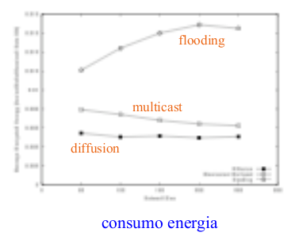

#### Latenza

- flooding &rarr; alta latenza con tanti nodi. Anche se facendo flooding si percorre anche il canale migliore c'è una broadcast storm di messaggi che interferiscono uno con l'altro
- multicast &rarr; latenza più bassa
- diffusion &rarr; trova cammini molto simili a quelli dell'albero ottimo

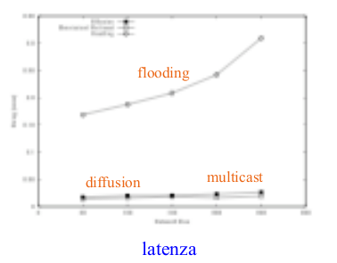

### Prestazioni direct diffusion ottimizzato

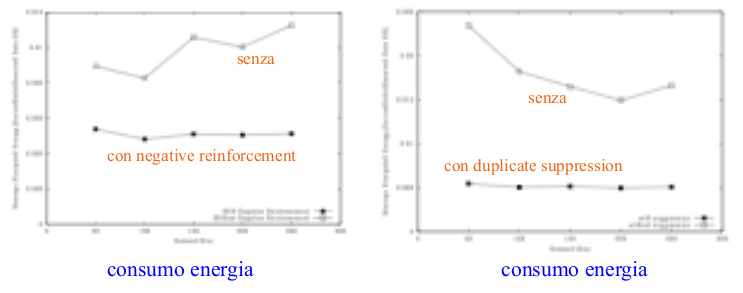

## Cost vs revers path

Direct diffusion rientra nella categoria di reverse path forwarding, non tollera la mobiltà dei sink, e c'è il rischio di formare loop. È utile quando ci sono tante interest con tanti eventi. L'altra categoria è cost-field-based di cui fa parte RUMOR.

pochi eventi ma tante query &rarr; rumor routing <br>tanti eventi ma poche query &rarr; direct diffusion

## Rumor routing

Rumor routing invece di fare un flooding dei dati fa una diffusione casuale dell'informazione  che un evento di un certo tipo si è verificato. Se il sink vuole saperne di più può seguire un cammino con un certo costo che porta all'evento. 

- area grigia &rarr; evento in corso
- nodi neri &rarr; hanno rilevato l'evento in corso
- nodo grigio &rarr; sink che manda query
- nodi bianchi &rarr; non hanno nessuna informazione sull'evento in corso
- doppio tratto &rarr; path per le query

I nodi in modo random decidono se mandare la notifica che l'evento si sta verificando o meno. Se stanno per mandare l'evento scelgono di nuovo in modo random un vicino. Il nodo vicino riceve l'agente (evento), e quindi sa che a distanza 1 da lui c'è un certo tipo di evento ma non conosce i dettagli. Anche questo nodo scegli un nuovo vicino random a cui inviare l'evento, la distanza è 2.

Le query inviate dal sink viaggiano in modo random, fino a quando arrivano ad un nodo che sa che si è verificato l'evento. Da questo punto in poi la query non viaggia più in modo casuale ma segue il percorso fino al nodo che sa tutto di quell'evento. La risposta con la descrizione completa dell'evento viaggia al contrario fino al sink. Le analisi statistiche dimostrano che la probabilità di intersezione tra una query ed un nodo che conosce dov'è un evento non è bassa. 

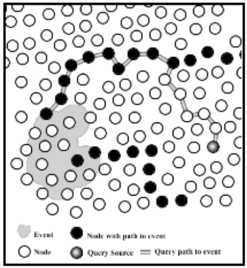

I sensori conoscono a livello di sviluppo dell'applicazione quali grandezze misurare. I nodi mantengono una lista dei vicini scoperti attraverso beaconing. I nodi si alternano in due stati:

- invio beacon con MAC address
- ascolto dei beacon 

### Pseudocodice data diffusion

```pseudocode
//il sensore controlla se c'è almeno un evento attivo tra tutti quelli   che deve notificare
upon event do
	//S stato del sensore, R variabile random
	//la funzione f1 decide se generare o no un agente
	take (bool) retransmit decision D <-- f1(S,R);
	//se la decisione di trasmissione è si, il messaggio M può
	//contenere tutti gli eventi che si stanno rilevando
	//se gli eventi sono tanti e non ci stanno nel frame dell'evento
	//metto solo gli eventi con priorità più alta, oppure vado a
	//rotazione, notificando ogni volta eventi diversi
	if (D = Yes) then
		generate agent M <--list of recent events;
		//inoltra ad una sola destinazione casualmente usando una
		//funzione f diversa da f1, i neighbors sono i vicini
		//svegli in questo momento
		forward to 1 dest <-- f({neighbors},R);
		
//il nodo riceve un evento
upon reception of an agent do
	//il nodo si ricorda da quale vicino ha ricevuto un agente
	//se il payload dell'agente non è pieno può crescere di dimensione
	//passando attraverso altri nodi
	//questo è possibile fino a quando non si raggiunge il massimo
	//payload
	synchronize events on agent w/ local events;
	//Il TTL è un numero di hop
	if (agent's TTL expired) then discard agent;
	//se il TTL non è scaduto il nodo sceglie in modo random un vicino
	//usando una funzione f' diverso da f, e una variabile R' che può
	//essere diversa da R
	//i vicini sono quelli attivi da cui sono stati ricevuti beacon
	else forward to 1 dest <--
		f’({neighbors},R');
```

### Diffusione dei dati

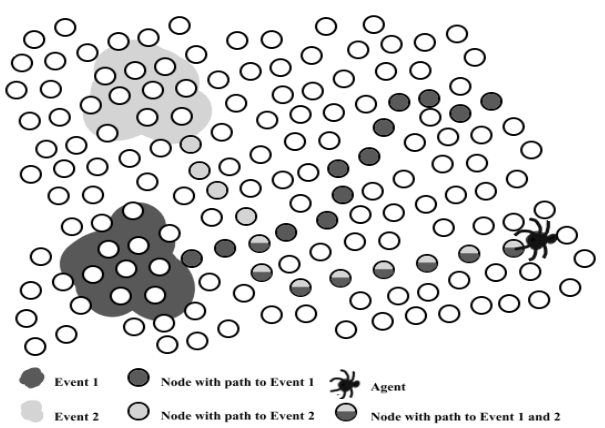

- Un sensore nella chiazza grigio chiaro ha fatto partire un evento
- l'evento viene inoltrato verso il basso, i nodi ricordano che si è verificato da qualche parte un evento grigio chiaro
- il punto bicolore è un sensore su cui è avvenuta una sincronizzazione perchè ha ricevuto sia l'evento chiaro che quello scuro. Memorizza quindi le strade per entrambi gli eventi
- Il sensore bicolore reinoltra entrambi gli eventi

### Blocco dei loop

Se una chiazza non è piccolissima l'evento potrebbe essere inoltrato da più nodi. Un nodo potrebbe ricevere due eventi uguali con distanza differente.

- A ha ricevuto un evento E1 e sa che può raggiungerlo da C con 4 hop

- A ha ricevuto un evento E2 e sa che può raggiungerlo da C con 2 hop

  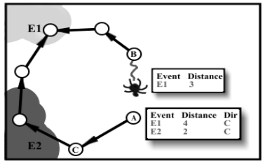

- B ha ricevuto E1 e lo reinoltra ad A

- Il nodo A capisce che il cammino per l'evento E1 passando per B è più corto di quello passando per C e memorizza solo il più breve. Con questo meccanismo si tagliano i loop

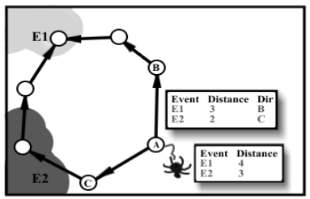

### Pseudocodice query processing

```pseudocode
when (event must be looked for) do
	//destinazione scelta in modo casuale con una funzione f
	//solo tra i vicini attivi
	send query to a dest <-- f({neighbors},R);
	//si attende risposta per un tempo T, il nodo può riprovare,
	//fare il flooding della query oppure non fare nulla
	if (no reply within T) then retry or flood
		query or resign;
//un nodo che riceve una query fa una reply che viaggia in un cammino a
//rovescio
upon reception of a query do
	//se ho info sull'evento
	if (info on event held locally) then reply;
	//se il TTL della query è scaduto allora la query viene buttata
	else if (query's TTL expired) then discard
		query;
//se la query è stata ricevuta da un nodo che conosce il cammino per 
//l'evento non si tocca più il TTL perchè non va fatta scadere
//nel cammino all'indietro
else if (path to event) then route query;
//se non ho un cammino per l'evento reinstrado la query casualmente
else send query to a dest <-- f({neighbors},R');
```

### Rumor routing + Directed diffusion

Si parla di insuccesso quando si hanno falsi positivi o falsi negativi:

- **Falso positivo**: al cercatore viene detto che l'evento c'è, ma questo non è vero. L'evento è terminato ma le informazioni sono obsolete

- **Falso negativo**: al cercatore viene detto che l'evento non c'è, ma non è vero. Questo è più grave in situazioni come incendi, alta temperatura in un reattore nucleare ecc...

Nel rumor routing il falso negativo si presenta quando le query girando a caso non arrivano mai ad un nodo che ha informazioni sull'evento. Il sink sta cercando di capire se si sta verificando un evento, e ha sentore che l'evento ha alta probabilità di essere in corso. Se l'evento è molto critico, il sink incomincia ad utilizzare un approccio rumor routing per diffondere le query. Mando una query, aspetta, non ha risposta. Il tempo può essere quanto serve al messaggio per coprire un numero di hop pari al diametro della rete. Se non riceve risposta rimanda di nuovo la query. Dopo un numero basso di tentativi in rumor routing unicast, il sink come ultima risorsa prova un approccio directed diffusion che comporta un flooding della query. Tutti quelli che hanno visto passare l'evento reinoltrano la query in flooding. È un trade off perchè all'inizio si risparmia energia con il rumor, se non si ottiene risposta si rinuncia al risparmio energetico usando il flooding. Rumor routing come directed diffusion non è un approccio standard ma solo un'idea generale a cui sono aggiunte vari meccanismi di ottimizzazione.

### Massimizzare probabilità intersezione

#### Usando la posizione

Query e agenti viaggiano in modo ortogonale così da incrociarsi sempre. Le query verso E/O, le notifiche verso N/S. I sensori hanno delle bussole che indicano il Nord, e usano antenne unidirezionali.

- **Usando hardware specifico** &rarr; Le antenne del trasmittente e ricevente devono essere allineate e sfasate al massimo del 15% rispetto alla linea retta, e devono essere in line of sight. Le antenne devono poter essere ruotate a nord o sud usando un motore. 
- **Usando i beacon** &rarr; I sensori si scambiano dei beacon con cui oltre al proprio mac address indicano anche la loro posizione stimata. Un nodo che deve inoltrare un messaggio riceve i beacon dai nodi vicini e in base alla sua posizione stima qual è il nodo che si trova più in direzione Nord di lui. Ovviamente i sensori non sono esattamente allineati. Questo non costa nulla sulla rete che si sta considerando perchè i beacon vengono già mandati nel rumor routing standard.

#### Con la lista dei vicini

I nodi cercano di instradare query ed agenti in linea retta senza usare la posizione. Il nodo processa il messaggio che riceve, aggiunge il suo mac address e lo reinoltra ad un vicino non elencato nella lista. Si cercano di evitare loop nel percorso dell'agente. Così però è poco preciso perchè i messaggi non viaggiano per forza in linea retta. Per migliorarlo il nodo carica nel messaggio anche il mac di tutti i suoi vicini. In questo modo i vicini in comune tra sorgente e nodo successivo non riceveranno mai il messaggio che tenderà a muoversi in linea retta. C'è un problema. Normalmente l'agente viaggiando viene arricchito da altri eventi che i nodi intermedi hanno visto. Si mette tutto nel payload. Si fa questo perchè una query che si muove random trova più facilmente una traccia. Il mac address è 48 bit, c'è quindi un problema di spazio, si sceglie al posto che caricare altri eventi sull'agente di caricare i mac address dei vicini. Come trade off si può riservare nel payload solo una parte per i vicini e si usa una politica first in - first out per quando il payload è pieno, sperando che ormai l'agente sia lontano da quei nodi.

#### Modalità promisqua

In modalità promisqua un sensore viene sempre risvegliato quando riceve un messaggio. Si può sfruttare questa modalità per aumentare la probabilità di intrecciare una query. Un nodo sceglie un vicino come next hop specificando il suo mac address. Il nodo successivo scopre di essere il destinatario confrontando il mac address del messaggio con il suo e reinoltra l'agente. Gli altri nodi intorno invece non sono destinatari ma ricevono comunque l'agente, ricordano nella loro cache che hanno visto l'agente e non reinoltrano l'agente. Normalmente la query deve incrociarsi esattamente su un nodo che ha portato l'agente. Con la modalità promisqua invece la query può arrivare ad un nodo che non ha ricevuto l'agente, ma che ha in cache il mac address di un nodo che è davvero sul path, e quindi gli reinoltra la query. Questo approccio è ottimo ma i nodi consumano più energia perchè si svegliano ogni volta che ricevono un messaggio anche se non è indirizzato a loro. 

### Rumor: prestazioni

I costi sono inferiori a direct diffusion con flooding delle query. Il costo di un flooding è $O(n^2)$ con $n$ numero di nodi. Nel caso di rumor routing il costo dipende dal numero di eventi e di query. Agenti e query devono avere un TTL grande (1000/2000 hop) per permettere di diffondere lontano l'evento e facilitare l'incrocio agente - query. 

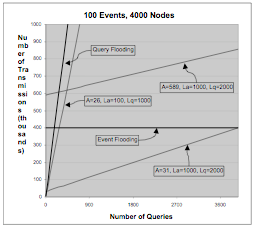

Le righe non grassetto riportano tre etichette:

- La &rarr; lifetime agente come numero di hop
- Lq &rarr; lifetime query come numero di hop
- A &rarr; numero di agenti che si creano con un evento

# Slide 5

## perchè un trasporto affidabile?

La ridondanza di sensori, cammini e notifiche permette di avere una buona affidabilità dell'invio dei dati da sensori a sink. Non è vero il caso contrario da sink a sensori.  

### Perchè non TCP ? 

- **problema nell'indirizzamento multicast** &rarr; tutte le destinazioni riportano alla sorgente se hanno ricevuto una porzione dei dati tramite ack. La sorgente deve quindi conoscere l'insieme delle destinazioni a cui sta parlando, ciò è impossibile con i protocolli visti in precedenza.
- **ACK è un problema** &rarr; i canali sono broadcast e proni a interferenze, gli acknowledgment potrebbero distruggersi in prossimita della sorgente. TCP funziona con l'idea di worst case, se arriva qualcosa di incomprensibile o non arriva niente ritrasmette il messaggio. La ritrasmissione consuma inutilmente batteria
- **Soglia di ritrasmissione** &rarr; Se uno o più nodi destinatari non ricevono le informazioni che la sorgente sta cercando di trasmettere in modo affidabile vanno ritrasmesse. Si può usare una soglia per cui se x nodi su n non ricevono le informazioni, la sorgente reinoltra in unicast agli n - x nodi. Se invece sono tanti i nodi che non hanno ricevuto i dati allora invia di nuovo il messaggio in broadcast a tutti. Il problema è individuare la soglia x e decidere quanto tempo aspettare gli ack. Con un retrasmission timeout basso il sink potrebbe non aspettare gli ack che stanno arrivando lentamente, con un timeout alto fa perdere molto tempo. È difficile stimare un retrasmission timeout su un insieme di destinazioni a distanza diversa e con un duty cycle diverso
- **TCP assume che la rete funzioni** &rarr; di solito in una rete normale un dato non arriva a destinazione perchè c'è congestione. Nelle WSN non dipende dalla congestione ma da un tasso di errore alto su canale, da collisioni tra le trasmissioni e da interferenze esterne. Nel frequency hopping il range di frequenze di trasmissione è diviso in sottorange. Sorgente e destinazione si accordano su come usare le frequenze saltando da una frequenza all'altra in modo random. Se c'è un interferenza su un sottorange di frequenza si ritrasmette subito su un'altra sottofrequenza. In generale è meglio essere più aggressivi che più lenti

## Influenza tasso di errore

$p$ è il tasso di errore sul canale. Con un cammino di $n$ hop tra sorgente e destinazione la probabilità che non subisca errore è $(1-p)^n$ . Gli hop sono piccoli quindi i cammini sono lunghi. Invece che operare end to end si opera hop by hop. Si cerca di essere affidabili sul singolo hop. Si usano NACK al posto che ACK, tutti i nodi che ricevono non comunicano, i nodi che non hanno ricevuto fanno NACK. I NACK agiscono su un singolo hop, si recupera subito senza instradare il NACK fino alla sorgente.

## Pump slowly, fetch quickly (PSFQ)

- **Fetch quickly** &rarr; se qualcosa va storto si cerca di recuperare (fetch) il messaggio che non è arrivato a destinazione
- **Pump slowly** &rarr; iniettare i dati nella rete lentamente in modo da permettere ai nodi che non ricevono i messaggi di avere il tempo di recuparare prima di immettere nuovi dati nella rete

### Obbiettivi

- **affidabilità nella consegna dei dati** &rarr; TCP opera in una rete in cui ci sono pochi fallimenti, per questo motivo effettua solo un numero piccolo di ritrasmissioni dopo le quali riporta errore al livello applicazione. Quello che fa PSFQ è usare un numero massimo di tentativi di recupero, se un nodo non riesce a recuperare e l'inconsistenza provvoca problemi nella rete allora si spegne.
- **minimo supporto dall'infrastruttura sottostante** &rarr; non chiede niente di particolare al livello 3, solo di sapere fare broadcast one-hop e un routing qualsiasi come Directed Diffusion.
- **minimo scambio di messaggi di controllo per reliability**
- **correttezza anche con qualità di canale molto bassa**
- **garanzia sulla latenza di consegna** &rarr; calcolare un upperbound sulla latenza di consegna

### Nomenclatura

Gli *user node* sono le sorgenti dei dati, i sensori sono i *destinatari*. 

L'algoritmo è organizzato in 4 fasi:

1. **PUMP** &rarr; user node invia dei dati con numero di sequena (come in TCP). I dati non sono per forza inviati con un unico messaggio. I dati sono inviati "lentamente" in modo che si riesca a recuperare un eventuale errore prima del dato successivo
2. Il nodo riceve un messaggio con numero di sequenza $m-1$ e poi $m+1$, capisce che gli manca $m$
3. **FETCH** &rarr; il nodo si attiva per eseguire il recupero su singolo hop usando un negative ack, cioè una richiesta di rinvio del dato. Si cercano di evitare nack duplicati.
4. **REPORT** &rarr; richiesto da user node in situazioni particolari, come quando c'è un singolo messaggio e quindi non si può rilevare la loss, oppure si perdono tutti i messaggi alla fine della trasmissione

### Fase di PUMP

Lo usernode invia i dati in broadcast a tutti i suoi vicini (1 hop) con periodo $T_{min}$. Tutti i nodi che ricevono un messaggio lo memorizzano nella cache. I messaggi hanno un numero di sequenza per ricomporre i dati e accorgersi di mancanze nella sequenza. Il messaggio rimane in cache per il tempo necessario agli altri nodi di rilevare un fallimento. Quando un nodo riceve  un nuovo messaggio se lo ha già in cache lo scarta, altrimenti lo salva ed esegue un broadcast del messaggio dopo un tempo random tra $[T_{min}, T_{max}]$. Il messaggio può già essere in cache perché i dati sono mandati in flooding da ogni nodo intermedio. Quando i nodi reinoltrano il messaggio sono sempre più lenti dell'user node che invia con frequenza $T_{min}$. Nelle specifice PSFQ non ci sono indicazioni sui valori di $T_{min}$ e $T_{max}$. Un nodo è certo che il messaggio successivo arriverà come minimo dopo $T_{min}$, se il messaggio arrivato gli fa capire che c'è un gap, il nodo sa che può recuperare il messaggio mancante in almeno $T_{min}$ tempo.  $T_{min}$ evita quindi di diffondere i messaggi troppo velocemente cioè fa controllo di flusso. In TCP c'è la windows di ricezione. $T_{max}$ serve per evitare collisioni data l'alta densità di nodi. Se X manda un messaggio ai vicini Y, W Z, questi nodi potrebbero essere in raggio di comunicazione tra loro. Se Y, W e Z facessero broadcast istantaneamente dopo aver ricevuto il messaggio, queste trasmissioni si distruggerebbero tra loro. Con un tempo random tra $T_{min}$ e $T_{max}$ i nodi sono desincronizzati nell'invio. La differenza tra $T_{min}$ e $T_{max}$ è in relazione con il numero di nodi vicini che potrebbe aver un nodo. PSFQ è fatto in modo da poter stimare il tempo necessario per inviare i dati in tutta la rete.  La massima latenza è $D(n) = T_{max} \cdot n \cdot num_{hop}$ con $n$ il numero dei dati, $num_{hop}$ gli hop per la destinazione più lontana.

### PSFQ: Invio dei NACK

Il messaggio 3 viene perso, A si accorge solo quando riceve il messaggio 4. A entra in fase di recupero del messaggio 3, ma evita di reinoltrare il messaggio 4. Questo perché A deve già mandare un broadcast con un NACK dicendo che manca il 3, se mandasse anche il messaggio 4 anche B e C si accorgerebbero della mancanza del 3 e farebbero broadcast di NACK del 3 che potrebbero scontrarsi tra loro e distruggersi. 

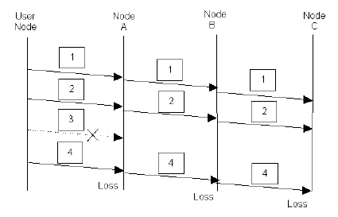

### Fase di FETCH

#### analisi statistica

Si definisce $\Phi(i)$ la probabilità di successo alle i-esima ritrasmissione.
$$
\Phi(0) = 0
$$

$$
\Phi(1) = (1-p)^3
$$

Se sto ritrasmittendo c'è stato un errore, la probabilità che arrivi il messaggio successivo è $(1-p)$ e questo fa notare che c'è un gap. Il nodo manda un NACK che ha probabilità $(1-p)$ che arrivi ad almeno un nodo con il messaggio che sto cercando, e ancora $(1-p)$ perché il nodo che ha il messaggio ricercato deve reinoltrarlo al nodo che ha fatto fetch. 
$$
\Phi(n) = (1-p)^2[1-p- \Phi(1) - \Phi(2) - ... - \Phi(n-1)]
$$
$(1-p)^2$ perché  $(1-p)$ arrivato con successo il messaggio successivo, moltiplicato per $(1-p)$ il NACK

$1-p$ è la probabilità di successo della i-esima ritrasmissione, moltiplicato per la probabilità del successo della ritrasmissione $\Phi(i)$ fino a $\Phi(n-1)$. Si sottraggono le probabilità di tutte le ritrasmissioni andate male fino a $\Phi(n)$ 

Probabilità che la prima e le $n-1$ trasmissioni successive vadano male e l'ultima vada bene:

$$
\Omega(n) = \Phi(1) + \Phi(2) + ... + \Phi(n)
$$
Probabilità recupero messaggio entro $n$ tentativi:

$$
(1-p) + (p * \Omega(n)) \; \; \; \; \; \; \; \; \; \; \; n \ge 1
$$
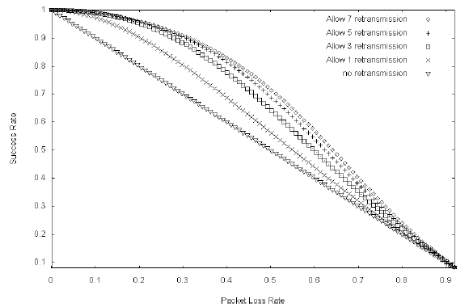

#### Dettaglio fetch

Si può mettere nel payload di un NACK tutti i messaggi mancanti. Il NACK non viene inviato subito ma con un ritardo casuale tra [0, $\Delta$], con $\Delta$ piccolo. Piccolo perchè si evita di aspettare troppo prima di inviare un nack e recuperare prima di $T_{max}$, ma allo stesso tempo grande abbastanza per desincronizzare i NACK degli altri nodi. 

Se un nodo sente un altro NACK con gli stessi gap, allora sopprime il suo NACK e aspetta direttamente la ricezione dei pacchetti corretti. Se non riceve una risposta re-invia un NACK ogni $T_r$ t.c $\Delta$ << $T_r$ < $T_{max}$ fino a threshold. 

Se un nodo chiede i messaggi può succedere che non ci sia nessun vicino che possiede tutti i messaggi richiesti, il nodo deve ricevere risposta tra $[1/4 \cdot T_r, 1/2 \cdot T_r]$ cioè si invia la risposta prima che il nodo ritrasmetta un altro nack. 

I nodi che rispondono ai nack non devono inviare tutti i messaggi richiesti, ma basta anche un solo messaggio. Sarà il nodo richiedente a mettere insieme i vari messaggi ricevuti da nodi diversi. Se un nodo che non riesce a recuperare tutti i messaggi non fa nulla fino a quando non inizia un nuovo update di una configurazione.

#### NACK: varianti

- **hop extra** &rarr; Quando un nodo ha mandato NACK per threshold volte ed è stato sentito dai vicini threshold volte, i nodi vicini cercano di aiutare il richiedente reinoltrando il NACK di un altro hop, aumentando così la distanza da 1 a 2 hop. 

- **vicino preferito** &rarr; il nodo genera NACK solo se riceve un messaggio nuovo dal suo vicino preferito. Nel NACK indico il genitore preferito. Per massimizzare la probabilità di successo e minimizzare le probabilità di collisione, gli altri nodi aumentano il loro tempo di risposta.

### PSFQ magic number

4 è un numero magico, usato in due modi:

1. Nella fase di PUMP i nodi mettono i cache i messaggi e pescano il ritardo casuale tra $T_{min}$ e $T_{max}$. Se ricevono un messaggio uguale per la quarta volta, buttano via il messaggio e cancellano anche la ritrasmissione. Questo perché ci sono già altri 4 nodi che stanno reinoltrando il messaggio e dopo 4 la probabilità di successo non aumenta di molto.
2. Nella fase di FETCH si limita il numero di tentativi di un nodo di recuperare un messaggio.

### Formato messaggi

#### Inject

Messaggio generato dallo user node da iniettare nella rete

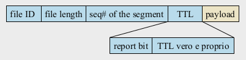

- file ID &rarr; univoco
- file length &rarr; consente ai nodi che ricevono le informazioni di capire se hanno ricevuto l'intero file 
- seq# of the segment &rarr; per riordinare i segmenti e per capire se c'è un gap
- payload
- TTL
  -  report bit 
  - TTL vero e proprio

#### NACK

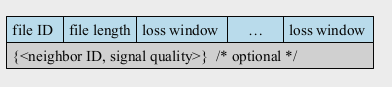

- fileID &rarr; Il nodo che è nella fase di fetch deve indicare che file vuole

- file length &rarr; lunghezza del file che si aspetta di ricevere

- loss window &rarr; indica l'ultimo messaggio ricevuto prima del gap e il primo messaggio ricevuto dopo il gap. Indicare quali sono gli estremi per indicare una loss fa risparmiare spazio ed è più semplice per il parsing perché è composta solo da due numeri interi. Inoltre le interferenze di solito portano a perdere più pacchetti in sequenza (burst di errore)
- {neighbor ID, signal quality} &rarr; vicino preferito che ha un segnale più forte. È un campo opzionale. Il neighbor ID è un indirizzo di livello 2 che il nodo conosce dopo aver ricevuto un beacon dal vicino

#### Report

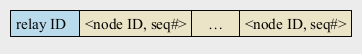

- relay ID &rarr;  chi ha generato il messaggio
- <node, ID, seq#> &rarr; il nodo successivo (in report mode) che riceve un report, aggiunge al report il proprio identificatore e reinoltra di nuovo il report.

### Problema del last ACK

Un nodo sta ricevendo una serie di messaggi e ad un certo punto non riceve più nulla. Per quella destinazione sono indistinguibili il in cui il trasferimento è davvero finito oppure il caso in cui la destinazione non riceve più niente perché tutti i messaggi successivi all'ultimo ricevuto sono andati persi per problemi di rete. Il nodo si rende conto di non aver ricevuto tutto confrontando la lunghezza dei dati ricevuti con la file length dei messaggi di inject. 

#### Last ACK: soluzione 1

Recupero proattivo invece che reattivo:

- Il nodo sospetta di aver perso qualcosa

- Se non riceve nulla per un tempo $T_{pro}$ manda un NACK con TTL 1
$$
  T_{pro} = min[\alpha(S_{max} - S_{last}) T_{max}, \; \alpha \cdot n \cdot T_{max}]
$$
  Questo perché:
  
  $\alpha(S_{max} - S_{last}) * T_{max}$

  - $T_{max}$ è il tempo massimo dopo il quale un nodo intermedio reinoltra un messaggio che ha ricevuto
- $S_{max}$ è il massimo numero di sequenza dell'ultimo segmento che il nodo deve ricevere. Si ricava dividendo file lenght per la dimensione dei messaggi che riceve
  - $S_{last}$ è l'ultimo segmento ricevuto

  Aspetto il massimo tempo disponibile per il quale ho ricevuto tutti i segmenti

  $\alpha \cdot n \cdot Tmax$

  - $n$ è il massimo numero di messaggi che un nodo può immagazzinare nella cache. Se un nodo può immagazzinare al più $n$ messaggi in cache, allora il messaggio più vecchio nella cache viene eliminato dopo al massimo $n \cdot T_{max}$. Se un nodo deve richiedere un messaggio deve farlo prima che venga eliminato dalla cache degli altri nodi.
  
  $\alpha$ è un parametro $\ge 1$, tanto più alto quanto peggiore è il canale. Se il canale non è problematico $\alpha$ si mette 1.

#### Last ACK: soluzione 2

Tutti i dati stanno in un unico messaggio. Un nodo che non riceve nulla può pensare che non gli sono stati inviati dati. Se lo user node invia un singolo messaggio mette il report bit nel messaggio di inject a 1, questo bit fa in modo che i nodi al posto che un NACK mandino un positive ACK. Non è possibile però usare un ACK delle reti tradizionali perchè gli ACK dei vari nodi potrebbero collidere tra loro.

Il nodo che riceve un inject con report bit a 1 controlla se il TTL non è esaurito e inoltra il messaggio in downstream. Se il TTL è 1 invece non reinoltra perché è un nodo foglia e va in report mode. Il nodo genera un ACK con identificatore nodo e identificatore file. I report quindi partono dai nodi foglia per poi tornare verso il sink. I nodi con TTL > 1 invece entrano in report mode, e aspettano di riceve report dai nodi più lontani

Un nodo in report mode risponde dopo un tempo casuale in $[0, \Delta]$ per desincronizzarsi dagli altri nodi nelle vicinanze. Il report viene inoltrato al proprio genitore, cioè da chi ha ricevuto il messaggio. Se un nodo non riceve report entro un tempo $T_{report}$ genera autonomamente un report. Il $T_{report}$ è più grande per i nodi più vicini al sink, perchè questi nodi devono aspettare che i report arrivino da lontano dai nodi foglia. Questo meccanismo di ACK è un ottimo esempio di aggregazione dei dati nel mezzo della WSN.

Se un nodo riceve un report message pieno allora genera un suo report e inoltra prima il nuovo report e poi il report pieno. Se facesse il contrario il nodo upstream riceverebbe un report pieno e quindi andrebbe a generare inutilmente un nuovo report. Inviando prima il report vuoto il nodo upstream aggiunge il suo identificatore al report vuoto e poi inoltra il report pieno.


