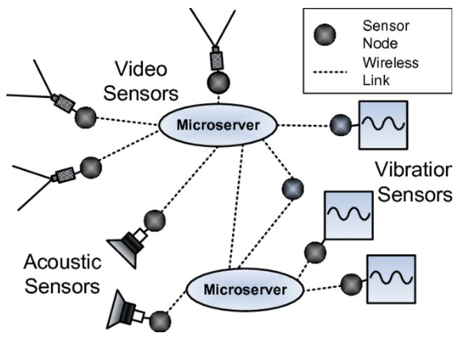
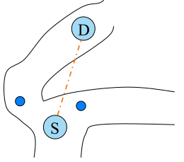

---
Appunti reti ad hoc
---

# Introduzione corso

## Prerequisiti

Nozioni di reti di calcolatori da laurea triennale, nozioni da reti wireless e mobili consigliate ma non obbligatori.

## Esame

Scritto su tutto il programma con domande aperte

## Orario lezioni

- ​	Martedì 14.45 – 16.15, Aula 302
- ​	Venerdì 14.45 – 16.15, Aula B2

### Materiale corso

- ​	Slide Ariel
- ​	Non ci sono libri
- ​	Risorse varie…

## Argomenti corso

### Caratteristiche challenged networks

reti caratterizzate da sfide di progettazione, diverse dalla reti internet che usano TCP, UDP.

**Composte da dispositivi:**

- Piccoli e mobili
- Eterogenei
- Limited MTU (dati nel body e header dei pacchetti)
- Con poche risorse: bandwidth, memoria, batteria…

**La topologia delle reti cambia frequentemente:**

- Le batterie si scaricano: per risparmiare batteria i dispositivi vanno in standby
- Gli ostacoli o le interferenze possono bloccare la comunicazione wireless
- Nodi sparsi/mobili: potrebbe non esserci una sequenza di nodi intermedi che permette di individuare una rotta tra sorgente e destinazione

### Reti single-hop

Un apparato utilizza una tecnologia wireless per comunicare con una stazione base (antenna). La stazione media tutte le comunicazioni, due apparati non comunicano direttamente tra di loro, ma con la stazione base

### Reti multi-hop(MANETs)

Non c’è un infrastruttura fissa, i nodi comunicano direttamente tra di loro. Se i nodi sono troppo lontani utilizzano i nodi intermedi come router.

C’è un assunzione fondamentale: i nodi sono mobili, ma poco mobili. I protocolli di instradamento individuano una sequenza di hop tra sorgente e destinazione, ma per tutto questo tempo, e nel tempo di invio dei dati da sorgente a destinazione la topologia non cambia. Questo non vale nelle challenged network.

### Tipi di challenged network

- ​	WSNs
- ​	Reti urbane
- ​	VANETs
- ​	IoT
- ​	Industry 4.0
- ​	DTNs

## WSNs – GoodFood

Usata nei vigneti. WSN con sensori distribuiti ad alta densità sul territorio. I sensori realizzano una rete wireless. Non tutti i sensori sono uguali, ci sono micro-server che comunicano con una rete fissa.

**Funzionalità:**

- Sincronizzazione: per comunicare ed etichettare i dati in modo temporale
- Sicurezza: il canale wireless è broadcast
- Localizzazione: localizzare i sensori per dare un senso alla misurazioni senza usare un GPS
- Comunicazione data-centric invece che address-centric: si comunica con sensori caratterizzati da una certa posizione o che ha raccolto certi tipi di dato. Non si comunica per indirizzo perché dall’indirizzo non si ricava la posizione
- Scalabilità a $O(10^3)$
- Self-organization: I sensori si organizzano da soli quando la topologia cambia per avere tolleranza ai fallimenti
- Eterogeneità dei nodi

## Urban / participatory sensing

Costituite dagli smartphone degli utenti.

### MetroSense projects

Collezione di progetti di urban sensing:

- Usare il microfono e il GPS del telefono per produrre commenti in una certa posizione
- Rilevazione agenti chimici
- Percorsi per ciclisti e sciatori

## Vehicular ad-hoc NETwork (VANETs)

Reti costituita da dispositivi wireless a bordo di veicoli e di apparati a lato strada.

### Traffic information system

Utilizzare le informazioni raccolte dai veicoli:

- Per migliorare il calcolo delle rotte dei navigatori
- Condividere percorso taxi con più utenti
- Ridurre inquinamento
- Semafori smart
- Gestione incidenti
- Informazioni su bar / ristoranti / monumenti / attrazioni
- Tracciare veicoli rubati
- Gestire flotte (es. pescherecci)

### UAV

Unmanned ground/aerial vehicle, droni utilizzati per varie applicazioni:

- Ricerca persone disperse
- Trasporto defibrillatore
- Consegna pacchi

## Delay tolerant Networks

Reti con nodi molto mobili e sparsi, molto probabile che siano partizionate. Sono delay tolerant perché dal momento in cui si rileva un dato, a quando viene consegnato può passare molto tempo.

### Deep-space networks

Ci sono due tipi di satelliti: satelliti in orbita bassa, satelliti in orbita geostazionaria. Quelli in orbita bassa hanno una velocità di orbita diversa da quella della rotazione terrestre, quindi i satelliti non puntano sempre nello stesso punto e anche la distanza dagli altri satelliti cambia. Quindi anche queste costellazioni di satelliti sono considerate reti challenged.

### Underwater networks

Sensori trasportati dall’acqua, o sensori ancorati ma che cambiano la loro profondità nel tempo. Usati per monitorare correnti oceaniche o inquinamento acqua.

### DAKNET

La zona è così rurale che non c’è nessun ritorno economico a tirare i cavi per creare la rete internet. Ci sono dei villaggi e dei pullman o delle macchine che si muovono da un villaggio all’altro.

Nei villaggi ci sono dei kiosk su cui si possono lasciare messaggi, quando il pullman passa per un villaggio si sincronizza con il kiosk, rilascia i messaggi per quel villaggio, e carica i messaggi memorizzati nel kiosk.

### Reti opportunistiche

Le reti opportunistiche sono costituite solo da apparati wireless portati dagli utenti. Wireless = WiFi / Bluetooth. Lo scambio di dati avviene quando c’è un’opportunità.

Idea futura per il 5G: offloading, se due dispositivi sono nella stessa cella, al posto che comunicare con la stazione base i due dispositivi comunicano direttamente tra di loro. L’antenna è usata solo per coordinare.

## Internet of Things

Interazione di “smart things” tra loro e con utenti.

# Slide 2

## Comunicazione sincrona

Normalmente la comunicazione è sincrona, il client può assumere che il server sia presente durante la comunicazione. C’è un rendezvous: cioè un appuntamento. Il server esegue il suo compito assumendo che il client rimanga presente in comunicazione fino alla risposta del server.
Randezvous stretto: dopo avere inviato i dati, il client rimane bloccato in attesa della risposta.

## Comunicazione asincrona

In reti challenged la propagazione del messaggio può richiedere tempo, perché non c’è sempre un cammino tra sorgente e destinazione. I nodi intermedi memorizzano il messaggio fino a quando non si presenta la possibilità di inoltrarlo. Quindi è impossibile instaurare una comunicazione sincrona. La sorgente non fa affidamento sul fatto che la destinazione sia raggiungibile, e non aspetta la risposta perché potrebbe richiedere molto tempo.

La rete ha:

- Memoria
- Intelligenza &rarr; sa che i messaggi vanno instradati al momento opportuno, è completamente diverso da quello che fa un router normale. Il router usando la tabella di routing se scopre che non c’è un cammino per la destinazione scarta il pacchetto

Soluzione:

- Middleware per i messaggi
- Gestore di code virtuale e distribuite

## Content centric networking (CCN) / Interest centric networking (ICN)

In questo paradigma ciò che  interessa al client è raggiungere un server qualunque in cui ci sia il contenuto cercato, non uno specifico server. Il middleware aggiunge intelligenza alla rete, gestisce l’instradamento togliendo il carico al client di capire dove sono i dati.
La sorgente fa broadcast per un nome di contenuto, cerca di raggiungere tutti i dispositivi di rete raggiungibili.

**Esempio rete LAN multihost (con più router):**
In una LAN il client invia in broadcast una query a tutti i router della rete. In HTTP la query contiene l’indirizzo del server e il nome del contenuto, nella CCN la query ha solo il nome di contenuto. Il problema è trovare uno schema di naming senza ambiguità che permette al middleware di trovare il contenuto richiesto. L’interest arriva a tutti i router che hanno un middleware, i quali cercano la copia del contenuto migliore (sul server più scarico/vicino). Le tabelle di instradamento memorizzano dove sono allocati i contenuti.
Il nome del contenuto può essere impreciso, e indicare genericamente un tipo di contenuto (keyword), il router con la sua routing table, capisce dove potrebbero essere i contenuti richiesti. L’interest ritorna un solo contenuto, trovata la direzione l’interest è reinoltrato solo in quella direzione, anche se altre destinazioni hanno un interest con una parte in comune.

**Architettura:**

- Rete tradizionale
- Middleware (CCN)
- Applicazioni

Un nodo che è nel mezzo della CCN vede arrivare degli interessi, capisce che può reinstradare gli interessi verso un nodo che probabilmente contiene il contenuto. Il nodo ricorda l’interest che ha ricevuto. Quando riceve una risposta (anche molto più tardi perché la rete è delay tolerant), la inoltra alla sorgente. Nel frattempo, il nodo può ricevere un altro interest che cerca lo stesso contenuto. In questo caso non reinoltra la richiesta perché sta ancora aspettando la risposta precedente. Memorizza comunque chi gli ha fatto questa richiesta. Quando il nodo riceve la risposta la reinoltra a tutti i nodi che avevano fatto la stessa richiesta.

### Schema CCN


#### Interfacce

- Face0: interfaccia del nodo che può comunicare con un antenna
- Face1: interfaccia che parla con la rete wired classica
- Face2: interfaccia che parla con un applicazione &rarr; ci sono nodi che forniscono servizi e contemporaneamente sono dei router

#### Strutture dati

**Content store**:
È una cache. Il nodo può mettere contenuti a disposizione della rete e rispondere a interessi. Inoltre, memorizza anche i contenuti ricevuti perché c’è alta probabilità che questi contenuti vengano richiesti di nuovo. In questo modo può rispondere agli interest anche se non è il creatore originale del contenuto. Il content store non è first in - first out, la memoria è limitata, alcune contenuti sono scartati secondo politiche di caching come least recently used  o least frequently used.

**Pending interest table (PIT):**
Se l’interest non è memorizzato nel contest store, il nodo va a guardare nel PIT che contiene i contenuti reinoltrati nel passato. Se il contenuto è stato già reinoltrato, il nodo sta aspettando una risposta, allora alla prossima interest per lo stesso contenuto non inoltra di nuovo la richiesta.

**Forwarding information based (FIB):**
Se il contenuto non è né nel content store né nella PIT, allora il nodo guarda la FIB, analogo di una tabella di routing per CCN. C’è una tabella con due colonne. Si fa il matching del contenuto usando i prefissi nella colonna di sinistra, si usa la colonna di destra per reinoltrare l’interest. Per un prefisso ci possono essere più interfacce che fanno match, ma in questo paradigma la politica di reinoltro è unicast. Se ricevo due interest verso la stessa interfaccia posso fare round robin per scegliere invece un’altra interfaccia. Fare il round robin permette di avere più possibilità di ricevere una risposta perché nelle reti challenged non è detto che ci sia un cammino verso la destinazione e inoltre si bilancia il carico facendo lavorare tutti i nodi.

## Publish-subscribe

Definizione: disaccoppiamento delle entità comunicanti, in tempo, spazio e sincronizzazione.

### Entità


- **Publisher:** qualcuno che produce contenuti e li targa in un certo modo. Il publisher manda il contenuto al broker. Il publisher non sa quanti subscriber leggono il suo contenuto.
- **Subscriber:** è il consumatore di contenuto. Il subscriber dice al broker che lui è interessato a contenuti targati in un certo modo. Aspetta poi passivamente che il broker gli porti i contenuti interessati.
- **Broker:** riceve le notifiche di pubblicazione dai publisher e riceve le notifiche di subscribe/ unsubscribe dai subscriber. Quando c’è un contenuto interessante per i subscriber inoltra il contenuto. Il paradigma non definisce che tipo di entità è il broker, dipende dalla rete.

Il broker può essere un entità distribuita (anche l’intera rete).

## Topic-based P/S

Paradigma basato su argomenti. Il publisher etichetta i contenuti generati con il nome di un canale, i subscriber possono sottoscriversi a questi canali che sono predefiniti. I canali possono poi essere organizzati in una tassonomia, una struttura ad albero in cui i nodi ai livelli più bassi sono più specializzati rispetto ai padri.

Esempio tassonomia: Animale &rarr; mammifero &rarr; canidi

Nel caso ci sia una tassonomia il subscriber quando sottoscrive ad un canale, sottoscrive anche a tutti i nodi discendenti.

### Codice sottoscrittore

~~~java
Subscriber sub = new heatingSubscriber();
EventService.subscribe(sub, "heating");

public class Heating implements Subscriber {
	public void notify (Object o) {
		if(o.temperature < 19°C)
			heating_ON();
    }	
}
~~~

Codice sottoscrittore interessato a tutti i dati che riguardano la temperatura. Il metodo `notify()` risveglia il sottoscrittore, l’oggetto `Object o` contiene un campo temperatura

### Scelta della tassonomia

Prima dell’installazione del sistema bisogna già decidere i topic dei dati, la struttura dei dati, e la tassonomia. 

**Tassonomia a granularità grossolana:**
Se la granularità è molto grossolana il sottoscrittore riceverà anche contenuti che non interessano, questo è un problema nelle challenged network perché solitamente sono reti wireless broadcast, e si va a intasare il canale con dati inutili. Inoltre, gli apparati sono spesso alimentati a batterie. Il costo della computazione è basso, ma è alto il costo della comunicazione, ed aumenta in base alla distanza

**Tassonomia a granularità fine:**
Ci sono tanti livelli nella tassonomia, ciò permettere ai sottoscrittori di agganciarsi anche ad un livello profondo. In questo caso c’è il rischio di dover costringere un subscriber a sottoscriversi a tanti canali alternativi. Questo può portare di nuovo ad avere dati inutili.

## Content-based P/S

Sono definite delle caratteristiche che vengono analizzate dai broker della rete, che in questo modo decidono se inoltrare o meno i dati. Il sottoscrittore non si iscrive ad un canale ma a contenuti con determinate proprietà (etichette, metadati XML).  

### Codice sottoscrittore

```java
String criteria = (temperature < 19°C)
Subscriber sub = new heatingSubscriber();
EventService.subscribe(sub, **criteria**);

public class Heating implements Subscriber {
	public void notify (Object o) {
		heating_ON();
	}
}
```

- Si definisce un criterio, il broker invia il dato al subscriber solo se la temperatura è minore di 19 gradi.
- Si crea il subscriber
- Il subscriber si iscrive ai contenuti che soddisfano il criterio
- Si sveglia con `notify()`, il dato è già stato processato dal broker

### Vantaggi/svantaggi

Non c’è da definire una tassonomia a priori, che se dovesse essere cambiata andrebbe riscritta per tutti i sensori che spesso sono difficili da raggiungere. Vanno definite delle proprietà ma è più facile che definire una tassonomia. 

## Type based P/S

Le informazione sono caratterizzate da una certa struttura. In un linguaggio object oriented sono classi. Il publisher genera un istanza di una classe, il subscriber si iscrive per ricevere oggetti appartenenti a specifiche classi

### Codice sottoscrittore

```java
public class Sensor { public float temperature; }
public class User { public float minT, maxT; }
public class Heating implements Subscriber<Sensor> {

public void notify (Sensor o) {
	if(o.temperature < 19°C)
		heating_ON();
	}
}
```

- La classe utente è un partecipante al sistema, potrebbe controllare la temperatura dal telefono
- La classe Heating controlla gli attuatori del riscaldamento (i subscriber)
- Il publisher è un sensore di temperatura o il device utente
- Il subscriber riceve sia la temperatura che le preferenze dell’utente.
- Nel caso di questa `notify()` sono ricevuti solo oggetti di classe sensore, non quelli della classe utente. Questo perché è un attuatore che accende/spegne riscaldamento in base alla temperatura dell’ambiente

### Vantaggi / svantaggi

Nel modello type-based si sta già pensando a livello di classe, mentre nel content based si pensa in astratto, è più flessibile. Dato che il codice va realizzato in modo da poter essere scritto nella memoria limitata dei sensori, l’approccio type-based permette di sapere a priori quanto spazio occuperà il codice.

## Utilità w.r.t. sensori

- **Topic:** arrivano tutte le informazioni di temperatura anche se sono di valore maggiore della soglia
- **Type:** arrivano tutte le informazioni dei sensori, anche se sono di valore > soglia perché si ricevono tutti gli oggetti di un tipo
- **Content:** arrivano solo le informazioni di interesse &rarr;  risparmio in banda ed energia

# Slide 3

## I sensori

Un sensore è un apparato il cui primo obbiettivo è rilevare dei segnali / grandezze dal mondo fisico in cui è immerso e quantificarle. Spesso hanno un sistema operativo ad hoc come TinyOS, Contiki o RIOT. Sono sistemi piccoli e molto performanti, focalizzano l’attenzione sul risparmio energetico

### Componenti sensori

- **Sensori veri e propri:** oggetti in grado di misurare una grandezza fisica analogica
  - *Passivi:* rilevano qualcosa nell’ambiente senza interagire con esso
    - *Unidirezionali:* puntano in una direzione (videocamera)
    - *Omnidirezionali:* misurano in tutte le direzioni (termometro, microfono)
  - *Attivi:* agiscono sull’ambiente per rilevare una grandezza (sonar, radar)
- **ADC:** analog digital converter, trasforma il segnale analogico in segnale digitale tramite campionamento
- **Micro-controller:** per elaborazione
- **External-memory**
- **Transceiver:** radio dell’apparecchio, trasmette e riceve
- **Power source:** spesso è una batteria

## Altri dispositivi

**Attuatore:** dispositivo che può modificare l’ambiente in cui è immerso (es. irrigatori, impianto di riscaldamento, motori...)

**Sink:** è un apparato che riceve tutte le informazioni rilevate dai sensori. Possono esserci più sink nell’ambiente che raccolgono dati differenti o dati dello stesso tipo. Il sink è cablato alla rete fissa e porta i dati raccolti su un cloud o ad un server. Possono elaborare parzialmente o totalmente i dati.

**Coordinatore:** in base a quello che ha raccolto dai sensori il coordinatore può mandare comandi agli attuatori e ai sensori per farli funzionare in modo differente (es. aumentare la frequenza delle misurazioni)

Sensori, attuatori e sink possono essere fissi o mobili. Se sono fissi i rapporti di vicinato cambiano solo in base al duty cycle. Se sono mobili ci sono più complicazioni perché la mobilità contribuisce alla variazione della topologia.

## Caratteristiche dispositivi in WSN

Apparati anche di piccole dimensioni:

- Alimentati a batteria, rete elettrica o tramite l’ambiente (energia eolica, solare…)
- Distribuiti sul territorio da monitorare &rarr;  i sensori sono sparpagliati in modo casuale, i sink e i controllori vengono piazzati. Spesso i sensori sono difficili da raggiungere una volta piazzati (es. in fondo al mare, in montagna...)
- Muniti di interfaccia wireless per la comunicazione

  - Eterogenei, i sink sono diversi dai sensori

  - Diversa disponibilità di energia e quindi diversa potenza di antenna
  - Tecnologia wireless diversa (bluetooth, wifi...)


## Multipath fading

Tutte le volte che si usa un canale wireless utilizzando un’antenna multidirezionale, il segnale viene propagato in tutte le direzioni. Il segnale può essere attenuato dall’acqua (quindi anche persone e pioggia), oppure essere riflesso dal metallo (quindi anche le automobili).
Quando le onde sono riflesse si ha il multipath fading, cioè un segnale riflesso si sovrappone al segnale originale. Se i due segnali hanno fase diversa, la somma / sottrazione algebrica delle onde sinusoidali può indebolire o interferire con il segnale originale.

## Requisiti WSN

**Accuratezza monitoraggio**:
Le reti di sensori misurano determinate grandezze ambientali, per poi memorizzare i valori o avvisare quando viene superato un valore di soglia preimpostata. Questi sensori devono essere piazzati in modo che tutta la superficie sia coperta dai sensori, in modo tale da verificare eventi con alta probabilità (non 100% perché i sensori si possono rompere).

**Autonomic / self organization:**
La rete deve potersi riconfigurare da sola perché spesso i sensori di cui è composta sono  difficili da raggiungere. I nodi devono quindi controllare costantemente le condizioni della rete di sensori (chi sono i vicini). Nella progettazione si deve pensare in anticipo agli ostacoli ambientali (alte temperature, campi elettromagnetici) per scrivere codice sui sensori che permetta loro di riconfigurarsi.

**Energy saving:**
Se non è possibile collegare i sensori alla rete elettrica è saggio prevedere di costruire la parte di computazione e comunicazione per risparmiare energia. Il consumo energetico è estremamente dipendente dall’hardware e dall’uso del dispositivo. 
Nella pila ISO /OSI ogni livello è una scatola nera che offre servizi al livello superiore e chiede servizi a quello inferiore. C’è un livello di astrazione tale per cui i livelli più alti sono indipendenti dall’implementazione dei livelli più bassi. Ad esempio ai livelli superiori non interessa se la comunicazione è fatta su fibra ottica o cavo in rame. Nelle WSN questo non è più vero. Lo stack va progettato tutto insieme, si sceglie l’hardware in base alle necessità della rete, e si sviluppa il software in base all’hardware. Si parla di cross layer design. Alcuni hardware consumano di più a mandare che a ricevere, altri consumano uguale. Il costo della computazione invece è poco più alto rispetto a quando il sensore dorme. 

Ci sono però diversi livelli di dormienza:

- **completamente dormente** &rarr; CPU e radio ferme, c’è solo un orologio che fa interrupt per svegliare il sensore
- **dorme poco** &rarr; il sensore tiene acceso il transceiver in modalità ricezione solo per i messaggi indirizzati a lui. Ogni scheda di rete ha un indirizzo fisico. Quando arriva un nuovo messaggio, la scheda di rete controlla il MAC address di destinazione, se corrisponde al proprio, la scheda di rete fa un interrupt per svegliare il sensore
- **Ricezione promisqua** &rarr; qualunque dato ricevuto indipendentemente dal MAC address di destinazione sveglia il sensore

É vero che in dormienza i sensori consumano molto meno rispetto a riceve e trasmettere, ma quando il sensore viene risvegliato il consumo di energia ha un picco di risveglio che poi si abbassa per tornare sul livello di consumo energetico medio 

**lifetime sensori e rete:**

È meglio massimizzaere il lifetime della rete e non del singolo sensore. I sensori fanno anche da router usando energia ( un po’ come nelle CCN).
Se si vuole minimizzare il consumo il sensore comunica solo con il sink, e trascura qualunque messaggio che non ha il suo MAC address (nodo selfish). Facendo così non fa da router. Il problema che in questo modo gli altri sensori potrebbero essere costretti a usare più energia per comunicare a distanze più grandi. Quindi potrebbe essere interessante massimizzaere la vita della rete e non del singolo sensore. Ogni sensore fa da router così tutti hanno una durata di batteria maggiore. Si dice load balancing, non c’è nessun sensore che lavora più di altri. Se un sensore finisce l’energia potrebbe diventare un punto di partizione nella rete e portare ad un buco nel monitoraggio.

**Scalabilità:**
Tanti nodi, alta densità.

**Robustezza:**
I sensori devono resistere a polvere, pioggia, alta temperature. La rete deve prevedere sensori che si scaricano, vengono spostati o vengono rotti. Il sistema deve essere robusto per adattarsi in modo autonomo, mantenendo l’accuratezza di monitoraggio. 

**Consenso:**
Il dato riportato da un singolo sensore non è significativo come l’insieme dei dati raccolti da tanti sensori.

## Deployed vs unplanned

**Deployed:**
Si studia come è fatta l’area in cui si vogliono piazzare i sensori e si sceglie accuratamente la posizione di ogni sensore. È un problema di max/min, si vogliono massimizzare/ minimizzare delle grandezze rispettando dei vincoli.
*Esempio:* massimizzare accuratezza e contemporaneamente minimizzare  costi.
Normalmente queste reti sono composte da oggetti piuttosto grandi.

**Unplanned:**


I sensori sono sparpagliati a caso nell’area interessata. I colori indicano l’interesse di rilevare un certo evento. Rosso indica che è più importante rilevare l’evento in quella zona.


L’ immagine indica come sono seminati i sensori. Ci sono chiazze di sensori più dense che corrispondono alle aree della figura precedente. Lo sparpagliare non è perfetto perché è importante creare anche dei cammini di comunicazione tra una chiazza e l’altra per fare arrivare i dati al sink.

## Localizzazione e sincronizzazione

Se i sensori sono stati piazzati si conoscono le coordinate, ma se i sensori sono stati sparpagliati devono essere in grado di individuare la loro posizione, assoluta (lat/long) oppure in relazione ad altri sensori. Il GPS non funziona indoor, in foreste, strade strette e consuma molta batteria. I sensori possono usare il segnale dei sink che sono dispositivi fissi per capire dove sono sfruttando caratteristiche come il tempo di propagazione del segnale.
La posizione è utile per aggregare i dati dei sensori vicini, e per capire in che posizione un certo evento si sta verificando. Può essere utile tenere sincronizzati gli orologi dei sensori per etichettare i dati anche in modo temporale. 

## Naming e routing

Non interessa andare verso un certo indirizzo o sensore, ma andare alla ricerca di un dato o inviare un dato ad un dispositivo sink qualsiasi che può raccogliere i dati.

## Range di comunicazione

**Hop lunghi:**
I sensori comunicano con il sink, i sensori lontani dal sink esauriranno prima le batterie perché la potenza necessaria di trasmissione varia con il quadrato della distanza. C’è probabilità di interferenza tra i sensori che stanno comunicando contemporaneamente.


**hop corti:**
I​ sensori comunicano con altri sensori, i sensori lontani dal sink comunicano comunque a breve distanza. Il problema è che un singolo sensore potrebbe diventare un punto fragile perché  si trova al centro e riceve messaggi da tutti gli altri sensori.

Ci sono due soluzioni a questo problema:

1. potenza variabile per la trasmissione
2. aggregazione dei dati con ottimizzazione della bandwidth usata

Rispetto agli hop lunghi c’è meno probabilità di interferenza. Gli hop corti sono preferiti nelle WSN.


## Data Aggregation

- **La stessa segnalazione può arrivare da più sensori** → in questo caso si eliminano i duplicati inviando al sink una volta sola l’evento
- **Gli eventi possono essere** **aggregati** → Certe volte non è necessario inviare tutti i dati che sono stati letti, alcuni nodi potrebbero fare un’aggregazione dei dati processandoli prima di inviarli al sink. Il tipo di processing dipende dal tipo di rete che si vuole sviluppare (es. un sensore riceve tante misure di temperature, fa media e varianza e inoltra solo il risultato).

- **Messaggi piccoli vs grandi** → i messaggi piccoli sprecano meno energia e hanno maggior possibilità di successo. C’è poca probabilità di sovrapporsi con altri nodi se la  comunicazione dura un breve intervallo temporale.

- **I nodi devono essere capaci di aggreggare** → application awareness, intelligenza dei nodi per capire la semantica dei dati che sono trasmessi nella rete

## Aspetti secondari WSN

**Database:**
È necessario raccogliere i dati prodotti dai sensori, il DB deve essere distribuito, i sensori devono memorizzare poche informazioni.

**Sicurezza:**
Il canale è wireless e il segnale può essere recepito da tutti quelli che sono in grado di sentirlo. La soluzione più semplice è cifrare i dati, un’operazione molto costosa in termini di computazione e memoria.

**Attuatori:**
Possono influenzare il sensing dei sensori mobili. 

## Nodi statici vs mobili

I **ferries** sono nodi di cui si può controllare il movimento per facilitare la comunicazione o per coprire aree rimaste scoperte o partizionate. I ferries potrebbero anche non cambiare la topologia della rete, ma essere dei magazzini di dati che vengono spostati da un’area all’altra (paradigma store, carry and forward).
Il movimento dei ferries può essere periodico e regolare, controllabile, o libero perché installati su veicoli o animali. Nell’ultimo caso la topologia cambia in modo quasi imprevedibile, c’è una maggiore probabilità di partizione della rete.

## Three tiered architecture

È un architettura gerarchica

- **Sensori** → alcuni sono più potenti in termini di calcolo, antenna e disponibilità energetica

- **Microserver** → maggiore capacità di comunicazione, OS tradizionale, più risorse in batteria (Raspberry e simili). Si parla di edge computing, elaborazione ai limiti della rete di sensori

- **Sink** → punto di connessione con internet. Invia i dati o riceve direttive come query di dati, cambio di configurazione dei sensori, ecc...

  

# Slide 4

## Tassonomia minima

**Hierarchical:**
Ci sono nodi di tipo diverso, alcuni più potenti. Sono reti più semplici da implementare perché spostano la computazione e il coordinamento su nodi centrali nella rete

**Reverse path forwarding:**
Questo approccio ipotizza che il sink faccia delle query che informino la rete di sensori di quello che il sink vuole sapere e quanto spesso. Le query fanno dei cammini che sono ricordati dai nodi, quando un nodo ha una risposta per la query inoltra seguendo il cammino al rovescio. Questi approcci assumono implicitamente che il canale sia full duplex (bidirezionale). 

**Cost – field:**
I sensori sono preprogrammati per riportare il verificarsi di un evento, seguono dei cammini precostituiti.

## Assunzioni sul sistema

- Sensori distribuiti sul territorio in modo unplanned, i sensori conoscono la loro posizione che però non è usata nell’algoritmo di instradamento ma solo per arricchire il dato rilevato.
- I sensori hanno ID univoci e orologi sincronizzati
- I sensori non sono mobili
- La rete è densa, ci sono path ridondanti, e la topologia è significativamente connessa
- I sensori sono intelligenti, sanno ragionare sui dati
- Il canale è wireless, le antenne sono omnidirezionali
- Preferiti hop corti

## Directed diffusion

Rientra nella categoria del reverse path forwarding.

### Assunzioni sui dati

Il sink invia delle query chiamate interest. Si dice interest e non query perché il sink annuncia di essere interessato ad un evento, ma non sa se lo riceverà mai. Diverso dalle query che spesso ritornano qualcosa.

L’interest è composto da coppie attributo valore:

```
type = four-legged animal

interval = 20 ms

rect = [-100, 100, 200, 400]

timestamp = 01:20:40

expiresAt = 01:30:40
```

- **type** → dice al sensore di stare attento ad un tipo di evento. Se un sensore non è capace di rilevare un evento farà solo da relay per i messaggi. Il duty cycle è diverso per i sensori che fanno solo relay
- **interval** → i sensori riconfigurano il loro duty cicle per misurare l’evento con la frequenza definita
- **rect** → area rettangolare in cui cercare l’evento. Le coordinate non sono coordinate assolute di latitudine e longitudine, ma relative ad un punto della rete
- **timestamp** → quando è stato fatto l’interest, gli orologi devono essere sincronizzati
- **expiresAt** → quando scade l’interest

### Caratteristiche

**canali bi-direzionali**

**reverse path forwarding**:
Gli interest installano informazioni di stato nei sensori che ricordano quali cammini sono stati seguiti dagli interest. 

**Reactive routing**:
Non vengono mantenute informazioni di instradamento o rapporti di vicinato. Le informazioni di stato vengono costruite solo nel momento in cui il sink inoltra un interest, e i cammini sono mantenuti attivi solo fino a quando questo interest è attivo. Le sorgenti sono i sensori, le destinazioni sono i sink.

**Flooding degli interessi**:
L’algoritmo si divide in due fasi. La prima è la diffusione degli interest. Il flooding è la politica di instradamento più banale: la sorgente invia il messaggio a tutti i suoi vicini, i nodi che ricevono il messaggio lo reinoltrano a tutti i suoi vicini escludendo il nodo da cui l’hanno ricevuto.

**Pila ISO/OSI:**

1. Livello fisico
2. Livello data link → mac address / hardware address
3. Livello rete → indirizzo ip
4. livello trasporto → numero di porta

L’hardware address può essere unicast o broadcast. L’informazione ad alto livello della interest che è destinata solo ad alcuni sensori, deve essere instradato usando l’hardware address. In queste reti wireless non si può fare il flooding classico diffondendo il segnale a tutti i sensori. Questo perché il segnale non è detto che venga rilevato da tutti i nodi a causa del duty cycle.
Non è obbligatorio fare tutte le comunicazione broadcast, quando le notifiche tornano indietro si indirizza a livello due unicast. Il cammino di ritorno non è unico ma si memorizzano tutti i cammini possibili, e poi si usa il migliore per il ritorno.

**Aggregazione dati**:
In direct diffusion i sink possono essere multipli, possono diffondere interessi diversi ma c’è la possbilità che sink differenti diffondano lo stesso interest. I sensori capiscono la semantica dei dati e fanno aggregazione filtrando i duplicati o adattando la frequenza con cui i dati vengono mandati verso i sink.
*Crying baby* → se due sink diversi chiedono lo stesso evento a frequenza diversa i sensori devono adattare il duty cycle per quello a frequenza maggiore. I sensori che hanno visto solo l’interest con frequenza più bassa però non vogliono riceve l’interest a frequenza più alta. A questi sensori può arrivare una notifica ogni *n* notifiche, oppure si fa la media di *n* notifiche e la si invia al sensore.

### Diffusione interesse

Il sink periodicamente guarda nella propria cache gli interessi attivi, rimuove quelli scaduti e invia ogni interesse attivo. Dato che il broadcast non è completo a causa del duty cycle dei sensori, è fondamentale diffondere l’interest periodicamente in broadcast. Il primo broadcast usa un alto interval (ogni quanto un sensore invia il dato) perché il sink non sa se l’evento a cui è interessato succederà mai. Infatti l’azione di risveglio del sensore è molto costosa. Nel momento in cui l’evento si verifica e un sensore comincia a inviare notifiche al sink, allora il sink cambia l’intervallo di monitoraggio dei sensori.

Ogni nodo ricorda l’interest nella cache, ogni entry è formata da:

- interest
- timestamp → da quando l’interest è attivo
- serie di gradienti:
  - neighbor ID (mac address)
  - data rate → rate a cui devo mandare le notifiche al vicino
  - duration → ricavata da timestamp e expiration.  	

I gradienti sono i nodi vicini a cui il sensore deve reinoltrare un evento. Un nodo può avere più vicini e inviare i dati ad ogni vicino con data rate diverso Gli interest duplicati sono scartati mantenendo solo l’ultimo. Nel gradiente non c’è scritto l’identificatore e la distanza dal sink. Un nodo che riceve un evento sa solo quali sono i next hop, non sa nemmeno se il next hop è un sink.

  
A destra c‘è il sink, il cerchio azzurro è la zona in cui il sink vuole monitorare l’evento. SRC è la sorgente dell’evento

1. il sink manda l’interest la prima volta ai propri vicini
2. i primi 2 nodi capiscono che non possono acquisire quella misurazione, si ricordano però come gradiente il sink, senza sapere se è davvero il sink o semplicemente un nodo intermedio
3. Il nodo in alto fa broadcast
4. I due sensori a sinistra ricevono l’interest, e ricordano come next hop il sensore precedente
5. Anche il sink riceve il broadcast dell’interest, è implicitamente un ACK per il sink. In più si vogliono supportare sink multipli. Anche il sink arancione ha una cache e si ricorda che se riceve un interest lo deve rimandare al sensore.
6. Anche il sensore in basso a sinistra del sink fa la stessa cosa di quello in alto
7. Il nodo centrale avrà due gradienti, ma lo stesso interest. Non fa di nuovo flooding perché è un duplicato.
8. I nodi facendo broadcast costruiscono anche dei gradienti all’indietro, sembrano controintuitivi ma in realtà servono per diffondere i dati anche a sink diversi.

### Routing eventi

I gradienti indicano quali vicini sono interessati ad un evento, possono essere sink o nodi più vicini ai sink. C’è ridondanza di gradienti e di path per essere in grado di riparare cammini rotti verso il sink.

Quando si verifica un evento per cui esiste un interesse attivo:

- Il nodo SRC manda l’evento a tutti i vicini di cui ha un gradiente,  è una trasmissione broadcast con indirizzi unicast
- Il sensore più vicino alla SRC riceve l’evento e lo rimanda al nodo alla sua destra e a quello in basso.
- La freccia è tratteggiata perché il nodo in basso ha già ricevuto la notifica dell’evento da SRC. Scarta quindi l’evento sapendo che il cammino verso l’alto è più lento
- Così via per tutte le frecce tratteggiate
- Il sink riceve eventi da entrambi i cammini, uno dei due sarà migliore perché più veloce o con meno interferenze.

### Varianti per la diffusione interest

- **Flooding →** versione base
- **Routing geografico →**  Al posto che mandare in flooding l’interesse lo mando in direzione dei sensori più vicini all’area target per l’interest
- **Direzione cached da risposte precedenti →** se il sink in passato aveva diffuso lo stesso interesse, e quella volta aveva scoperto che le notifiche gli arrivavano solo da un sottoinsieme di nodi, allora il sink può ricordare questo sottoinsieme e in futuro diffondere l’interest solo ai vicini da cui ha ricevuto risposte la volta precedente

### Rinforzo positivo

Il sink manda un interest unicast soltanto al vicino da cui riceve meglio le notifiche chiedendo un interval minore e quindi una frequenza più alta. Il nodo vicino al sink sceglierà il proprio vicino migliore e manda indietro il nuovo interest del sink. Si continua fino alla sorgente, rinforzando solo il cammino migliore.

### Rinforzo negativo

#### Potare path peggiori 

1. **soft state** &rarr; i record vengono mantenuti solo per il loro lifetime, le informazioni obsolete vengono cancellate automaticamente. Il sink potrebbe voler monitorare un evento ad una frequenza maggiore, ma non aggiorna il cammino peggiore i cui nodi manterranno la frequenza dell'interest originale. I nodi scartano i gradienti quando scadono, il cammino peggiore lentamente andrà a spegnersi. 

2. **hard state** &rarr; le informazioni di stato sono ricordate in un nodo fino a quando non vengono esplicitamente aggiornate o cancellate. Il sink manda di nuovo una interest unicast per lo stesso evento, nella stessa area di interesse ma sul cammino peggiore richiede una frequenza molto minore. Il cammino non si spegne, il sink riceverà ogni tanto delle notifiche duplicate dal cammino peggiore e migliore.
3. **hard state violento** &rarr; Il sink manda un interest con timestamp e expire uguali. La durata quindi sarà 0, e tutti i nodi a cascata cancelleranno il corrispondente gradiente.

Spegnendo tutti i nodi del cammino peggiore si risparmia batteria, lasciandoli accesi a frequenza alta si mantiene un cammino di backup nel caso ci fossero problemi con il cammino peggiore.

Se il sink non riceve più notifiche dal suo vicino preferito significa che:

1. l'evento nell'area di interesse non si sta più verificando
2. l'evento sta continuando a verificarsi, i sensori continuano a mandare le notifiche ma queste si perdono perché un nodo non riesce più a comunicare con il suo vicino

Queste due situazioni sono indistinguibili per il sink, quindi avere dei cammini di backup è utile per distinguere le due situazioni. Il sink può rinforzare positivamente un cammino di backup e rinforzare negativamente il vecchio cammino migliore.

#### Rinforzo da nodo intermedio

Se un nodo sul cammino migliore non riceve più notifiche dal suo vicino per qualunque motivo, ma ricevere notifiche a bassa frequenza da un nodo sul cammino peggiore, allora il nodo va a rinforzare il suo vicino. Il cammino migliore devia, anche gli altri nodi scelgono i loro nodi migliori fino ad arrivare alle sorgenti

#### Downconvert

Se un sensore qualsiasi riceve le notifiche con un determinato rate non necessariamente deve mandarle a tutti i suoi gradienti con lo stesso rate, ma adatta la sua frequenza a quella scritta all'interno del gradiente. Il nodo fa una media o manda solo l'ultima notifica in unicast. I nodi utilizzano dei beacon, messaggi che notificano i vicini di essere svegli, i nodi fanno quindi un invio unicast a tutti i gradienti svegli.

### Prestazioni direct diffusion

#### Consumo energia

- flooding &rarr; consuma tanto perché si fa sempre broadcast

- multicast su albero ottimo &rarr; Prestazione misurate considerando un albero ottimo con radice nel sink, non realizzabile nella realtà delle WSN. Consuma più energia della diffusione perché non viene fatta nessuna aggregazione intermedia

- diffusion &rarr; I nodi buttano via le notifiche duplicate e fanno aggregazione

  

#### Latenza

- flooding &rarr; alta latenza con tanti nodi. Anche se facendo flooding si percorre anche il canale migliore c'è una broadcast storm di messaggi che interferiscono uno con l'altro
- multicast &rarr; latenza più bassa
- diffusion &rarr; trova cammini molto simili a quelli dell'albero ottimo


### Prestazioni direct diffusion ottimizzato


## Cost vs revers path

Direct diffusion rientra nella categoria di reverse path forwarding, non tollera la mobiltà dei sink, e c'è il rischio di formare loop. È utile quando ci sono tante interest con tanti eventi. L'altra categoria è cost-field-based di cui fa parte RUMOR.

pochi eventi ma tante query &rarr; rumor routing
tanti eventi ma poche query &rarr; direct diffusion

## Rumor routing

Rumor routing invece di fare un flooding dei dati fa una diffusione casuale dell'informazione  che un evento di un certo tipo si è verificato. Se il sink vuole saperne di più può seguire un cammino con un certo costo che porta all'evento. 

- area grigia &rarr; evento in corso
- nodi neri &rarr; hanno rilevato l'evento in corso
- nodo grigio &rarr; sink che manda query
- nodi bianchi &rarr; non hanno nessuna informazione sull'evento in corso
- doppio tratto &rarr; path per le query

I nodi in modo random decidono se mandare la notifica che l'evento si sta verificando o meno. Se stanno per mandare l'evento scelgono di nuovo in modo random un vicino. Il nodo vicino riceve l'agente (evento), e quindi sa che a distanza 1 da lui c'è un certo tipo di evento ma non conosce i dettagli. Anche questo nodo sceglie un nuovo vicino random a cui inviare l'evento, la distanza è 2.

Le query inviate dal sink viaggiano in modo random, fino a quando arrivano ad un nodo che sa che si è verificato l'evento. Da questo punto in poi la query non viaggia più in modo casuale ma segue il percorso fino al nodo che sa tutto di quell'evento. La risposta con la descrizione completa dell'evento viaggia al contrario fino al sink. Le analisi statistiche dimostrano che la probabilità di intersezione tra una query ed un nodo che conosce dov'è un evento non è bassa. 


I sensori conoscono a livello di sviluppo dell'applicazione quali grandezze misurare. I nodi mantengono una lista dei vicini scoperti attraverso beaconing. I nodi si alternano in due stati:

- invio beacon con MAC address
- ascolto dei beacon 

### Pseudocodice data diffusion

```pseudocode
//il sensore controlla se c'è almeno un evento attivo tra tutti quelli   che deve notificare
upon event do
	//S stato del sensore, R variabile random
	//la funzione f1 decide se generare o no un agente
	take (bool) retransmit decision D <-- f1(S,R);
	//se la decisione di trasmissione è si, il messaggio M può
	//contenere tutti gli eventi che si stanno rilevando
	//se gli eventi sono tanti e non ci stanno nel frame dell'evento
	//metto solo gli eventi con priorità più alta, oppure vado a
	//rotazione, notificando ogni volta eventi diversi
	if (D = Yes) then
		generate agent M <--list of recent events;
		//inoltra ad una sola destinazione casualmente usando una
		//funzione f diversa da f1, i neighbors sono i vicini
		//svegli in questo momento
		forward to 1 dest <-- f({neighbors},R);
		
//il nodo riceve un evento
upon reception of an agent do
	//il nodo si ricorda da quale vicino ha ricevuto un agente
	//se il payload dell'agente non è pieno può crescere di dimensione
	//passando attraverso altri nodi
	//questo è possibile fino a quando non si raggiunge il massimo
	//payload
	synchronize events on agent w/ local events;
	//Il TTL è un numero di hop
	if (agent's TTL expired) then discard agent;
	//se il TTL non è scaduto il nodo sceglie in modo random un vicino
	//usando una funzione f' diverso da f, e una variabile R' che può
	//essere diversa da R
	//i vicini sono quelli attivi da cui sono stati ricevuti beacon
	else forward to 1 dest <--
		f’({neighbors},R');
```

### Diffusione dei dati


- Un sensore nella chiazza grigio chiaro ha fatto partire un evento
- l'evento viene inoltrato verso il basso, i nodi ricordano che si è verificato da qualche parte un evento grigio chiaro
- il punto bicolore è un sensore su cui è avvenuta una sincronizzazione perchè ha ricevuto sia l'evento chiaro che quello scuro. Memorizza quindi le strade per entrambi gli eventi
- Il sensore bicolore reinoltra entrambi gli eventi

### Blocco dei loop

Se una chiazza non è piccolissima l'evento potrebbe essere inoltrato da più nodi. Un nodo potrebbe ricevere due eventi uguali con distanza differente.

- A ha ricevuto un evento E1 e sa che può raggiungerlo da C con 4 hop

- A ha ricevuto un evento E2 e sa che può raggiungerlo da C con 2 hop

  

- B ha ricevuto E1 e lo reinoltra ad A

- Il nodo A capisce che il cammino per l'evento E1 passando per B è più corto di quello passando per C e memorizza solo il più breve. Con questo meccanismo si tagliano i loop


### Pseudocodice query processing

```pseudocode
when (event must be looked for) do
	//destinazione scelta in modo casuale con una funzione f
	//solo tra i vicini attivi
	send query to a dest <-- f({neighbors},R);
	//si attende risposta per un tempo T, il nodo può riprovare,
	//fare il flooding della query oppure non fare nulla
	if (no reply within T) then 
		retry or flood query or resign;
//un nodo che riceve una query fa una reply che viaggia in un cammino a
//rovescio
upon reception of a query do
	//se ho info sull'evento
	if (info on event held locally) then reply;
	//se il TTL della query è scaduto allora la query viene buttata
	else if (query's TTL expired) then discard
		query;
//se la query è stata ricevuta da un nodo che conosce il cammino per 
//l'evento non si tocca più il TTL perchè non va fatta scadere
//nel cammino all'indietro
else if (path to event) then route query;
//se non ho un cammino per l'evento reinstrado la query casualmente
else send query to a dest <-- f({neighbors},R');
```

### Rumor routing + Directed diffusion

Si parla di insuccesso quando si hanno falsi positivi o falsi negativi:

- **Falso positivo**: al cercatore viene detto che l'evento c'è, ma questo non è vero. L'evento è terminato ma le informazioni sono obsolete

- **Falso negativo**: al cercatore viene detto che l'evento non c'è, ma non è vero. Questo è più grave in situazioni come incendi, alta temperatura in un reattore nucleare ecc...

Nel rumor routing il falso negativo si presenta quando le query girando a caso non arrivano mai ad un nodo che ha informazioni sull'evento. Il sink sta cercando di capire se si sta verificando un evento, e ha sentore che l'evento ha alta probabilità di essere in corso. Se l'evento è molto critico, il sink incomincia ad utilizzare un approccio rumor routing per diffondere le query. Mando una query, aspetta, non ha risposta. Il tempo può essere quanto serve al messaggio per coprire un numero di hop pari al diametro della rete. Se non riceve risposta rimanda di nuovo la query. Dopo un numero basso di tentativi in rumor routing unicast, il sink come ultima risorsa prova un approccio directed diffusion che comporta un flooding della query. Tutti quelli che hanno visto passare l'evento reinoltrano la query in flooding. È un trade off perchè all'inizio si risparmia energia con il rumor, se non si ottiene risposta si rinuncia al risparmio energetico usando il flooding. Rumor routing come directed diffusion non è un approccio standard ma solo un'idea generale a cui sono aggiunte vari meccanismi di ottimizzazione.

### Massimizzare probabilità intersezione

#### **Usando la posizione**

Query e agenti viaggiano in modo ortogonale così da incrociarsi sempre. Le query verso E/O, le notifiche verso N/S. I sensori hanno delle bussole che indicano il Nord, e usano antenne unidirezionali.

**Usando hardware specifico**:
Le antenne del trasmittente e ricevente devono essere allineate e sfasate al massimo del 15% rispetto alla linea retta, e devono essere in line of sight. Le antenne devono poter essere ruotate a nord o sud usando un motore. 

**Usando i beacon**:
I sensori si scambiano dei beacon con cui oltre al proprio mac address indicano anche la loro posizione stimata. Un nodo che deve inoltrare un messaggio riceve i beacon dai nodi vicini e in base alla sua posizione stima qual è il nodo che si trova più in direzione Nord di lui. Ovviamente i sensori non sono esattamente allineati. Questo non costa nulla sulla rete che si sta considerando perchè i beacon vengono già mandati nel rumor routing standard.

#### Con la lista dei vicini

I nodi cercano di instradare query ed agenti in linea retta senza usare la posizione. Il nodo processa il messaggio che riceve, aggiunge il suo mac address e lo reinoltra ad un vicino non elencato nella lista. Si cercano di evitare loop nel percorso dell'agente. Così però è poco preciso perchè i messaggi non viaggiano per forza in linea retta. Per migliorarlo il nodo carica nel messaggio anche il mac di tutti i suoi vicini. In questo modo i vicini in comune tra sorgente e nodo successivo non riceveranno mai il messaggio che tenderà a muoversi in linea retta. C'è un problema. Normalmente l'agente viaggiando viene arricchito da altri eventi che i nodi intermedi hanno visto. Si mette tutto nel payload. Si fa questo perchè una query che si muove random trova più facilmente una traccia. Il mac address è 48 bit, c'è quindi un problema di spazio, si sceglie al posto che caricare altri eventi sull'agente di caricare i mac address dei vicini. Come trade off si può riservare nel payload solo una parte per i vicini e si usa una politica first in - first out per quando il payload è pieno, sperando che ormai l'agente sia lontano da quei nodi.

#### Modalità promisqua

In modalità promisqua un sensore viene sempre risvegliato quando riceve un messaggio. Si può sfruttare questa modalità per aumentare la probabilità di intrecciare una query. Un nodo sceglie un vicino come next hop specificando il suo mac address. Il nodo successivo scopre di essere il destinatario confrontando il mac address del messaggio con il suo e reinoltra l'agente. Gli altri nodi intorno invece non sono destinatari ma ricevono comunque l'agente, ricordano nella loro cache che hanno visto l'agente ma non lo reinoltrano. Normalmente la query deve incrociarsi esattamente su un nodo che ha portato l'agente. Con la modalità promisqua invece la query può arrivare ad un nodo che non ha ricevuto l'agente, ma che ha in cache il mac address di un nodo che è davvero sul path, e quindi gli reinoltra la query. Questo approccio è ottimo ma i nodi consumano più energia perchè si svegliano ogni volta che ricevono un messaggio anche se non è indirizzato a loro. 

### Rumor: prestazioni

I costi sono inferiori a direct diffusion con flooding delle query. Il costo di un flooding è $O(n^2)$ con *n* numero di nodi. Nel caso di rumor routing il costo dipende dal numero di eventi e di query. Agenti e query devono avere un TTL grande (1000/2000 hop) per permettere di diffondere lontano l'evento e facilitare l'incrocio agente - query. 


Le righe non in grassetto riportano tre etichette:

- La &rarr; lifetime agente come numero di hop
- Lq &rarr; lifetime query come numero di hop
- A &rarr; numero di agenti che si creano con un evento

# Slide 5

## perchè un trasporto affidabile?

La ridondanza di sensori, cammini e notifiche permette di avere una buona affidabilità dell'invio dei dati da sensori a sink. Non è vero il caso contrario da sink a sensori.  

### Perchè non TCP ? 

- **problema nell'indirizzamento multicast** &rarr; tutte le destinazioni riportano alla sorgente se hanno ricevuto una porzione dei dati tramite ack. La sorgente deve quindi conoscere l'insieme delle destinazioni a cui sta parlando, ciò è impossibile con i protocolli visti in precedenza.
- **ACK è un problema** &rarr; i canali sono broadcast e proni a interferenze, gli acknowledgment potrebbero distruggersi in prossimita della sorgente. TCP funziona con l'idea di worst case, se arriva qualcosa di incomprensibile o non arriva niente ritrasmette il messaggio. La ritrasmissione consuma inutilmente batteria
- **Soglia di ritrasmissione** &rarr; Se uno o più nodi destinatari non ricevono le informazioni che la sorgente sta cercando di trasmettere in modo affidabile vanno ritrasmesse. Si può usare una soglia per cui se x nodi su n non ricevono le informazioni, la sorgente reinoltra in unicast agli n - x nodi. Se invece sono tanti i nodi che non hanno ricevuto i dati allora la sorgente invia di nuovo il messaggio in broadcast a tutti. Il problema è individuare la soglia x e decidere quanto tempo aspettare gli ack. Con un retrasmission timeout basso il sink potrebbe non aspettare gli ack che stanno arrivando lentamente, con un timeout alto fa perdere molto tempo. È difficile stimare un retrasmission timeout su un insieme di destinazioni a distanza diversa e con un duty cycle diverso
- **TCP assume che la rete funzioni** &rarr; di solito in una rete normale un dato non arriva a destinazione perchè c'è congestione. Nelle WSN non dipende dalla congestione ma da un tasso di errore alto su canale, da collisioni tra le trasmissioni e da interferenze esterne. Nel frequency hopping il range di frequenze di trasmissione è diviso in sottorange. Sorgente e destinazione si accordano su come usare le frequenze saltando da una frequenza all'altra in modo random. Se c'è un interferenza su un sottorange di frequenza si ritrasmette subito su un'altra sottofrequenza. In generale è meglio essere più aggressivi che più lenti

## Influenza tasso di errore

*p* è il tasso di errore sul canale. Con un cammino di *n* hop tra sorgente e destinazione la probabilità che non ci sia errore è $(1-p)^n$ . Gli hop sono piccoli quindi i cammini sono lunghi. Invece che operare end to end si opera hop by hop. Si cerca di essere affidabili sul singolo hop. Si usano NACK al posto che ACK, tutti i nodi che ricevono non comunicano, i nodi che non hanno ricevuto fanno NACK. I NACK agiscono su un singolo hop, si recupera subito senza instradare il NACK fino alla sorgente.

## Pump slowly, fetch quickly (PSFQ)

- **Fetch quickly** &rarr; se qualcosa va storto si cerca di recuperare (fetch) il messaggio che non è arrivato a destinazione
- **Pump slowly** &rarr; iniettare i dati nella rete lentamente in modo da permettere ai nodi che non ricevono i messaggi di avere il tempo di recuparare prima di immettere nuovi dati nella rete

### Obbiettivi

- **affidabilità nella consegna dei dati** &rarr; TCP opera in una rete in cui ci sono pochi fallimenti, per questo motivo effettua solo un numero piccolo di ritrasmissioni dopo le quali riporta errore al livello applicazione. Quello che fa PSFQ è usare un numero massimo di tentativi di recupero, se un nodo non riesce a recuperare e l'inconsistenza provvoca problemi nella rete allora si spegne.
- **minimo supporto dall'infrastruttura sottostante** &rarr; non chiede niente di particolare al livello 3, solo di sapere fare broadcast one-hop e un routing qualsiasi come Directed Diffusion.
- **minimo scambio di messaggi di controllo per reliability**
- **correttezza anche con qualità di canale molto bassa**
- **garanzia sulla latenza di consegna** &rarr; calcolare un upperbound sulla latenza di consegna

### Nomenclatura

Gli *user node* sono le sorgenti dei dati, i sensori sono i *destinatari*. 

L'algoritmo è organizzato in 4 fasi:

1. **PUMP** &rarr; user node invia dei dati con numero di sequena (come in TCP). I dati non sono per forza inviati con un unico messaggio. I dati sono inviati "lentamente" in modo che si riesca a recuperare un eventuale errore prima del dato successivo
2. Il nodo riceve un messaggio con numero di sequenza $m-1$ e poi $m+1$, capisce che gli manca $m$
3. **FETCH** &rarr; il nodo si attiva per eseguire il recupero su singolo hop usando un negative ack, cioè una richiesta di rinvio del dato. Si cercano di evitare nack duplicati.
4. **REPORT** &rarr; richiesto da user node in situazioni particolari, come quando c'è un singolo messaggio e quindi non si può rilevare la loss, oppure si perdono tutti i messaggi alla fine della trasmissione

### Fase di PUMP

Lo usernode invia i dati in broadcast a tutti i suoi vicini (1 hop) con periodo $T_{min}$. Tutti i nodi che ricevono un messaggio lo memorizzano nella cache. I messaggi hanno un numero di sequenza per ricomporre i dati e accorgersi di mancanze nella sequenza. Il messaggio rimane in cache per il tempo necessario agli altri nodi di rilevare un fallimento. Quando un nodo riceve  un nuovo messaggio se lo ha già in cache lo scarta, altrimenti lo salva ed esegue un broadcast del messaggio dopo un tempo random tra $[T_{min}, T_{max}]$. Il messaggio può già essere in cache perché i dati sono mandati in flooding da ogni nodo intermedio. Quando i nodi reinoltrano il messaggio sono sempre più lenti dell'user node che invia con frequenza $T_{min}$. Nelle specifice PSFQ non ci sono indicazioni sui valori di $T_{min}$ e $T_{max}$. Un nodo è certo che il messaggio successivo arriverà come minimo dopo $T_{min}$, se il messaggio arrivato gli fa capire che c'è un gap, il nodo sa che può recuperare il messaggio mancante in almeno $T_{min}$ tempo.  $T_{min}$ evita quindi di diffondere i messaggi troppo velocemente cioè fa controllo di flusso. In TCP c'è la windows di ricezione. $T_{max}$ serve per evitare collisioni data l'alta densità di nodi. Se X manda un messaggio ai vicini Y, W Z, questi nodi potrebbero essere in raggio di comunicazione tra loro. Se Y, W e Z facessero broadcast istantaneamente dopo aver ricevuto il messaggio, queste trasmissioni si distruggerebbero tra loro. Con un tempo random tra $T_{min}$ e $T_{max}$ i nodi sono desincronizzati nell'invio. La differenza tra $T_{min}$ e $T_{max}$ è in relazione con il numero di nodi vicini che potrebbe aver un nodo. PSFQ è fatto in modo da poter stimare il tempo necessario per inviare i dati in tutta la rete.  La massima latenza è $D(n) = T_{max} \cdot n \cdot num_{hop}$ con $n$ il numero dei dati, nella sequenza, $num_{hop}$ gli hop per la destinazione più lontana.

### PSFQ: Invio dei NACK

Il messaggio 3 viene perso, A si accorge solo quando riceve il messaggio 4. A entra in fase di recupero del messaggio 3, ma evita di reinoltrare il messaggio 4. Questo perché A deve già mandare un broadcast con un NACK dicendo che manca il 3, se mandasse anche il messaggio 4 anche B e C si accorgerebbero della mancanza del 3 e farebbero broadcast di NACK del 3 che potrebbero scontrarsi tra loro e distruggersi. 


### Fase di FETCH

#### analisi statistica

Si definisce $\Phi(i)$ la probabilità di successo alle i-esima ritrasmissione.
$$
\Phi(0) = 0
$$

$$
\Phi(1) = (1-p)^3
$$

Se sto ritrasmittendo c'è stato un errore, la probabilità che arrivi il messaggio successivo è $(1-p)$ e questo fa notare che c'è un gap. Il nodo manda un NACK che ha probabilità $(1-p)$ che arrivi ad almeno un nodo con il messaggio che sto cercando, e ancora $(1-p)$ perché il nodo che ha il messaggio ricercato deve reinoltrarlo al nodo che ha fatto fetch. 
$$
\Phi(n) = (1-p)^2[1-p- \Phi(1) - \Phi(2) - ... - \Phi(n-1)]
$$
$(1-p)^2$ perché  $(1-p)$ arrivato con successo il messaggio successivo, moltiplicato per $(1-p)$ il NACK

$1-p$ è la probabilità di successo della i-esima ritrasmissione, moltiplicato per la probabilità del successo della ritrasmissione $\Phi(i)$ fino a $\Phi(n-1)$. Si sottraggono le probabilità di tutte le ritrasmissioni andate male fino a $\Phi(n)$ 

Probabilità che la prima e le $n-1$ trasmissioni successive vadano male e l'ultima vada bene:

$$
\Omega(n) = \Phi(1) + \Phi(2) + ... + \Phi(n)
$$
Probabilità recupero messaggio entro $n$ tentativi:

$$
(1-p) + (p * \Omega(n)) \; \; \; \; \; \; \; \; \; \; \; n \ge 1
$$


#### Dettaglio fetch

Si può mettere nel payload di un NACK tutti i messaggi mancanti. Il NACK non viene inviato subito ma con un ritardo casuale tra [0, $\Delta$], con $\Delta$ piccolo. Piccolo perchè si evita di aspettare troppo prima di inviare un nack e recuperare prima di $T_{max}$, ma allo stesso tempo grande abbastanza per desincronizzare i NACK degli altri nodi. 

Se un nodo sente un altro NACK con gli stessi gap, allora sopprime il suo NACK e aspetta direttamente la ricezione dei pacchetti corretti. Se non riceve una risposta re-invia un NACK ogni $T_r$ t.c $\Delta$ << $T_r$ < $T_{max}$ fino a threshold. 

Se un nodo chiede i messaggi può succedere che non ci sia nessun vicino che possiede tutti i messaggi richiesti, il nodo deve ricevere risposta tra $[1/4 \cdot T_r, 1/2 \cdot T_r]$ cioè si invia la risposta prima che il nodo ritrasmetta un altro NACK. 

I nodi che rispondono ai NACK non devono inviare tutti i messaggi richiesti, ma basta anche un solo messaggio. Sarà il nodo richiedente a mettere insieme i vari messaggi ricevuti da nodi diversi. Se un nodo che non riesce a recuperare tutti i messaggi non fa nulla fino a quando non inizia un nuovo update di una configurazione.

#### NACK: varianti

- **hop extra** &rarr; Quando un nodo ha mandato NACK per threshold volte ed è stato sentito dai vicini threshold volte, i nodi vicini cercano di aiutare il richiedente reinoltrando il NACK di un altro hop, aumentando così la distanza da 1 a 2 hop. 

- **vicino preferito** &rarr; il nodo genera NACK solo se riceve un messaggio nuovo dal suo vicino preferito. Nel NACK indico il genitore preferito. Per massimizzare la probabilità di successo e minimizzare le probabilità di collisione, gli altri nodi aumentano il loro tempo di risposta.

### Numero magico PSFQ

4 è un numero magico, usato in due modi:

1. Nella fase di PUMP i nodi mettono i cache i messaggi e pescano il ritardo casuale tra $T_{min}$ e $T_{max}$. Se ricevono un messaggio uguale per la quarta volta, buttano via il messaggio e cancellano anche la ritrasmissione. Questo perché ci sono già altri 4 nodi che stanno reinoltrando il messaggio e dopo 4 la probabilità di successo non aumenta di molto.
2. Nella fase di FETCH si limitano il numero di tentativi di un nodo di recuperare un messaggio.

### Formato messaggi

#### Inject

Messaggio generato dallo user node da iniettare nella rete


- file ID &rarr; univoco
- file length &rarr; consente ai nodi che ricevono le informazioni di capire se hanno ricevuto l'intero file 
- seq# of the segment &rarr; per riordinare i segmenti e per capire se c'è un gap
- payload
- TTL
  -  report bit 
  - TTL vero e proprio

#### NACK


- fileID &rarr; Il nodo che è nella fase di fetch deve indicare che file vuole

- file length &rarr; lunghezza del file che si aspetta di ricevere

- loss window &rarr; indica l'ultimo messaggio ricevuto prima del gap e il primo messaggio ricevuto dopo il gap. Indicare quali sono gli estremi per indicare una loss fa risparmiare spazio ed è più semplice per il parsing perché è composta solo da due numeri interi. Inoltre le interferenze di solito portano a perdere più pacchetti in sequenza (burst di errore)
- {neighbor ID, signal quality} &rarr; vicino preferito che ha un segnale più forte. È un campo opzionale. Il neighbor ID è un indirizzo di livello 2 che il nodo conosce dopo aver ricevuto un beacon dal vicino

#### Report


- relay ID &rarr;  chi ha generato il messaggio
- <node, ID, seq#> &rarr; il nodo successivo (in report mode) che riceve un report, aggiunge al report il proprio identificatore e reinoltra di nuovo il report.

### Problema del last ACK

Un nodo sta ricevendo una serie di messaggi e ad un certo punto non riceve più nulla. Per quella destinazione sono indistinguibili il in cui il trasferimento è davvero finito oppure il caso in cui la destinazione non riceve più niente perché tutti i messaggi successivi all'ultimo ricevuto sono andati persi per problemi di rete. Il nodo si rende conto di non aver ricevuto tutto confrontando la lunghezza dei dati ricevuti con la file length dei messaggi di inject. 

#### Last ACK: soluzione 1

Recupero proattivo invece che reattivo:

- Il nodo sospetta di aver perso qualcosa

- Se non riceve nulla per un tempo $T_{pro}$ manda un NACK con TTL 1
$$
  T_{pro} = min[\alpha(S_{max} - S_{last}) T_{max}, \; \alpha \cdot n \cdot T_{max}]
$$
  Questo perché:

  $\alpha(S_{max} - S_{last}) * T_{max}$

  - $T_{max}$ è il tempo massimo dopo il quale un nodo intermedio reinoltra un messaggio che ha ricevuto
- $S_{max}$ è il massimo numero di sequenza dell'ultimo segmento che il nodo deve ricevere. Si ricava dividendo file lenght per la dimensione dei messaggi che riceve
  - $S_{last}$ è l'ultimo segmento ricevuto

  Aspetto il massimo tempo disponibile per il quale ho ricevuto tutti i segmenti

  $\alpha \cdot n \cdot Tmax$

  - *n* è il massimo numero di messaggi che un nodo può immagazzinare nella cache. Se un nodo può immagazzinare al più *n* messaggi in cache, allora il messaggio più vecchio nella cache viene eliminato dopo al massimo $n \cdot T_{max}$. Se un nodo deve richiedere un messaggio deve farlo prima che venga eliminato dalla cache degli altri nodi.
  
  $\alpha$ è un parametro $\ge 1$, tanto più alto quanto peggiore è il canale. Se il canale non è problematico $\alpha$ si mette 1.

#### Last ACK: soluzione 2

Tutti i dati stanno in un unico messaggio. Un nodo che non riceve nulla può pensare che non gli sono stati inviati dati. Se lo user node invia un singolo messaggio mette il report bit nel messaggio di inject a 1, questo bit fa in modo che i nodi al posto che un NACK mandino un positive ACK. Non è possibile però usare un ACK delle reti tradizionali perchè gli ACK dei vari nodi potrebbero collidere tra loro.

Il nodo che riceve un inject con report bit a 1 controlla se il TTL non è esaurito e inoltra il messaggio in downstream. Se il TTL è 1 invece non reinoltra perché è un nodo foglia e va in report mode. Il nodo genera un ACK con identificatore nodo e identificatore file. I report quindi partono dai nodi foglia per poi tornare verso il sink. I nodi con TTL > 1 invece entrano in report mode, e aspettano di riceve report dai nodi più lontani

Un nodo in report mode risponde dopo un tempo casuale in $[0, \Delta]$ per desincronizzarsi dagli altri nodi nelle vicinanze. Il report viene inoltrato al proprio genitore, cioè da chi ha ricevuto il messaggio. Se un nodo non riceve report entro un tempo $T_{report}$ genera autonomamente un report. Il $T_{report}$ è più grande per i nodi più vicini al sink, perchè questi nodi devono aspettare che i report arrivino da lontano dai nodi foglia. Questo meccanismo di ACK è un ottimo esempio di aggregazione dei dati nel mezzo della WSN.

Se un nodo riceve un report message pieno allora genera un suo report e inoltra prima il nuovo report e poi il report pieno. Se facesse il contrario il nodo upstream riceverebbe un report pieno e quindi andrebbe a generare inutilmente un nuovo report. Inviando prima il report vuoto il nodo upstream aggiunge il suo identificatore al report vuoto e poi inoltra il report pieno.

# Slide 6

## Requisiti localizzazione

- **operatività in condizioni avverse** &rarr; due nodi riescono a comunicare solo se sono in line of sight, e si considerano tra loro vicini. Invece due nodi alla stessa distanza ma con un ostacolo in mezzo non riescono a comunicare e non si considerano vicini. Gli ostacoli possono essere grandi oggetti fisici, oggetti metallici riflettenti o l'acqua
- **limitare dispendio energetico**
- **accuratezza della misura e granularità** 
- **disponibilità o meno dell'infrastruttura** &rarr; il GPS sfrutta una rete di satelliti già esistente per determinare la posizione. I nodi anchor sono quei nodi che conoscono la loro posizione e possono aiutare altri nodi a ricavare la loro. Non è garantito che esista un qualsiasi tipo di infrastruttura per la rilevazione della posizione
- **non cooperative / cooperative target** &rarr;  se l'oggetto da localizzare emette o non emette i segnali. In questo corso si considerano gli oggetti cooperativi
- **mobilità o meno dei nodi** &rarr; se c'è la certezza che i nodi non si muovono, si può usare una procedura di localizzazione molto precisa che verrà eseguita una sola volta. Se i nodi sono mobili c'è un consumo periodico di energia usato per la localizzazione

## Relazioni tra sensori

### Prossimità

La prossimità tra due nodi determina se sono in reciproco raggio radio. Ritorna un booleano con valore on / off. È imprecisa perché non ritorna nessuna informazione sulla distanza tra i due nodi.


Supponiamo che i punti neri sono degli anchor point, questi nodi sono stati piazzati e hanno memorizzate le loro coordinate assolute. Se un nodo riesce a sentire 3 anchor point si trova nell'area di intersezione dei tre cerchi.


La potenza del segnale decresce con il quadrato della distanza; inoltre il raggio radio non è un cerchio perfetto perché dipende dalle caratteristiche dell'ambiente.

### Distanza

####  RSSI

La misura della potenza si indica con received signal strength indicator (RSSI). Le due parti devono essere d'accordo su qual è la potenza del segnale emesso alla sorgente. La potenza viene trasformata da mW a dBm.
$$
x = 10log_{10}(P/1mW)
$$

- **exponential decay** &rarr; $\frac{1}{R^2}$
- **in guide d'onda** &rarr; $\frac{1}{R^{1.5}}$ perché una guida d'onda è qualcosa che mantiene il segnale in linea retta come un corridoio
- **vicino al terreno** &rarr; $\frac{1}{R^4}$ perché il terreno assorbe il segnale

Il multipath fading è quel fenomeno per cui con antenne omnidirezionali il segnale si propaga in tutte le direzioni e può essere riflesso da muri e oggetti, entrare in collisione con il segnale originale e a seconda della differenza di fase tra i due segnali le onde si sommano o si sottraggonno. Se si sommano la potenza del segnale è maggiore, se si sottraggono la potenza è minore.

#### Time of arrival

- **Round-trip time** &rarr; Per misurare la distanza tra due nodi posso usare il round-trip time, cioè calcolo il tempo che il segnale ci mette ad arrivare a destinazione e ritornare alla sorgente. È lo stesso sistema usato dal Ping. Ci sono due implementazioni di Ping: nella prima la destinazione risponde immediatamente, è soggetta ad attacchi Dos. La seconda implementazione risponde solo quando non ha nient'altro da fare, in questo caso il round trip time non è accurato. 

- **Time of arrival (TOA)** &rarr; Si utilizzano orologi sincronizzati per tutti i nodi, il problema è che non è semplice mantenere gli orologi sincronizzati.

- **Time difference of arrival (TDOA)** &rarr; Dalla sorgente si inviano due segnali a velocità diverse. Il ricevente calcola la differenza di tempo di arrivo dei due segnali e stima la distanza. Si possono usare per esempio frequenze radio e ultrasuoni. Questo richiede di avere un hardware in grado di trasmettere e ricevere due tipi di segnali diversi.

#### Array di antenne

Tante antenne montate su un oggetto ricevente a distanza nota tra loro. La sorgente invia un beacon che viene ricevuto da tutte le antenne che si trovano a distanza diversa. La velocità della luce è costante, la distanza tra le antenne e l'angolo di arrivo del segnale sono noti. Si usano questi parametri per stimare la distanza tra sorgente e ricevente. È necessario hardware aggiuntivo (array di antenne) di dimensioni non trascurabili.


#### Segnali acustici

Non soffrono del problema del multipath fading, il loro comporamento è sempre $\frac{1}{R^2}$, il segnale non è riflesso ma assorbito da tutte le superfici e quindi sorgente e destinazione devono essere perfettamente in line of sight. L'hardware di trasmittente e ricevente è più grande di quello necessario per le onde radio.

## Trilaterazione

La triangolazione richiede la misura dell'angolo di arrivo del segnale, si usa invece la trilaterazione che richiede solo la misurazione di distanze.

Un sensore che si trova stima la distanza tra sé e tre nodi anchor, il punto in cui le tre circonferenze si incontrano è la posizione del sensore.


Sistema di 2 equazioni in due variabili che rappresentano due circonferenze:

$$
\begin{cases}
  R1^2 = (x-\alpha)^2 + (y-\beta)^2 \\
  R2^2 = (x-\alpha)^2 + (y-\beta)^2 \\
\end{cases}
$$
Si ottengono 2 soluzioni, aggiungendo un terzo cerchio si trova la coppia *(x, y)* corretta.

Il GPS utilizza la trilaterazione in uno spazio 3D, sono necessarie 4 sfere perchè l'equazione della sfera è:
$$
R^2 = (x-\alpha)^2+(y-\beta)^2+(z-\gamma)^2
$$
Gli anchor point hanno memorizzate la loro posizione assoluta o relativa, la posizione del nodo ricavata dagli anchor può essere quindi assoluta o relativa. Gli anchor devono essere piazzati in modo tale che ogni nodo sia nel raggio di comunicazione di almeno tre anchors. Una soluzione alternativa è avere degli anchor mobili dotati di GPS, possono essere UGV (veicolo terrestre non pilotato) oppure UAV (droni che volano). Si muovono seguendo una determinata traiettoria, ogni volta che rilevano un sensore che emette dei beacon si muovono in 3/4 posizioni vicine al nodo per permettergli di fare trilaterazione.

## Global positioning system

Costellazione di 24 satelliti in orbita non geostazionaria (orbita bassa), costa meno carburante portare i satelliti in orbita bassa ma il satellite non punta sempre sulla stessa porzione di superficie terrestre. I satelliti forniscono una posizione assoluta in 3D e l'orario. Il GPS funziona solo all'esterno e in line of sight, la precisione per usi civili è entro i 15m. La ricezione del segnale GPS è costoso in termini di energia, ma in wireless sensor network con sensori fermi basta rilevare la posizione una sola volta.

### Stima distanza in GPS

Il ricevente sceglie i 4 satelliti da cui riceve meglio, rimane in ascolto (lock) perché deve ricevere una raccolta di informazioni chiamate effemeridi che descrivono l'orbita del satellite. Le effemeridi sono trasmesse ogni 30s e possono servire fino a 24 trasmissioni per avere un orbita completa, può richiedere quindi fino a 24 minuti. Il nodo può memorizzare le effemeridi in un almanacco e utilizzare entro un raggio di 100 km e per un tempo massimo di due mesi. Le effemeridi trasmettono anche un codice di cifratura generato in modo pseudocasuale e anche con quale schema è stato cifrato. Il nodo guarda nell'almanacco quando il satellite invierà un segnale con quel codice. Il nodo si sincronizza con i 4 orologi dei satelliti e usa il time of arrival per determinare la distanza dal satellite.

## Localizzazione senza GPS

Si suppone che ci siano diversi anchor points con un raggio radio uguale tra loro e sempre costante, e che le loro antenne siano omnidirezionali con una propagazione del segnale ideale a forma di sfera perfetta. Gli anchor points mandano beacon periodici desincronizzati nel tempo per far conoscere la loro posizione ai sensori.

Nell'immagine a sinistra un sensore sente il segnale dei due anchor points in basso, quindi si trova nella nella lunetta formata dai due cerchi. La parte alta della lunetta è da escludere perché il sensore non sente il raggio radio degli anchor points a nord.

Questo metodo non è adatto indoor perché il segnale non può propagarsi in modo ideale. È diverso dalla trilaterazione perché in quel caso si misura una stima della distanza e inoltre si richiede che ogni sensore sia in grado di stimare la distanza da 3 anchor.

### Metodo del centroide

Il sensore conosce il raggio di trasmissione e il periodo di invio dei beacon degli anchor points. Il sensore ascolta per un tempo t e conta il numero di beacon che riceve. S è il numero di campioni da raccogliere, se un anchor manda un beacon ogni T, per prendere S campioni il sensore aspetta $t = (S+1+\epsilon)T$. C'è un +1 perché il sensore potrebbe mettersi ad ascoltare subito dopo che un anchor ha mandato un beacon. $\epsilon$ è perchè gli orologi del sensore non sono precisi.

Si può calcolare la metrica di connettività $CM_i$,  per l'anchor i:
$$
CM_i = 100 \cdot Nrecv(i,t) / Nsent(i,t) = 100 \cdot Nrecv(i,t)/S
$$
Questa metrica indica i beacon ricevuti rispetto a quelli che il sensore dovrebbe aver ricevuto. Si discriminano con una soglia gli anchor da cui si riceve bene da quelli da cui si riceve male. Si considerano solo gli anchor che superano la soglia.

Il centroide è la media geometrica di tutte le k coordinate che il sensore sente:
$$
(X_{est}, Y_{est}) = \sum X_{ij} / k, \sum Y_{ij}/k
$$
Sperimentalmente la posizione con anchor point con S = 20 varia tra 2m e 4.5m

### Footprint

Si piazzano in un ambiente indoor delle sorgenti di segnale che si limitano a indicare nei beacon il loro identificatore senza la posizione. Si divide l'ambiente con una griglia a granularità da decidere. Lo staff tecnico con un dispositivo uguale a quello che useranno i frequentatori dell'area si posiziona in ogni punto della griglia (vertici dei quadrati) e misura da quali sorgenti di segnali si ricevono i beacon e la RSSI (received signal strenght). Si costruisce una mappa che indica in ogni punto della griglia da chi si riceve e con che potenza. Questa mappa è molto dipendente dalla struttura dell'ambiente, la mappa viene messa su un dispositivo all'ingresso dell'area indoor. Ogni utente può scaricare un'applicazione che conosce la mappa e che si interfaccia con bluetooth o wifi. Il segnale rilevato dal dispositivo viene confrontata con la mappa e si trova il punto che più assomiglia al punto sulla mappa e si sceglie quella come posizione stimata.

# Slide 7

## Vehicular Ad-hoc NETwork

Rete costituita da dispositivi wireless a bordo di veicoli ed eventuali apparati a lato strada. L'obbiettivo è creare degli Intelligent Transport System (ITS) per:

- comunicazione in-vehicle
- comunicazione tra veicoli 
  - car-to-car &rarr; macchine, autobus, tram...
  - machine-to-machine &rarr; oggetti che si muovono ma che non necessariamente hanno a bordo esseri umani. 
- comunicazione tra veicoli e infrastruttura
- altri sistemi di trasporto come ferroviario, aereo e marittimo


### Infrastruttura VANETs

**AU - Application Unit:**
Oggetti elementari per veicolo e passeggeri.

**OBU - On Board Unit:**
Sovraintende alla guida del veicolo e in futuro guida autonoma indipendente. Sono in grado di comunicare con altri OBU o con RSU.

**RSU - Roadside Unit:**
Estende il range di comunicazione dei veicoli, possono avere memoria in cui fare buffer di contenuti, avere delle applicazioni e essere connesse a internet dando anche accesso  a informazioni per i passeggeri.

### Domini di comunicazione

**In-vehicle:**
comunicazione tra sensori e/o parti del veicolo (AUs) sfruttando OBU

**Ad-hoc:**

- V2V - vehicle to vehicle tra OBUs
- V2I - vehicle to infrastructure tra OBUe RSU

**Infrastractural:**
Connessione di RSU o OBU a internet

### 802.11: basic service set

**BSSID:**
Basic service set ID, è il MAC address dell'access point, identifica un gruppo.

**SSID:**
Service set ID, stringa significativa per gli umani che indica i tipi di contenuti in quel gruppo.

**IBSS:**
Indipendent BSS, il BSSID è il MAC address dell'iniziatore.


Negli Extended SS gli access point cooperano tra di loro per avere una definizione comune del gruppo (SSID comune) e per la comunicazione tra dispositivi in celle diverse. Il BSSID è il MAC address dell'iniziatore, se l'iniziatore sparisce, sparisce anche il gruppo.

**wildcard BSSID:**
Si inviano i dati ad un MAC address con 48 bit a 1

Ci vogliono diversi secondi per fare il setup della comunicazione in WIFI, un tempo inadeguato per le VANETs.

### 802.11p WAVE

Non è tanto la mobilità dei nodi che rende difficile la comunicazione, perchè se i nodi si muovono a velocità omogenea cambia la loro posizione assoluta ma non la posizione relativa. Diverso è il caso delle automobili, in cui i link tra i nodi cambiano continuamente e le velocità dei nodi non sono trascurabili, due automobili in direzione opposta hanno una velocità totale pari alla somma delle loro velocità. Quindi è necessario avere una comunicazione molto rapida tra i nodi.

Come gli altri 802.11, WAVE è uno standard per WLAN (wireless local area network). Lo spettro scelto per la comunicazione è quello intorno ai 5.9 GHz, è "free but licensed". Si possono produrre liberamente apparati che emettono frequenze nei 5.9 GHz ma non sono utilizzabili fino a quando non si ottiene una licenza (gratuita) dallo stato che garantisce la conformità degli apparati con 802.11p WAVE. In questo modo il costo delle auto non aumenta e contemporaneamente si evitano interferenze con altri dispositivi non certificati.

WAVE utilizza 7 canali diversi:

- parte grigia &rarr; intervallo di guardia che funziona da divisore con gli apparati che trasmettono a frequenze vicine a 5.9 GHz
- canale verde &rarr; canale di controllo, utilizzabile solo per applicazione di safety stradale, non vengono mandati dati ma solo informazioni necessarie per coordinare i veicoli all'accesso a WAVE
- canale azzurro &rarr; per messaggi brevi tra veicoli vicini per evitare tamponamenti e incidenti
- canale rosso &rarr; per la comunicazione su lunga distanza (anche su più hop) come notifiche di allerta in prossimità di intersezioni, incidenti ecc...
- 4 canali rosa &rarr; canali di servizio per applicazioni utente come parcheggi, attrazioni turistiche ecc...


WAVE ha una banda di 2 Mbps e un raggio radio di 300m.

Tutti i veicoli hanno almeno 2 radio, una è sempre connessa alla wildcard BSSID (canali di safety), e un'altra radio che trasmette sugli altri canali (canali di servizio). Con un solo beacon e senza negoziazione manda un segnale a tutti i dispositivi in range radio per poter accedere ad una BSSID non safety.  Non c'è il concetto di iniziatore come in 802.11, e chi ha creato una BSSID (usando un valore random invece che il MAC address) può lasciare il gruppo senza distruggerlo.


> Il MAC layer è il data link layer

### Performance 802.11p vs LTE

LTE in-coverage: comunicazione con antenna

LTE out-of-coverage: comunicazione ad-hoc senza antenna


### Caratteristiche VANETs

**Mobilità vincolata:**
Dipende dalla topografia delle strade, dalla presenza di edifici, dalle indicazioni fornite da segnaletica e semafori, e dall'orario. La connettività è ostacolata dalla velocità dei veicoli e da molti altri elementi presenti sulle strade.

**Non ci sono problemi di batteria:**
La batteria dei veicoli si ricarica mentre sono in moto, c'è abbastanza spazio per l'hardware.

**Scalabilità:**
A seconda della zona considerata ci possono essere molti dispositivi connessi. Nella rete viaggiano molti messaggi e vanno evitate le collisioni. La soluzione è che il primo veicolo che si rende conto che c'è un problema in strada fa broadcast a tutti i suoi vicini dell'informazione che descrive l'evento specificando la sua posizione (ogni veicolo ha il GPS).  Ogni nodo vicino genera un tempo casuale per il reinoltro del messaggio per espandere più lontano l'informazione, questo tempo è tanto più piccolo quanto è più lontano il veicolo dalla sorgente. Quando il timer scade, i veicoli rifanno broadcast. La sorgente in questo modo ha un ack dell'invio del proprio messaggio. I veicoli che sentono il broadcast non rifanno il broadcast perchè è già stato fatto da qualcun'altro. In pratica rifarà broadcast il veicolo più lontano dalla sorgente ma sempre all'interno del suo raggio radio. A catena l'invio si espande a veicoli lontani. 

**Densità variabile:**
Varia in base a zona, orario, traffico. Ci sono casi in cui i veicoli sono così lontani da non essere nemmeno in raggio radio. I veicoli possono variare la loro potenza trasmissiva in base al numero di vicini, in una zona trafficata si trasmette a basso raggio per non trasmettere a troppi veicoli contemporaneamente.

### Progetti su VANETs

**Traffic information system:**

- raccolta informazioni sul traffico
- raccolta informazioni dei veicoli come direzione, posizione, velocità
- mapping info geografiche su mappa stradale
- computazione rotta ottimale

**CarTel:**
Smart vehicle capace di collezionare e analizzare dati da sensori a bordo.

**myTaxi, PlanetTran, Uber:**
Rotte intelligenti per portare più utenti seguendo una singola tratta, trovare il taxi più vicino all'utente.

**C2C:**
Car to car consortium, ha come obbiettivi:

- sviluppo standar europeo per ITS (intelligent transport system)
- armonizzazione degli standard C2C mondiali
- scelta frequenze europee unlicensed per V2V (veichle to veichle) e V2I (veichle to infrastructure)
- assistenza guidatore per maggiore sicurezza stradale
- controllo del traffico
- applicazione per guidatori e passeggeri (pagamento pedaggi, previsioni del tempo, applicazioni di intrattenimento)

### Applicazioni VANETs

**Intersection collision avoidance:**
evitare collisioni ad un incrocio con poca visibilità

**Public safety:**
Segnalare l'arrivo di un'ambulanza alle altre macchine, configurare i semafori per avere un'onda verde per l'ambulanza.

**Segnalazione ostacoli:**
quando si forma una coda il guidatore può sapere che si è verificato un incidente.

**Estensione segnaletica:**
I veicoli in coda vicino ad un incidente possono mandare l'informazione a veicoli che viaggiano in direzione opposta, questa macchina porterà le informazioni indietro a macchine lontane che sapranno in anticipo dell'incidente. Altre applicazione sono la segnalazione di scuole, ospedali, ponti bassi, restringimento di strada, rilevamento stanchezza conducente, distanza di sicurezza, frenata di emergenza.

### Requisiti applicazioni

- comunicazioni d'**emergenza** con i dati trasmessi affidabilmente e con bassa latenza
- **privacy** &rarr; i veicoli sono costantemente monitorati, si conosce il numero di targa e quindi il proprietario del veicolo. Tutto viaggia su canali wireless in broadcast.
- **scalabilità**
- **problema testing soluzioni** &rarr; è pericoloso testare le soluzioni direttamente sui veicoli reali, si possono usare dei simulatori 

### Pattern di comunicazione

**Unicast:**
Si indirizza specificando il destinatario. Sarà poco usato in VANETs.

**Multicast:**
Si indirizza ad un gruppo di destinatari. Si devono preconfiguare gli apparati con degli indirizzi di gruppo. Le destinazioni devono essere conosciute (ambulanze, pattuglie polizia). 

**Anycast:**
Variante del multicast in cui si trasmette ad un destinatario qualunque di un gruppo.

**Geocast:**
Variante di broadcast/multicast, si indicano tutti i veicoli all'interno di una determinata area geografica. Al momento dell'emissione del messaggio la sorgente non ha idea di quanti sono i veicoli in quella determinata area geografica. L'insieme delle destinazioni può variare mentre il messaggio viaggia.

**Geographic routing: **
A differenza del geocasting è più simile a unicast perchè si indirizza ad uno specifico veicolo ma utilizzando l'informazione sulla posizione.

# Slide 8

## MANET e VANET

I tradizionali algoritmi delle MANET sono poco efficaci per reti veicolari, infatti questi algoritmi sono pensati per nodi mobili ma non veloci come quelli presenti nelle VANET. Gli algoritmi tradizionali hanno un monitoring continuo della rete per aggiornare sempre la topologia della rete. Negli algoritmi per MANET non si mantiene una topologia aggiornata della rete, e nel momento in cui una sorgente genera il messaggio ci si preoccupa di scoprire la topologia della rete, trovare una rotta e instradare il messaggio. Questi algoritmi spesso ricorrono ad un flooding on-demand per scoprire la topologia. Il problema per le VANET è che questi algoritmi hanno un ritardo alto e un overhead alto (il flooding ha tempo $O(n^2)$). 

**Distance effect:**


A vuole scoprire il cammino per K per inviare dei dati. Il nodo I si sposta e esce dal raggio di H e J. Nel tempo che la risposta torna ad A, il cammino non è più valido perché  J non ha più un next hop. Nelle MANET si supponeva che questo problema accadesse molto raramente, cosa non vera per le VANET.

### Idee alternative per VANET

Non è la sorgente a decidere il routing per la destinazione ma sceglie solamente il suo vicino migliore. Il vicino a sua volta sceglie il nodo successivo per portare il messaggio alla destinazione. È inutile costruire una conoscenza della topologia se tanto la rete cambia continuamente. Nessun nodo ha tabelle di instradamento e si preoccupa solo quando riceve un messaggio di instradarlo. Per una maggiore accuratezza è necessario conoscere dove vanno (posizioni, interessi) e chi frequentano (socialità) i nodi.

## Geographic forwarding

La sorgente S è riuscita a determinare le coordinate della destinazione D ma conosce solo i 4 vicini (pallini blu) nel suo raggio radio. Dato che si parla di VANET tutti i nodi hanno un GPS a bordo. S invia un messaggio al pallino blu in alto, il vicino sceglierà a sua volta il suo vicino migliore per inviare il messaggio.


**Vantaggi:**

- decisioni locali che sfruttano i beacon che già viaggiano nella rete
- adeguamento della rotta man mano che ci si avvicina alla destinazione
- combinabile con meccanismi più complessi come abitudini dei nodi

### Problemi geographic routing

**Scelta del next-hop:**
S deve inviare un messagio a D e deve scegliere a quale pallino blu inviarlo. Se scegliesse il vicino a destra sarebbe un problema perché il nodo si sta allontanando da D.



Per un inoltro più preciso si possono aggiungere informazioni sulla direzione, la velocità dei nodi ecc... questo però porta ad avere pacchetti più grandi e maggiore possibilità di collisione.

**Partizione della rete:**
Possono esserci delle zone in cui i veicoli sono molto pochi e distanti, questo crea delle partizioni nella VANET. Nelle reti opportunistiche (non VANET per ora), il nodo giallo che riceve il messaggio aspetta che ci sia un'opportunità di reinoltrare il messaggio. Si passa da un routing store and forward in cui i pacchetti vengono scartati quando non c'è un cammino, ad un approccio store carry and forward in cui se non c'è un next hop il pacchetto viene portato in giro fino a quando c'è un'opportunità di fare l'inoltro.


### Assunzioni sul sistema

- i nodi devono conscere la **loro posizione** &rarr; usando GPS, trilaterazione con anchor points
- i nodi devono conoscere la **posizione dei vicini**
- c'è un **location service** &rarr; un database distribuito che riceve query con identificatore di un nodo e restituisce come risposta le coordinate più recenti. 
- i dati si muovono più velocemente dei nodi &rarr; la velocità di propagazione dei dati è pari alla velocità della luce, e quindi molto maggiore dei veicoli.

[saltare slide 7, 8, 9]

## Location service

### Location service poco usati

**Soluzione statica:**
Fixed base station mantenuto aggiornato sulla posizione dei suoi nodi.

**Flooding:**
Flooding periodico di position query quando un nodo si sposta, anche se a nessuno interessa l'informazione.

### Grid location service (GLS)

Ogni nodo ha la sua posizione memorizzata in più location server distribuiti nel sistema. Questo aumenta la probabilità che ogni nodo abbia nelle vicinanze un location server che sappia indicare la posizione della destinazione ricercata. 

**Assunzioni:** 

- politica di inoltro geografico anche per i messaggi che scambia GLS (location query, location reply e location update)
- ogni nodo conosce i vicini a 2 hop
- i clock sono sincronizzati (utilizzando il GPS)
- i nodi sono densi, le aree scoperte sono rare
- i nodi conoscono una griglia sovrimposta all'area

**Griglia:**
Un quadrato di ordine 1 è un quadrato in cui tutti i veicoli che stanno lì dentro si trovano al massimo a distanza due hop.  I quadrati sono costruiti a partire dalle coordinate <0,0>.  La diagonale del quadrato è $\sqrt2 \cdot radio range$.
Quattro quadrati di ordine 1 formano un quadrato di ordine 2. Alcuni quadrati non possono essere costruiti, in figura si vede un quadrato giallo che non ha nessun quadrato di ordine 2 adiacente. Quattro quadrati di ordine 2 formato un quadrato di ordine 3.


**Semplificazioni:**

- i nodi sono tutti spenti e si accendono nello stesso momento a tempo zero
- i nodi in quadrati di ordine superiore al primo sono considerati fermi

**Algoritmo:**

1. Un nodo si sveglia e manda messaggi periodici di HELLO con il suo ID univoco e posizione. Il messaggio è ricevuto solo dai vicini one hop (nel suo raggio radio)
2. Un nodo costruisce la lista dei suoi vicini tramite i messaggi di HELLO.
   Se un nodo riceve un HELLO da un nodo che si trova in un 1-quadrato diverso dal proprio ignora il messaggio.
3. I successivi messaggi di HELLO contengono anche ID e posizione dei nodi vicini. Ogni nodo in questo modo conosce i suoi vicini fino ad un massimo di 2 hop

**Lemma 1 (efficienza):**
Se c'è una query da S per D, con S e D nel medesimo 1-square, allora la query arriva a D in uno step. Uno step è il costo che serve per passare da un quadrato ad un altro, anche di ordine differente purchè la differenza sia al massimo di un ordine. 

#### Distribuzione location server

Per ogni k-square in cui il nodo *n* si trova, *n* piazza un location server in ogni (k-1)-square in cui *n* non è. Se *n* si trova in un quadrato di ordine 2 piazza i location server negli altri 3 quadrati di ordine 1. L'operazione viene ripetuta per i quadrati di ordine superiore. Il location server del nodo *n* in un k-square è il nodo con ID più vicino a *n* tra tutti quelli nel quadrato con ID > ID(*n*). Quando si raggiunge il massimo identificatore si riparte da 0 e si prende il più piccolo. Per esempio se ho *n* = 17, *n1* = 2, *n2* = 7, si deve prendere il più piccolo maggiore di 17, essendo *n1* e *n2* minori di 17 viene scelto 2. Per tutta la durata dell'algoritmo i nodi non conoscono gli altri nodi al di fuori del loro 1-square, e nemmeno quali sono i loro location server. Quando *n* manda un location update lo inoltra geograficamente nel k-quadrato in cui deve risiedere il location server di interesse. Il primo nodo che riceve il location update non sa se è idoneo, quindi incapsula l'update in una finta query che viene instradata come se stesse cercando il location service di *n* all'interno del k-quadrato in cui deve essere aggiornato il location server. Il nodo usa un criterio C per inoltrare una query da una sorgente S a una destinazione D. Quando il messaggio arriva al location service, esso aggiorna la posizione. Chi cerca la posizione con lo stesso criterio C, la  troverà esattamente su quel nodo che fa da location service.


#### Location query / reply

Il nodo preso in considerazione è 17:

1. Il nodo 76 inoltra la query per la posizione di 17 nel suo 1-square che ha l'identificatore più piccolo tra i più grandi rispetto al target.
2. Il nodo che riceve la query (sempre 76 perchè c'è solo lui) controlla se è un location server di 17, non lo è, ma è location server di altri nodi. Tra questi nodi sceglie il più piccolo tra i più grandi di 17 cioè 21
3. 21 controlla se è location server di 17, scegli il più piccolo tra i più grandi di 17 e reinoltra la query al nodo 20
4. 20 è location server di 17, inoltra la query a 17


#### Inoltro location query pseudocodice

```pseudocode
Lookup(D): let S1 be the 1-square of S
    if (D in S1) then EXIT; // found!
    else {
        i = 1;
        select Ri = min{n in S1 | ID(D)<ID(n)};
        send Location_Query(D) to Ri;
    }

receive(Location_Query(D)) {
	if (Ri location server for D ∨ Ri=D) then EXIT; // found!
	else {
		i++;
		select Ri = min{n | R(i-1) locserv ∧ ID(D)≤ID(n)};
		send Location_Query(D) to Ri;
	}
}
```

#### Analisi efficienza ed efficacia

I nodi sono un numero finito, gli identificatori sono univoci e confrontabili tra loro. 

**Lemma 2:** Se un query da S per D, con S e D nello stesso k-square allora la query arriva a D in al più k step. 

**DIMOSTRAZIONE:**

*se k = 1:*
Se sorgente e destinazione sono nello stesso quadrato di ordine uno allora la destinazione è subito trovata (lemma 1)

*se k > 1:*

R1 in S1 è t.c. nessun altro nodo *n* in S1 ha ID(D) < ID(*n*) < ID(R1)

R1 è location server, nel 2-square che contiene il 1-square per tutti i nodi *m* che hanno  ID(D) $\leq$ ID(*m*) < ID(R1)

Se R1 è location server di D &rarr; può instradare la location query direttamente a D, altrimenti:

R1 sceglie il relay R2 tale che ID(D) $\leq$ ID(R2) < ID(R1), R2 si trova in un 2-square in cui c'è anche R1

R2 è location server nel 3-square che contiene il 2-square, per tutti i nodi *m* che hanno ID(D) $\leq$ ID(m) < ID(R2)

**Riassunto ad alto livello:**

- ad ogni step decresce in modo monotono l'identificatore del relay che si sta usando
- gli identificatori sono discreti e in numero finito
- prima o poi la ricerca si deve fermare perchè si arriva a D
- Ad ogni passo l'algoritmo sale almeno di un ordine di quadrato, la sorgente si trova sempre all'interno del k-quadrato. 
- Quando scelgo un Rx nello x-square che contiene D, allora D deve aver scelto Rx come location server perchè non c'è altro nodo intermedio migliore
- arrivo a Rx in al più x passi, ad un certo punto D e S si trovano nello stesso k quadrato

#### Selezione location server

- Il location update viene inoltrato geograficamente verso il baricentro del quadrato target
- Il primo nodo R0 genera una fake query per D
  - c'era il nodo R1 migliore di sè nel suo 1-square o nel suo database
  - se non lo trova &rarr; non esiste nodo n t.c ID(D) $\leq$ ID(*n*) < ID(R0) e quindi R0 è location server di D
- altrimenti si itera avvicinandosi a ID(D)
- L'inoltro si ferma quando
  - Rx corrente non conosce nessuno migliore di lui &rarr; fa da location server per D
  - Rx conosce qualcuno migliore ma al di fuori dello square target &rarr; fa il location server perchè gli square di ordine inferiore sono già stati scartati

#### Struttura dati e messaggi

**Location table:** ID dei nodi di cui *n* è location server e loro posizioni geografiche
**Location cache:** ID e posizione dei nodi di cui *n* ha inoltrato gli update. Quando il nodo *n* dovrà inoltrare una query ad ha un nodo in cache, lo invia geograficamente nella posizione salvata in cache.

| LOCATION UPDATE                 |
| :------------------------------ |
| source ID                       |
| source location                 |
| source timestamp                |
| update destination square       |
| update timeout                  |
| next location server's ID       |
| next location server's location |

update timeout &rarr; La sorgente prevede l'invio di un nuovo update dopo un certo timeout, se il nodo non riceve nulla può scartare l'informazione perchè non è più location server per S.

| LOCATION QUERY                            |
| :---------------------------------------- |
| source ID                                 |
| source location                           |
| ultimate target ID                        |
| next location server's ID                 |
| next location server's location           |
| timestamp from previous server's database |

#### Gestione mobilità

Se un nodo si muove di 1-square non è neccessario un update. Fissata una distanza d, il nodo aggiorna i-square server quando si sposta di un valore maggiore di $2^{i-2} \cdot d$ 
Se non ricevo risposta per due query successive (perchè i nodi sono mobili) il tempo di invio aumenta con binary exponential backoff. Questo ritardo serve per dare il tempo al nodo di aggiornare i suoi location server. Il ritardo cresce esponenzialmente come l'esponenzialità della distanza dei location server più lontani. 
Problema local maximum: la destinazione è lontana e si sta allontanando. Per risolvere il problema quando una destinazione cambia il proprio 1-square lascia a tutti i nodi un forwarding pointer al nuovo 1-square. Quando i nodi scambiano i messaggi di HELLO, aggiungono l'informazione dello spostamento di D. 

#### GLS vs DSR

DSR è un algoritmo per MANET, la sorgente S genera un messaggio per D e aspetta le risposte, ricorda tutte le route reply che riceve e sceglie il cammino più corto da S a D. Se il cammino migliore si rompe passa al secondo migliore. 

Confronto sulla probabilità di inoltro pacchetti con CBR (constant bit rate) tra gli algoritmi DSR e Grid:


# Slide 9

## Position based routing

I vicini si conoscono con dei beacon ma i nodi non sanno com'è fatta la topologia della rete a distanza maggiore di uno hop. Per inoltrare i dati si utilizzano le coordinate della destinazione, che vengono utilizzate per scegliere il vicino appropriato in modo da ridurre la distanza dalla destinazione. L'approccio usato è di tipo reattivo, la rotta non viene costruita a priori perchè cambia rapidamente. È contrapposto all'approccio proattivo in cui si crea un percorso usato per l'inoltro.

Ci sono numerose proposte in letteratura per realizzare position based routing:

- flooding direzionale &rarr; un nodo fa flooding ad un sottoinsieme di vicini che si trovano più vicini alla destinazione. Il problema è che si generano più copie di un messaggio che possono creare collisioni sul canale. Per comunicazioni non unicast ma geocast (multicast su un area) allora il flooding è una soluzione corretta. 
- unicast

### Caratteristiche algoritmi per VANET

- Loop freedom &rarr; I cammini che si formano ad ogni passo devono essere esenti dai loop.

- Alta probabilità di consegna &rarr; se un nodo trova un vicino che ha maggior probabilità di lui di inviare il dato lo inoltra, altrimenti viene buttato via (store and forward)
- Scalabilità &rarr; il costo dell'algoritmo cresce in misura non elevata al crescere delle dimensioni del sistema ad esempio log(*n_nodi*) oppure *n_nodi*
- Robustezza
- Distribuito &rarr; non c'è nessuna autorità centralizzata
- Stateful / stateless
- Path strategy &rarr; flooding, multipath o single path
- metrica usata &rarr; ottimizzare l'energia utilizzata per trasmettere ed evitare collisioni o altro
- requisiti fisici e requisiti di sistema addizionali (es. conoscenza delle mappe stradali)
- location updates
- QoS &rarr; vincola alcuni parametri, ad esempio si potrebbe richiedere una percentuale di consegna dei pacchetti pari al 95% o richiedere pacchetti entro un tempo massimo
- costruire una topologia &rarr; tutti gli algoritmi sulle VANET descritti nel corso non costruiscono una topologia, ma ci sono alcuni esempi in letteratura.

### Politiche GREEDY: progress


In figura la sorgente S deve mandare dei dati alla destinazione D, il discorso è valido anche per un relay intermedio che sta inoltrando i dati. Il cerchio rappresenta il raggio di comunicazione di S al cui interno c'è il nodo A. Per misurare il progresso si collegano con un segmento S e D e si traccia un segmento perpendicolare a $\overline{SD}$ da A trovando un punto A'. Il segmento $\overline{SA'}$ è il progresso di A. Questo progresso è positivo perchè A' è più vicino a D. L'idea degli algoritmi basati su progress scelgono uno dei vicini con progresso positivo.

### Politiche GREEDY: Neighbor selection

**RPM - Random Progress Method:**
Un vicino random tra quelli con progresso positivo. I vantaggi sono testare cammini diversi per ogni pacchetto ed avere una banda aggregata più alta perchè i pacchetti sono divisi su cammini diversi.

**MFR - Most Forward within Radius:**
Il vicino con il progresso positivo maggiore. Il vantaggio è un dato che fa pochi hop lunghi per raggiungere la destinazione. 

**NFP - Nearest with Forward Progress:**
Il vicino con la distanza in linea d'aria minore dal nodo corrente. Il vantaggio è usare una potenza di trasmissione minore per risparmiare batteria ed evitare collisioni.

**GS - Greedy Scheme:**
Non considera il concetto di progresso. Sceglie il vicino con la distanza minima dalla destinazione.

**DIR -  Compass Routing:**
Non considera il concetto di progresso. Sceglie il vicino B di un nodo A in modo tale che la direzione A-B sia la più vicina ad A-D


#### Problema approcci greedy

La consegna può fallire per un problema di massimo locale


#### Recovery strategy

**Flooding MFR:**
Quando un nodo non può inoltrare un pacchetto fa flooding a tutti i suoi vicini che useranno la strategia attualmente implementata nella rete per compiere l'inoltro. Se un  vicino nota di essere un massimo locale fa di nuovo flooding.

**Alternate MFR:**
Il nodo in massimo locale con una strategia libera per l'implementatore individua i *k* vicini buoni come backup.

**Disjoint MFR:**
Il nodo in massimo locale inoltra al migliore dei suoi vicini escludendo quello da cui ha ricevuto il pacchetto.

### Greedy Perimeter Stateless Routing (GPSR)

Si può dimostrare che se c'è un cammino per la destinazione allora GPSR lo trova, in caso contrario c'è una partizione di rete che rende impossibile raggiungere la destinazione. 

Assunzioni:

- usare una delle politiche greedy viste prima
- i link sono bidirezionali
- ci sono dei location server
- i veicoli mandano periodicamente dei beacon con ID e posizione che vengono memorizzati dai vicini in una tabella mantenuta soft-state
- ogni pacchetto contiene l'ultima posizione corrente del sender per facilitare la risposta della destinazione. Le NIC (network interface card) sono configurate in modalità promisqua quindi i nodi ascoltano anche i messaggi degli altri. Questo porta ad un consumo di batteria maggiore, ma non è un problema nelle VANETs.

#### Problema del massimo locale


In figura si vede che S non può raggiungere D direttamente perchè non ci sono nodi in mezzo. S è un massimo locale, ma ha un cammino verso sinistra per D. Questo nodo però ha un progresso negativo ed ha un angolo diverso da quello per $\overline{SD}$.
L'obbiettivo è trovare una sequenza di nodi che fanno il giro intorno all'area vuota per arrivare a D senza mai tornare sui propri passi ed usando solo la conoscenza locale dei nodi.

## Teoria dei grafi

**face:** regione poligonale chiusa tra archi
**right-hand rule:** se ci si muove in un grafo scegliendo sempre come arco successivo quello preso in senso antiorario, allora la faccia del poligono viene attraversata in senso orario. 


#### Grafo planare

Un grafo è planare se per ogni coppia di archi non si incrocia se non nei vertici. Sui grafi planari è possibile applicare la regola della mano destra.


​												     grafo non planare


​												     grafo planare

#### Relative neighborhood graph

Algoritmo che planarizza un grafo garantendo che non venga disconnesso. In figura ci sono i nodi *u*, *v* e *w*. Nel processo di planarizzazione mantengo un arco tra *u* e *v*, solo se non c'è un altro nodo *w* nella lunetta grigia. Altrimenti elimino l'arco tra *u* e *v* perchè sono raggiungibili passando per *w*.


#### Gabriel graph

Si elimina l'arco tra *u* e *v* se esiste un nodo *w* nel cerchio grigio che ha come centro  il punto medio tra *u* e *v* e che ha raggio pari alla metà della distanza tra *u* e *v*.


#### Esempio planarizzazione


### GPSR

L'algoritmo utilizza una strategia greedy quando possibile, sui massimi locali passa in perimeter mode. *x* è un massimo locale, e riceve un pacchetto da inoltrare verso D. Marca il pacchetto come pacchetto entrato in perimeter mode. Si cerca di percorrere il perimetro della zona vuota usando la regola della mano destra. *x* planarizza il suo intorno, nel pacchetto indica anche le sue coordinate. La posizione è importante perchè la parete da costeggiare è il segmento che congiunge *x* con D. *x* controlla la congiungente con la destinazione, e sceglie il primo arco in senso antiorario che lo congiunge ad un vicino e che si trova dall'altra parte della congiungente. I nodi successivi fanno la stessa operazione. Se non c'è un arco dall'altra parte della congiungente $\overline{xD}$ allora il nodo proietta la propria immagine sulla congiungente $\overline{xD}$ e poi in senso antiorario sceglie il primo arco. Quando il massimo locale è superato GPSR torna ad usare un approccio greedy. Si pò dimostrare che la regola della mano destra in un grafo planare trova un percorso per la destinazione, se questo esiste.


#### Esempio GPSR

Slide 9, pagine 18 - 55

FINIRE LA PARTE SU CONFRONTO GLS E GPSR


# Slide 10

## Internet of Things

IoT è una rete globale di oggetti interconnessi univocamente indirizzabili, basata su protocolli di comunicazione standard. L'obbiettivo di IoT è connettere la rete internet tradizionale a oggetti che utilizzano protocolli diversi come quelli visti in questo corso. La rete è globale perché da qualunque parte del mondo dovrei poter accedere ad un oggetto nella IoT, può includere dispositivi sottomarini o satelliti in cielo. Per l'indirizzamento univoco si usa come riferimento IPv6, infatti IPv4 non ha abbastanza indirizzi per tutti i dispositivi IoT.

### Applicazioni


### Ricerca


### LLNs

Le Low-Power Lossy Networks sono reti a bassa potenza soggette a fallimento e partizioni. I nodi sono immersi negli oggetti di tutti i giorni (es. interrutore luce). Si parla quindi di cyber-physical system perchè sono contemporaneamente oggetti fisici e virtuali. Questi dispositivi hanno batteria e potenza limitate. 

**Full function devices:** hanno IPv6 e protocolli a contorno come il protocollo del rilevamento dei vicini. 

**Reduced function devices:** hanno solo i protocolli della rete di cui fanno parte e non possono essere connessi direttamente a Internet.

L'obbiettivo della standardizzazione è avere compatibilità e integrazione nonostante l'eterogeneità.

### IoT smart object

- ha un insieme minimo di funzioni di comunicazione
- possiede un identificatore unico e un nome
  - descrizione human-radable che ne indica le funzioni
  - publish/subscribe non cerca un device ID ma un servizio
- ha capacità limitate di computazione
- può avere la capacità di misurazione di fenomeni fisici

### Differenze rispetto a WSN/VANETs

**Eterogeneità:**
Gli oggetti nella IoT non utilizzano tutti lo stesso protocollo di comunicazione.

**Ricerca e composizione:**
Nodi con funzionalità semplici devono interfacciarsi usando tecnologie differenti per offrire dei servizi.

**Machine-to-machine:**
comunicazione e integrazione con Internet

### Principali problemi IoT

**Scalabilità:**
Ci saranno miliardi di dispositivi, serve scalabilità sulla comunicazione, elaborazione e coordinamento

**Identificazione univoca:**
Il passaggio a IPv6 è obbligatorio, potrebbe essere necessaria una traduzione quando una parte della rete utilizza una tecnologia diversa.

**trust, privacy, sicurezza:**
Gli oggetti che portiamo con noi possono rivelare i nostri dati

### Tecnologie e approcci

Si userà un approccio SOA (service oriented architecture): astrae caratteristiche dai device a servizi forniti.

- object abstraction: interfacia tra comandi specifici di apparato, e linguaggio di rete
- service management: espone l'elenco dei servizi forniti dall'oggetto
- service composition: compone diversi oggetti per ottenere un servizio che non è fornito da nessuno ma che è l'unione di più parti.

### Web of Thing


Standard a livello applicazione per fornire un interfaccia alle LLNs. [saltare da 13 a 16]

### Requisiti industry 4.0

- Tutto è connesso tramite IoT o IoP

- autonoma &rarr; i sistemi cyber fisici operano autonomamente senza umani
- reti deterministiche e a bassa latenza (< 5ms)
- alta affidabilità (consegna pacchetti $>=$ 99%)
- ambiente difficile &rarr; umidità, caldo, polvere, interferenze

- in comune con IoT:
  - resistente ai fallimenti
  - basso consumo energetico
  - eterogeneità
  - scalabilità
  - standard universali

### Industrial wireless network


# Slide 11

## Concetti di base

### CSMA/CA

Carrier Sense Multiple Access with Collision Avoidance, diverso da ethernet che propone collision detection. Per fare collision detection infatti è necessario trasmettere e contemporaneamente ascoltare se avviene una collisione. 

In CSMA/CA un oggetto per trasmettere cerca di capire se il canale è libero, se è libero aspetta ancora un piccolo intervallo per desincronizzarsi. Il backoff usa il binary exponential backoff, se si rileva una collisione si aspetta un tempo casuale tra [0, 1], se succede ancora tra [0, 2], [0, 4], [0, 8] ...

La procedura di channel busy serve per evitare starvation, alla scadenza del timer il nodo potrebbe riuscire a trasmettere.


```pseudocode
sense channel; // CCA
if (free) then
	wait for DIFS;
	sense again channel;
	if (free) then
		send frame;
	else backoff();
else backoff();

backoff() {
	set timer ß BEB();
	sense channel;
	wait for an event...
	if (channel busy) then
		pause timer;
		wait free channel;
		wait for DIFS;
		resume timer;
	if (timeout) then
		sense channel;
	if (channel free)
		send frame;
	else backoff();
}

// CCA = clear channel assessment
// BEB = binary exponential backoff
// DIFS = distributed inter-frame space
```

### Slotted Aloha

I nodi sono sincronizzati, il tempo procede in slot, ogni slot ha tempo sufficiente per trasmettere un frame MAC di dimensione massima. Una stazione trasmette all'inizio dello slot oppure trasmette al successivo.

### Reti deterministiche

Realizzare reti deterministiche con throughput garantito, bassa latenza e alta affidabilità. Con approcci non deterministici come slotted Alhoa o CSM/CA non è possibile fare reti deterministiche.

**TDM:**
Ogni stazione sulla rete ha un quanto di tempo a sua esclusiva disposizione per trasmettere dei frame. Di solito sono distribuiti in round robin, gli slot non utilizzati sprecano tempo nella rete. Ma TDM è stato ripreso e modificato definendo *k* slot che riservati a chi vuole trasmettere, quindi le stazioni che hanno bisogno di trasmettere molti dati hanno più slot riservati.

**FDM:**
La frequenza è divisa in sottointervalli, ogni intervallo è associato ad una stazione, si evitano le collisioni. Anche in questo caso esiste una variante in cui le stazioni non hanno frequenze riservate ma le stazioni fanno hopping da un intervallo all'altro usando una schema per cui non ci saranno mai due stazioni che trasmettono sullo stesso canale.

## 6TISCH

Per dispositivi wireless con poche risorse e energia.


- livello fisico: 802.15.4, standard per wireless personal area network
- data link: IEEE 802.15.4e che include TSCH
- data link: LCC
- middleware: 6LoWPAN HC, per fare header compression per i livelli più bassi che non possono gestire IPv6
- 6LoWPAN ND: per scoprire i vicini
- RPL (ripple): per connettere reti diverse (es. GPSR e direct diffusion)
- CoAP: per il web of things

Diversi sistemi operativi per reti di sensori inglobano molti di questi protocolli

### IEEE 802.15 working group

Wireless Specialty Networks:

- 802.15.4 &rarr; standard a livello fisico e mac per WSN
- 802.15.3 &rarr; tecnologie a corto raggio  WPAN usate anche da 5G per la multimedia
- 802.15.5 &rarr; mesh networking, l'infrastruttura di rete è a maglia fissa
- 802.15.6 &rarr; body area networks, dispositivi che si trovano sulla/nella persona (misura glicemia, ossigenazione ecc...)

### Network structure


A internet IPv6 sono collegati dispositivi su reti low power lossy network (LLN) che utilizzano 6TiSCH. Dei router di confine chiamati 6LBR (LLN Border Router) mediano la comunicazione tra la rete tradizionale e le reti LLN. Essendo reti differenti i router devono anche modificare i dati, è facile da LLN a Internet, più complicato da Internet a LLN perchè i pacchetti IPv6 sono troppo grandi. I 6LBR forniscono anche il tempo di rete per la sincronizzazione.

### Time Slotted Channel Hopping

Si divide il tempo di rete in intervalli abbastanza lunghi da consentire ad una stazione di mandare un frame, e una stazione può mandare il frame sono all'inizio dello slot. La granularità è di millisecondi o microsecondi, i nodi devono essere sincronizzati per sapere quando inizia uno slot. Il canale copre un determinato range di frequenze, una stazione non utilizza interamente il range che è diviso con FDM. Una stazione quando invia ha uno schema di hop da un sottocanale all'altro e non trasmette due volte sullo stesso. Si realizza una matrice che ha sulle ordinate i 16 sottocanali, sulle ascisse ci sono gli slot. Gli slot rossi sono liberi per chi vuole comunicare, gli slot azzurri sono destinati ad una coppia di nodi, gli slot bianchi sono slot in cui non si trasmette o si riceve. I nodi sono attivi sono quando trasmettono e ricevono, si arriva fino ad un anno di batteria.


### TSCH: channel structure

- CDU matrix &rarr; channel distribution and usage matrix
- 1 timeslot &rarr; trasmissione frame + trasmissione ack, è uno dei rettangoli azzurri
- slotframe &rarr; dopo quanti timeslot si riparte dall'inizio, non c'è uno standard
- i nodi sui frame di dati e sugli ack inviano anche l'informazione sul clock per avere una sincronizzazione maggiore rispetto a quella fornita solo dai 6LBR
- scheduled cell &rarr; timeslot riservato per una coppia [A, B] in cui A trasmette e B riceve
- shared cell: slot non riservato con contesa
- bundle: insieme di tutte le celle schedulate per $A \Larr\Rarr B$ (full duplex). Il bundle definisce la bandwidth per una coppia di nodi

### Timeslot with acknowledged trasmission

- Il trasmettitore aspetta un offset per tolleranza con le trasmissioni precedenti
- con CCA controlla se il canale è libero
- trasmette il frame
- il ricevente commuta la scheda di rete su ricezione
- il ricevente ascolta nell'intervallo R1 e R2, in questo intervallo deve iniziare a ricevere il pacchetto, se non riceve niente allora il trasmettitore non deve inviare niente
- Il trasmettitore commuta su riccezione e aspetta un tempo T3 - T4 per ricevere l'ACK
- il ricevente commuta su trasmissione e invia l'ACK


### Problemi timeslot assignment

Due nodi vicini non possono trasmettere sullo stesso sottocanale ma c'è il problema della hidden station. Due nodi con un vicino comune non possono comunicare nello stesso timeslot nello stesso canale. È un problema di colorazione del grafo, in cui vanno minimizzati il numero dei colori per massimizzare il riuso della matrice


### TSCH: scheduled timeslot processing


### TSCH: management of shared cells


### Synchorinization and channel hopping

L'ingresso di un nodo nella rete è gestito dai 6LBR che gli forniscono la matrice e l'ASN (absolute slot number), un valore di 40 bit inizializzato a 0 quando la rete è stata creata e incrementato ad ogni timeslot. 
$$
ASN = k \cdot S + t
$$

- k = numero di ripetizioni dello slotframe da quando la rete è stata creata

- S = periodo slotframe

- t = slot offset

$$
trasmissionFrequency = f((ASN + channelOffset) \; mod \; nFreq)
$$

- channel offset = numero di sottocanali per slotframe

- nFreq = numero delle frequenze disponibili

- funzione *f* = traduce in elementi di una lookup table di frequenze

- ad ogni iterazione ASN cambia e così anche le frequenze

### Esempi di costruzione slotframe

**Un timeslot per ogni nodo:**
Scala come *O(n)*, i nodi sono dormienti per il resto del tempo, c'è alta lantenza e alto risparmio energetico.

**Un timeslot per ogni colore:**
Un nodo che ha vicini di colore diverso deve prendersi tutti gli slot per trasmettere e ricevere e quindi è sempre sveglio. La latenza è minimizzata, la banda è massima ma nel caso peggiore il nodo è sempre sveglio.

**In ogni slot frame il nodo ha la possibilità di parlare con tutti i suoi vicini:**
Tradeoff tra i due casi precedenti, minore latenza del primo caso e maggiore risparmio energetico del secondo.

### Funzionalità 6top

- Formazione rete &rarr; procedura di join, fornitore del segnale orario, autenticazione e distribuzione di chiavi
- computazione path &rarr; come alternativa a RPL
- scheduling computation
- queue management
- performance monitoring

# Slide 12

## LoWPAN

### Caratteristiche

reti con 10^3 - 10^5 dispositivi con scarse risorse di energia, memoria, computazione e possono essere mobile. Il canale utilizza frame di piccole dimensioni, il bit rate è basso ed essendo wirelesss il tasso di errore è alto. Per risparmiare energia il raggio radio è di poche decine di metri. Il payload di livello 2 802.15.4 è di 81-102 byte, ricordando che IPv6 usa 16 byte per l'indirizzo sorgente e 16 byte per l'indirizzo di destinazione. La topologia è multi-hop mesh.

### benefici IPv6 over LOWPAN

IPv6 ha una copertura quasi pari a IPv4, tutti i protocolli sono già standardizzati quindi non serve inventarsi un nuovo livello 3. Gli IP disponibili bastano a identificare univocamente ogni dispositivo della rete. Il problema è garantire compatibilità tra le reti LLN e IPv6.

### Ripasso IPv6

Un pacchetto IPv6 è formato da un main header di 40B + extension header, la sua massima dimensione è 1280B, troppo per le LLN.

### 6LoWPAN caratteristiche

é un middleware per adattare IPv6 sopra 802.15.4.

Funzionalità:

- header compression
- gestire frammentazione &rarr; i pacchetti IPv6 vanno frammentati in più pacchetti
- protocollo di routing sopra mesh &rarr; routing differente da quello classico per adattarsi a LLN

### struttura sistema


mesh addressing:
Dall'esterno la rete può essere vista come una VLAN (quindi rete broadcast), oppure come una LLN. È più sensato far vedere direttamente la LLN così è possibile andare ad indirizzare direttamente un singolo oggetto.

### mesh addressing header

- 10

- S e D &rarr; una rete LLN può essere connessa alla rete Internet oppure ad un'altra LLN. Se indirizzo in un'unica LLN si può usare l'host ID. Se indirizzo tra due LLN è necessario l'indirizzo esteso perchè serve anche il network ID. I bit S D dicono se gli indirizzi sono contratti o estesi
- Hop limit &rarr; numero massimo di radio hop (massimo 15 hop)
- source address / destination address &rarr; la lunghezza dipende dai flag S e D

### Fragment header

- 110
- rsv
- datagram size &rarr; taglia totale dei dati non frammentati IPv6
- datagram tag &rarr; comune a tutti i frammenti di uno stesso dato
- datagram offset &rarr; spiazzamento all'interno dei dati originari


### header compression: schema HC1

[riguardare perchè non ho capito niente minuto 30 ultima lezione]


### header UDP / IPv6

- flag per la porta sorgente che indica se è una porta well-know e quindi che bastano 4 bit per la porta
- flag per la porta destinazione che indica se è una porta well-know e quindi che bastano 4 bit per la porta
- len
- porta


### Routing intra-LoWPAN

**Mesh under:**
La rete LoWPAN è vista all'esterno come una LAN, all'interno si fa un broadcast tenendo conto che non tutti i nodi sono in raggio radio. È una modalità poca adatta perchè i nodi hanno poche risorse

**Route over:**
A livello 3 la rete è vista come una rete magliata e quindi servono più hop per arrivare a destinazione. I nodi hanno un indirizzo univoco.

## RPL

- Opera sopra link eterogenei e molto instabili (ostacoli, interferenze, mobilità, duty cycle...)
- deve consumare meno risorse possibili:
  - mantiene poche informazioni di stato
  - assenza di loop
  - RPL se ci sono problemi sui collegamenti non cerca immediatamente di ripristinare il link ma aspetta di vedere se si stabilizzano
  - overhead proporzionale alla instabilità della rete

RPL utilizza un approccio distance vector, costruisce un destination oriented directed acyclic graph.
*Acyclic graph*: un albero
*Destination oriented*: la destinazione è la radice dell'albero che è un border router
*Directed*: si conosce se il messaggio viaggia verso l'alto o verso il basso
Possono esserci tanti grafi ed un nodo può appartenere a più grafi, ogni istanza di RPL è indipendente dalle altre.

### costruzione DODAG

LBR manda un messaggio DIO a tutti i sui vicini, i nodi vicini controllano se soddisfano i vincoli e scelgono se accettare di far parte del DODAG. Se hanno risorse sufficiente fanno da nodi intermedie, altrimenti scelgono di essere foglie. I nodi intermedi reinoltrano a tutti vicini il messaggio DIO, ricordando il livello dell'albero a cui si trovano. I nodi possono ricevere il messaggio da più genitori ma ne sceglieranno solo uno.

### uso del DODAG

I nodi ricordano la direzione verso la root

**direzione UP: i nodi instradano verso la root**
La costruzione del DODAG non parte sempre dal router, infatti un nodo che ha bisogno di inviare i dati può chiedere la costruzione del DODAG.

**direzione DOWN: per comunicazione tra nodi, o da core network a nodi:**
boh non lo so

### Gestione messaggi DAO

**Storing mode:** 
ogni nodo ha una routing table con informazioni sui suoi figli, si possono usare dei prefissi che rappresentano un sottoalbero.

**Non-storing mode: **
i messaggi DAO vengono rimandati alla radice che è l'unica a ricordare la topologia completa dell'albero. Utilizza source routing facendo passare il pacchetto per tutti i nodi che formano il percorso fino alla destinazione.

### Prevenzione loop

I messaggi hanno un flag che indicano la direzione up/down, se un nodo riceve un pacchetto che viaggia in direzione down da un proprio figlio capisce che c'è un errore nella costruzione dell'albero e quindi si deve riconfigurare. C'è anche il flag del livello dell'albero che aiuta a capire se il pacchetto sta viaggiando nella direzione giusta. Un nodo può stare su più DODAG ma questi non sono mai mischiati, un dato che viaggia su un grafo non si sposterà mai su un altro DODAG. 

### Gestione link instabili

**Local repair:**
Se un nodo ha perso un genitore, cerca un vicino che possa sostituirlo. Il vicino candidato si deve trovare nello stesso DODAG e deve trovarsi ad un livello inferiore.

**Global repair:**
è scatenata solo dal 6LBR, prevede la ricostruzione totale dell'albero. Se la rete è particolarmente instabile si potrebbe fare ogni notte.

**Trickle timer:**
determina la frequenza dell'invio dei messaggi DIO. Permette di rilevare inconsistenze nell'albero facendo un refresh periodico delle informazioni.

### Considerazioni finali

- RPL assume che esista un meccanismo di neighbor discovery e che abbiano un indirizzo di livello 2 e 3
- approccio indipendente da tecnologie di livello 2
- i cammini sono buoni, i nodi vicini alla root hanno routing table di dimensioni maggiori


