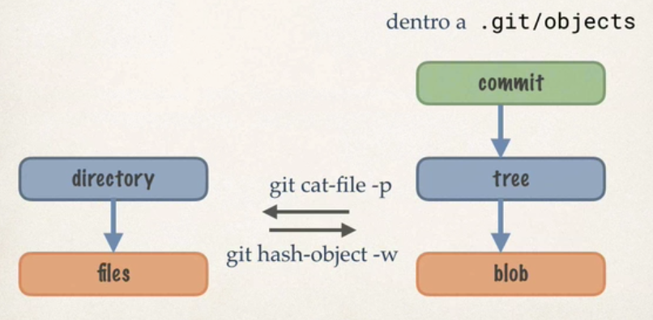
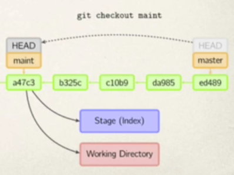

# Cattedrale, Bazaar e Kibutz

**Lettura obbligatoria:** The mythical man-month (capitoli 1 – 12)

**Non linearità del software:** Se un ponte regge 100 tonnellate, ne regge anche 50, i test sono lineari. Nel software il test con un input non dimostra che il software funzioni anche con un input diverso. Va scritto software “perfetto”.

## Problemi identificati da Brook

**Il software invecchia in fretta:** se passa troppo tempo, un software in sviluppo potrebbe risultare inutile o superate.

Le tecniche di stima sono ancora terribili al giorno d’oggi, anche se sono migliorate.

Si confonde “effort” con “progress”, si tende a monitorare il lavoro in base alle ore. In realtà le ore non contano. L’effort è molto facile da misurare, il progress dipende. 

**Man-month:** unità di misura, quanti uomini-mese ci vogliono per realizzare un prodotto. Uomini e mesi sembrano intercambiabili ma in realtà si ritorna alla confusione tra effort e progress. Esempio: per fare un bambino ci vogliono 9 man-month, se ho due donne ci vogliono sempre 9 man-month.

**Legge di Brooks:** aggiungere personale ad un progetto in ritardo, porterà solo il progetto a ritardare di più.

**Secondo sistema:** quando si scrive una cosa per la seconda volta si pensa di poter evitare gli errori della prima volte e aggiungere anche nuove funzionalità con il tempo risparmiato. FALSO

## La cattedrale / la sala operatoria

Distinzione chiara tra il lavoro architetturale da quello implementativo. La parte architetturale è accentrata, chi implementa non prende decisioni architetturali. C’è un single point of failure nel caso l’architettura presenta dei problemi.

Viene chiamata anche la sala operatoria. C’è un chirurgo e un co-pilota (programmatori bravissimi) e un equipe con ruoli precisi (persone normali).

## Bazaar

Eric Raymond prende come esempio il kernel di Linux e Fetchmail che coinvolgono tantissima gente e sono programmi di successo, ma usano un sistema diverso dalla cattedrale pensata da Brook. Quindi dice che non è vero che l’unico modo di sviluppare software è a cattedrale.

Un bazaar è un mercato in cui chiunque può mettere una bancarella e vendere quello che gli pare. La metafora è che ci si auto- organizza e non c’è nulla di pianificato. Il codice sorgente è condiviso, ogni persona è utente e programmatore. Si perseguono gli obbiettivi dei singoli, e così facendo indirettamente si costruisce l’intero software.

- Una persona contribuisce perché vuole, non perché lavora in azienda    
- Gli altri utenti, che hanno altri obbiettivi, sono comunque in grado di interagire al livello dello sviluppo
- Rilascia appena puoi. Rilascia spesso. Si riduce il rischio di aver messo molto effort senza progress
- Linus’ law: “*se mi date abbastanza palle degli occhi, ogni bug viene a galla*”. All’aumentare degli utenti di un sistema, aumenteranno i bug. Se sono utenti consapevoli, loro saranno in grado di spiegarvi perché una funzionalità non va.

Non è semplice definire un bug, senza specifiche ognuno potrebbe avere una sua visione su quali siano bug.

## Il Kibbutz

Diverse organizzazioni si occupano di ambiti diversi della stessa applicazione. Ad esempio kernel Linux + applicazioni.

- Distribuzioni Linux
- Pacchetto → ha le informazioni necessarie per integrarsi in una distribuzione (dipendenze)

I kibbutz sono aziende agricole create con la nascita di Israele il cui scopo è permettere lo sviluppo della terra promessa.

Lavorare in un Kibbutz significa fare uno sforzo collettivo per un ideale condiviso e superiore.

### Debian

Debian utilizza il modello Kibbutz, è diverso dal Bazaar perché c’è un’ organizzazione con delle policy. Le policy sono decise da un comitato tecnico composto da una decina di persone. Ad ogni policy corrisponde un tool che incarna la policy, quindi non è necessario conoscere  e capire al 100% le policy.

### Dpkg e conffiles

Quando si aggiorna un programma da una versione precedente ad una successiva spesso le personalizzazioni fatte dall’utente vengono perse. Questo succede perché l’aggiornamento di un programma è in realtà l’installazione di un nuovo programma. 

Debian cerca di risolvere questo problema facendo in modo che le parti del programma personalizzabili siano indicate. Nel 99% è un file di testo nella cartella /etc.

**Nomenclatura:**

- V →  pacchetto vecchio
- V’ → pacchetto nuovo
- Cd → file di configurazione di V
- Cu → file originale del sistema cambiato dall’utente
- C'd → file di configurazione di V’

Quando un pacchetto viene installato sopra uno vecchio si verificano **4 condizioni diverse**:

- Cd = C’d = Cu → niente da configurare, l’utente non ha modificato niente
- Cd = C’d and Cd $\neq$ Cu → l’utente ha modificato il file di configurazione, posso tenere la configurazione vecchia perché è compatibile con la nuova versione del programma V
- Cd $\neq$ C’d and Cd = Cu → l’utente non ha modificato il file di  configurazione, gli metto il nuovo file di configurazione
- Cd $\neq$ C’d and Cd $\neq$ Cu → il file di configurazione della nuova versione di V è cambiato, e l’utente aveva modificato la configurazione, in qualche modo si cerca di adattare il nuovo file di configurazione

# Sviluppo agile

Negli anni 90 nascono una serie di movimenti che propongono di sviluppare software in modo diverso dalla visione classica degli ingegneri del software.

Nel 2001 queste idee sono raccolte nell’agile manifesto. Questo manifesto è astratto e non appartiene a nessun progetto.

## Valori dell’agile manifesto

- Individui e le interazione più che i processi e gli strumenti
- Il software funzionante più che la documentazione esaustiva
- La collaborazione col cliente più che la negoziazione dei contratti
- Rispondere al cambiamento più che seguire un piano

I progetti di solito si sviluppano seguendo un canone che è utilizzato per valutare la correttezza e la qualità di un prodotto. È difficile trovare un’alternativa allo sviluppo secondo un canone. Gli agilisti infatti non propongono un canone ma una serie di principi da seguire.

## Principi dell’agile manifesto

1. Rilasciare software di valore, fin da subito e in maniera continua
2. Cambiamenti nei requisiti anche a stadi avanzati
3. Rilasciare frequentemente software funzionante
4. Il software funzionante è la principale misura di progresso
5. Committenti e sviluppatori devono lavorare insieme quotidianamente
6. Individui motivati e ben supportati
7. Conversazione faccia a faccia
8. Sviluppo sostenibile: mantenere un ritmo costante  no straordinari, indicano pianificazione sbagliata
9. Eccellenza tecnica
10. Semplicità → fare sempre il minimo
11. Auto organizzazione
12. A intervalli regolari il team riflette su come diventare più efficace

## I veri punti chiave

- **Team piccoli e auto-organizzati,** senza manager tradizionali, ma facilitatori. Il manager è una persona che gestisce, il facilitatore tenta di mettere d’accordo i membri del gruppo
- **Rifiuto di azioni e decisioni big upfront →** energie spese nel fare più che nel progettare, se in futuro ci sarà un cambiamento da fare, si spenderanno energie per quel cambiamento. È comunque meglio che immaginarsi tutti i possibili cambiamenti prima di iniziare a sviluppare
- **Misura e controllo del processo di sviluppo**, con pianificazioni con orizzonti temporali ridotti → il processo è sempre importante, si rifiuta una pianificazione totale preferendo una pianificazione giornaliera
- … morta la registrazione

# Scrum

Scrum è descritto in un piccolo manuale di riferimento. Scrum in italiano si traduce come “mischia del rugby”. La metafora è che tutti insieme si superano le avversità.

## I ruoli

I gruppi sono coesi e piccoli, formati da 7 $\pm$ 2 persone.

Ci sono 2 ruoli definiti:

- **product owner:** interfaccia col cliente / committente, fissa le priorità in base a opportunità e rischi di buisnes e gestisce il backlog. Nella metodologia agile si cercava di portare il committente nel gruppo di sviluppo, questo però trova l’opposizione del committente che non è interessato a partecipare al lavoro. In Scrum invece si sceglie una persona che svolge il ruolo del committente, ma che è sempre interna al team, e partecipa a tutte le attività del team
- **scrum master:** è il facilitatore del gruppo, non fa veramente parte del gruppo ma controlla che gli altri membri agiscano secondo le metodologie Scrum e che non ci siano impedimenti  
- **Gli altri:** stimano la complessità del lavoro, identificano i rischi, dimostrano il progresso del prodotto scrivendo codice.

## Il backlog

Il backlog sono le cose che mancano da fare. Il product owner gestisce il backlog. In un sistema a cascata non c’è motivo di gestire il backlog, perché man mano che faccio qualcosa lo cancello dalla lista. In Scrum non si pianifica all’inizio, ma si risponde al cambiamento ripianificando a piccoli passi.

## Pianificazione

Scrum organizza i requisiti in user stories. Ogni volta che si fa una stima ci si riferisce ad una o più storie. Un insieme di storie si chiama epopea. Il lavoro si divide in periodi di 1 – 3 settimane chiamati sprint. Alla fine dello sprint si rilascia.

Finestra chiusa → è vietato aggiungere nuove funzionalità ad uno sprint in corso. Tutte le eventuali tutte le eventuali negoziazioni sono rimandate allo sprint successivo. In uno sprint al massimo si consegna meno di quello pianificato, mai di più. Se si vuole consegnare di più si inizia un nuovo sprint. La pianificazione quindi diventa “che cosa facciamo nel nuovo sprint?”

Per capire cosa mettere nello sprint servono due cose:

- velocity → quanto si è veloci a fare le cose
- stima del tempo necessario per un requirement → viene trasformato in user stories, per ogni storia si calcola quanta fatica è richiesta

### Stima di una stories

Si scegli la user story più chiara per tutti, sia per il tempo richiesto, sia per effettivamente quello che va fatto. É scelta come user story 1 ed è il riferimento per quantificare tutte le altre stories.

Planning poker → ogni persona dice quant’è lunga secondo lui una storia. Non lo fa dicendolo esplicitamente ma prendendo una carta con un numero segreto. In questo modo una stima non influenza le altre. Si girano tutte le carte, chi ha la più alta/bassa deve argomentare il perché. L’obbiettivo è arrivare ad una stima condivisa da tutto il gruppo. 

Altro metodo più semplice è quello delle magliette (S, M, L)

### Riunioni di planning

**Regole riunioni:**

- hanno un timer
- si distinguono maiali da polli. I maiali sono direttamente coinvolti e prendono le decisioni, i polli sono solo interessati e danno pareri solo se richiesto dai maiali. Una persona è almeno un pollo perché tutti sono interessati

**Stand up meeting** → riunione di 15 minuti fatta in piedi tutte le mattine, si discute cosa si è fatto il giorno prima e cosa sarà fatto oggi, si discute se ci sono impedimenti.

**Planning** → lo si fa ogni 1/5 giorni, più o meno a metà sprint. È l’aggiornamento del backlog.

**Retrospettiva** → alla fine dello sprint,  si valuta quello che è stato fatto. È fatta solo con il gruppo

**Review** → visto che si rilascia la review coinvolge anche il cliente

## Tecniche di programmazione

### Pair programming

Si programma in coppia, ci sono due ruoli:<br>Il pilota usa la tastiera, scrive solo quello che gli dice il copilota. L’idea è che il copilota è costretto ad esplicitare quello che vuole fare. Il pilota fa da filtro per quello che dice il copilota. I due ruoli non sono fissi, si cambiano ogni n minuti. Studi dimostrano che la produttività è leggermente minore, ma la qualità del codice è maggiore. C’è anche un livellamento delle skill, quelli più bravi permettono a quelli meno bravi di migliorare.

### Codice condiviso

Solitamente la modularizzazione del software è usata come divisione del lavoro ma anche come rigida distinzione delle responsabilità. Un modulo è solo di una persona, ci mette le mani solo lui, se c’è un bug è colpa sua. 

Con il codice condiviso invece tutti possono mettere le mani dappertutto. È prevalente l’interesse del gruppo a far funzionare le cose rispetto a distinguere le responsabilità sul codice. Anche nei gruppi agili comunque normalmente una persona mette le mani solo sulla sua parte, però se il sistema non funziona è consentito andare a risolvere i problema degli altri. 

La condivisione del codice è resa tollerabile dalla continuos integration, cioè andare continuamente ad andare a integrare i moduli per controllare se funzionano quando messi insieme.

### Refactoring

Refactoring vuol dire riscrivere un pezzo di codice senza cambiare la sua funzionalità. Non esiste però un modo automatico per sapere se il codice nuovo è davvero equivalente a quello vecchio. Aggiungendo un criterio di funzionalità come quello del TDD, si può affermare che due codici sono equivalenti se i due codici riescono a superare gli stessi test. 

Queste operazioni di refactoring si fanno con l’aiuto di un tool e non a mano. Ad esempio il cambio di nome di una variabile non è un semplice search and replace, ma è una ricerca semantica di quella specifica variabile.

I cataloghi di refactoring servono per future implementazioni nei tool e per la maturazione dei programmatori che andando a leggere il razionale dei refactoring posso imparare modi più eleganti per sistemare il codice

Code smell → stessa riga di codice più volte, e altro…

### TDD 

Test driven developement, si traduce con sviluppo guidato dal test. Non è solo una tecnica di verifica, ma una tecnica di specifica, con la quale si definisce che cosa si vuole ottenere. I test li scrive la stessa persona che poi cerca di passare questi test

- Rosso: test non superato, l’obbiettivo è farlo diventarlo verde. Solitamente un test deve essere passato in 10 minuti, se ci vuole più tempo è troppo complicato, spezzo il test in sotto-test.
- Verde: test superato. Si fa refactoring del codice, il test deve essere ancora verde dopo il refactoring.

**Problemi:**

- Il TDD è che è estremamente dipendente dal tool, per esempio se faccio test su database e ogni volta ci vogliono 15 minuti per verificare se un test è rosso o verde allora il TDD non è fattibile.
- Alcuni test possono avere side effect irreversibili (esempio mandare una mail di test).
- Spesso si vogliono fare test su pezzi di codice che non si stanno sviluppando.

Questi problemi si risolvono con i mock object, classi che imitano il comportamento di altre classi reali. I mock non eseguono il codice vero, ma gli viene insegnato a rispondere in un certo modo alle chiamate dei metodi.

### Velocity tracking

La velocità è una caratteristica del gruppo di lavoro, non la si conosce a priori ma si impara a conoscere a seguito di diversi progetti.

Il tracking è la maniera con la quale si cerca di misurare il progresso. È una velocità perché è il progresso rispetto all’effort.

La velocità è inizialmente stimata riferendosi a 1/3 del tempo a disposizione; con 6 programmatori e uno sprint di 2 settimane: 

Per le storie si usa una taskboard, una lavagna divisa in 4 colonne:

- story: storie da fare in uno sprint
- not started: storie non iniziate
- in progress: storie in corso
- done: storie finite

Si possono mettere dei limiti su una colonna, ad esempio un massimo di 3 storie in progress. Il numero di storie non è detto che sia fisso, se una storia è troppo complessa potrebbe venir divisa in 2 storie distinte. É sempre vietato introdurre nuove storie. 

burndown chart: quanto ci metto a bruciare tutti i miei post-it

- 30 post-it iniziali
- sprint 20 giorni
- alla fine dello sprint idealmente devo avere 0 post-it
- Ogni giorno guardo quanti post-it ho finito, e controllo se sono oltre il pianificato o sotto il pianificato. 

  
 
 

# Software configuration management

Tool che nascono per permettere la collaborazione tra le persone, ma sono così importanti che si usano anche lavorando da soli. 

**Definizione formale:** pratiche che hanno l’obbiettivo di rendere sistematico il processo di sviluppo, tenendo traccia dei cambiamenti in modo che il prodotto sia in ogni istante  in uno stato(configurazione) ben definito.

Gli oggetti di cui si controlla l’evoluzione sono detti configuration item o **artifact** (manufatto).

Ogni **configurazione** è un insieme di artifact in una particolare versione.

La **versione** è un prodotto consegnabile, i componenti all’interno sono in una certa **revisione.**

## **Indipendenza** SCM

Gli SCM sono per lo più indipendenti da linguaggi di programmazione e applicazioni, e lavorano genericamente su file di testo. Non entrando nella semantica dei file però anche uno spazio o un a capo vengono considerate significative per un SCM.

- Anni 80, strumenti locali → per modificare un file si faceva il lock in modo che nessun altro potesse modificarlo, ma solo leggerlo
- anni 90, strumenti client-server centralizzati
- anni 2000, strumenti distribuiti peer-to-peer

Gli strumenti  di versioning devono essere in grado di presentare all’utente dove un file è stato modificato. Per farlo devono analizzare il binario dei file dato che un byte non corrisponde ad un carattere, dipende dal tipo di file. Quando si fa una nuova revisione si calcola le modifica della nuova revisione e si salva tutta, per quella vecchia si memorizza solo il cambiamento. Si fa così perché molto più spesso si accede alla revisione più recente di un file.

## Meccanismo base

**Check-out** → voglio cambiare un artifact (revisione) o una versione di una configurazione

**Check-in** → immetti dentro una versione comune le modifiche (change-set)

Il **change set** è l’insieme dei cambiamenti che differenziano la vecchia versione da quella precedente. Quando faccio una commit, prima vengono calcolati i file cambiati e poi viene fatto l’upload solo delle differenze.

Una **repository** è l’insieme di tutti i contenuti e le metainformazioni collegati che caratterizzano il sistema in tutte le sue versioni. Ha le informazioni sulla storia, su cui ha toccato i file.

Nei sistemi centralizzati era il server a mantenere la repo, gli sviluppatori chiedevano una specifica configurazione da copiare in locale e facevano le modifiche che poi venivano uploadate sul server di nuovo.

Nel caso dei sistemi distribuiti ognuno sulla propria macchina ha sia la repo che la work copy, ma non solo, queste repo sono su più macchine e non si sincronizzano in automatico. Git permette la riscrittura della storia.

## Regolazione lavoro concorrente

In uno stesso progetto ci sono più evoluzioni parallele del sistema (**branch**), e spesso si vuole fare il merge. Nel momento in cui io ho due client di Git, uno dei due lavora su un proprio ramo che dall’altra parte non esiste. L’operazione di **merge** deve essere nella maggior parte dei casi automatica.

Hunk → insieme di righe che corrispondono ad un blocco che è stato modificato o non modificato.

Unire i contenuti però non è banale:

- Lavoro parallelo su artifact (file) diversi → merge automatico, non ci si da fastidio. Ci potrebbero essere problemi però a livello di codice se i due file sono dipendenti tra loro
- Lavoro parallelo sulla copia locale dello stesso artifact (hunk diversi) → se si modificano parti diverse di codice (git non riconosce la simantica) il merge è fattibile.
- Lavoro parallelo sulla copia locale dello stesso artifact (hunk uguali) → necessi sempre di lavoro intelligente

Ci si organizza fuori dal tool per minimizzare il lavoro sullo stesso artifact, anche se non risolve al 100% il problema.

## Terminologia merge

Singola evoluzione → passo da un artifact R ad uno R’ in cui alcune righe sono in comune, altre sono state modificate / elminate.

Il diff prende l’intersezione tra le due revisioni, e per quelle che sono state aggiunte si mette un più, per quelle eliminate un meno. Poi cerco di raggrupparle in hunk. Il diff è diviso in fette

La patch prende l’output del diff, lo applica a R per ottenere R’ ma anche un qualunque R* vicino a R per ottenere un R*’. Quest’ultima cosa può funzionare ma è limitata, fare il diff a due a due perde alcune informazioni.

## 3 way merge

Non si fa il confronto tra me e il passato, e poi tra la nuova versione e me. Ma prendo il più recente degli antenati comuni e faccio la differenza

Siano A’ e A* due revisioni con antenato comune A:

- hunk comuni a tre delle revisioni → nessuno ha toccato quell’hunk
- hunk comune a due delle tre  →  
  - comuni a A’ e A* → merge
  - comuni a A e A’ oppure A* → modifica di uno solo dei due, 	prendo la versione modificata
- tutti e tre gli hunk diversi → due persone hanno modificato in 	modo diverso lo stesso hunk, non c’è un modo automatico per fare 	merge

# Git

Negli ultimi 10 anni gli strumenti di versioning sono cambiati radicalmente. In passato si pensava che dividere il programma in tanti rami fosse un problema. Oggi invece ogni feature ha un ramo diverso, e ogni programmatore lavora su più rami in parallelo.

## Comandi Git

Lo stesso comando git ha molte opzioni che modificano radicalmente il suo comportamento per evitare di avere molti comandi con sintassi diversa. É possibile espandere git in maniera molto semplice aggiungendo comandi personalizzati.

### git init

Inizializza un repository vuota creando una cartella .git che contiene:

- HEAD
- config
- description

### git help

git XXX --help

​	oppure

man git-XXX

### livelli git


- **Working space:** quello che si vede nella directory
- **Index:** dove si salva la versione della prossima configurazione di cui si vuole fare commit
- **Repository(history)**

### working space vs .git/objects



- **Working space** &rarr; sono directory e file
- **Git objects**
  - tree &rarr; quasi concetto di directory
  - blob &rarr; è quasi un file, è condiviso in diverse versioni, diverse directory, non c'è il nome del file

### head

La head punta ad un nome di un ramo. I commit sono l'evoluzione di quel ramo. Se la head non punta ad un ramo ma ad una commit si dice detatched. La commit rischia di andare persa.

### git status

Rappresenta la situazione attuale. I file untracked sono file presenti nel working space ma non aggiunti alla repository. Non cambia nulla nella directory di git.

### git add

I file in add verranno aggiunti alla repository alla prossima commit. La add è utile perché si può usare la copia creata per tornare ad una versione precedente senza però fare commit. Oppure per scegliere un sottoinsieme di file di cui fare la commit. Nella cartella .git viene creato un nuovo file che è l’hash del file aggiunto.

L’hash serve per:

- verificare l’uguaglianza tra file
- risparmiare spazio su file con lo stesso contenuto (stessa versione di più file)
- essere sicuri che il file sia stato salvato nel modo corretto

Nell’hash non c’è il nome del file ma solo il contenuto. Infatti se faccio add di un file con un nome diverso ma contenuto uguale ad un altro file già presente nella repo git, allora non verrà fatto un nuovo hash. Git tiene comunque conto che un nuovo file è stato creato.

Funzionamento git add dettagliato:

- calcola dimensione file
- crea una stringa composta da type + spazio + dimensione + terminatore stringa. type per tutti i file è uguale a BLOB

- concatena il risultato con il contenuto vero e proprio
-  calcola lo SHA1 della “stringa” complessiva. Le prime due cifre dell’hash sono usate per accedere al filesystem in maniera efficiente

### git cat-file

Dato un hash ritorna informazioni sul file. Se l’hash è univoco basta specificare i primi quattro caratteri.

- -t → tipo
- -s → dimensione
- -p → stampa il contenuto (non sempre vero)

### File index

é un file fondamentale, essendo molto usato deve essere efficiente, è uno dei pochi file che non è testuale ma binario. Sull’index c‘è tutto quello che poi andrà in commit.

### git commit

Il commit necessita di un commento. Crea un nuovo file di tipo commit che contiene autore, data e commento. Nascosto c’è un puntatore ad un altro hash. Di solito non si specificano i file nella commit, ma è possibile farlo.


- Il commit punta ad uno o più oggetti commit parent
- ha un unico tree a cui punta che è la radice della configurazione
- la radice può puntare ad altri tree che sono subdirectory
- i tree mantengono dei puntatori a dei blob che hanno un file name e dei permessi


Situazione normale del commit, la HEAD viene spostata sul nuovo commit che però mantiene un riferimento al commit precedente.


git commit --amend serve per annullare l'ultimo commit. Prende l'antenato del commit.

### git diff


- **git diff** &rarr; confronto tra stage e working space. Guardo cosa ho modificato da quanto ho fatto degli add. Prima di un commit lo uso per verificare se c'è qualche modifica che non ho ancora aggiunto. I file untracked sono ignorati
- **git diff --cached** &rarr; confronto tra HEAD e index per vedere cosa cambierebbe dopo una commit
- **git diff HEAD** &rarr;  differenza tra working directory e head bypassando l'index
- **git diff etichetta1 etichetta2** &rarr; confronto tra due etichette
- differenza tra due versione di file. Il separatore -- serve per indicare che sono file, altrimenti git da per scontato che sono rami.

### git checkout

```bash
git checkout[ref][--][files]
```

- se specifico i file &rarr; vengono copiati i files nella versione presente in ref in index e working directory

  

- se non specifico i file &rarr; viene spostata la HEAD

  

### git reset

- ```bash
  git reset [ref][--][files]
  ```

  **git reset -- files** &rarr; prende HEAD e copia solo sull'index

  

- **git reset HEAD^3** &rarr; sposta la HEAD, il commit puntato in precedenza non è più raggiungibile. 

  - --soft &rarr; index e working directory non cambiano. Se poi si fa una commit, compatto più commit in una sola
  - --hard &rarr; cambiano index e working directory, butto via tutto il lavoro corrente
  - con niente &rarr; Cambia l'index. Torna indietro alla versione precedente, ma nella  working directory ci sono ancora i file vecchi. Scelgo di quali file fare add e commit

  


### Git data: repository


Se un oggetto non è puntato da nessun altro oggetto Git è autorizzato a cancellarlo.

### Branch

Un'etichetta è un punto di partenza per accedere a file e directory. Posso avere diverse etichette che rappresentano diverse fronti di evoluzione del progetto


branch &rarr; riferimento relativo ad un evoluzione, quando faccio commit cambia

tag &rarr; relativo ad uno specifico commit

## Comandi esercitazione

```bash
mkdir tre 
cd tre
git init
echo A > A #crea un file A con scritto A
git add A
git commit -m "A"
echo B > B
git commit -m "Ac"
git add B
git commit -m "B"
ls
cat HEAD #head punta al ramo master
cat refs/head #c'è l'hash del commit a cui master sta puntando
git branch #elenca i branch
git branch featB #crea una nuova etichetta sotto refs/head che punta al commit in cui sono in questo momento, e sotto logs/refs.
#logs registra cosa è successo nel tempo, permette di accedere file persi
#siamo comunque su master
git checkout featB #prende la versione puntata da featB e la copia nella working directory
touch C
git add C
git commit -m "C" #master è ancora alla versione senza C
git checkout master #C sparisce
echo B >> B #aggiunge una B
git checkout featB #non sovrascrive B con la versione vecchia, è prudente
git checkout master
git commit --amend "B è un bellissimo file" #butta via il commit precedente e lo sostituisce con quello nuovo, l'hash cambia perchè ho cambiato il commento, e ho cambiato l'ora del commit
cd .git/logs
cat HEAD #all'inizio ci sono tanti 0, HEAD non puntava nulla, poi ci sono tutti i commit/checkout con ora + commento
git checkout "hash del commit con messaggio B" #si passa ad una detatched HEAD, serve un nuovo branch per salvare il lavoro
git checkout -b #crea un ramo e si sposta sul nuovo branch, la HEAD non è più detatched
git reflog #oltre all'hash indica anche cose come HEAD@{5} che significa tornare a 5 versioni precedenti
rm A
rm B
git checkout -- A B #torno alla stessa situazione dell'ultima commit
```

## Riferirsi ad una commit

- nome &rarr; hash / primo prefisso non ambiguo
- nickname &rarr; un tag, un branch, HEAD
- parentela
  - ^n ennesimo padre &rarr; se una commit ha più di un padre
  - ~n  ennesimo antenato

### esercizio


Come posso a partire da A nominare:

- F = ^2 ~1 oppure ^1 ~3
- E = ~1 ^2
- H = ~2 ^2 


